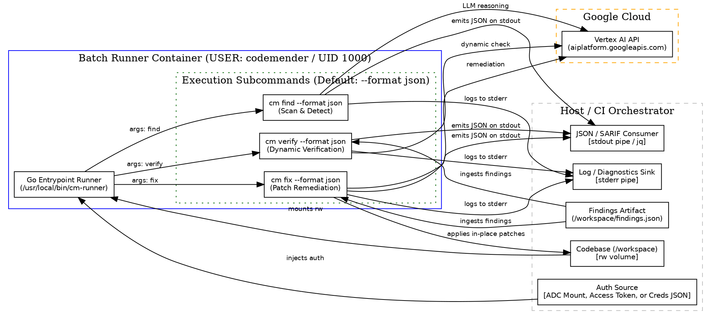

# ADR-0001: CodeMender Headless Batch Runner Container Protocol

- **Status:** accepted
- **Date:** 2026-08-14
- **Decision Makers:** Charles LeDoux (ledoux@google.com)

**Shortlink:** go/cm-connect-adr-0001

## Context and Problem Statement

`cm-connect` provides an unprivileged Docker environment for running CodeMender
(`cm`). While the initial implementation provided an interactive sandbox
dropping developers into `/bin/bash`, automated CI/CD pipelines (e.g., GitHub
Actions PR gating, automated security sweeps, batch triage) require a headless,
deterministic **Batch Runner Container Protocol**.

Because CodeMender (`cm`) already incorporates internal network controls and
isolation during exploit verification and tooling execution, the runner
container does not need a complex host-level egress proxy or network filtering
layer. How should the runner container receive inputs, execute target commands
(`find`, `verify`, `fix`), handle credentials and state, and deliver structured
output to host orchestrators and CI systems?

## Decision Drivers

- **Automated Integration & Machine-Readable Defaults:** The container's primary
  purpose is automated integration and CI/CD pipelines. Output MUST default to
  structured, machine-readable format (JSON/SARIF) on stdout.
- **Zero Host Intrusion & Clean IO:** Must cleanly separate machine-readable
  data on stdout from human-readable diagnostics, progress spinners, and logs on
  stderr.
- **Deterministic Batch Execution:** Must run non-interactively without
  requiring a pseudo-TTY (`-it`), executing a single command and exiting cleanly
  with the tool's exact status code.
- **Phase-Specific Ergonomics (`find`, `verify`, `fix`):** Must naturally
  support the three primary CodeMender workflows:
  - `find`: Static and AI-assisted scanning yielding vulnerability findings.
  - `verify`: Dynamic exploit verification validating reproducible findings.
  - `fix`: Automated patch generation directly modifying code or exporting
    patches.
- **Flexible Authentication:** Support local developer workflows (host ADC
  volume mount), CI/CD runners (short-lived access tokens via environment
  variables), and Workload Identity Federation (credential configuration files).
- **Strict Unprivileged Userspace Execution:** Container must always enforce
  running as a non-root, unprivileged user (`codemender`, UID 1000, GID 1000) to
  maintain a consistent security posture across all runtime environments.
- **Exit Code Transparency:** Must faithfully propagate CodeMender's exit codes
  to the host runner to enable deterministic CI/CD step pass/fail decisions.

## Considered Options: Protocol Architecture

- **Option 1: Unified CLI Entrypoint Runner Protocol (Chosen)** — A single
  container image with an intelligent entrypoint wrapper that executes
  `/usr/local/bin/cm`, automatically injecting machine-readable formatting by
  default, forwarding arguments, supporting interactive fallback when launched
  without arguments, and streaming clean outputs.
- **Option 2: Payload-Driven Task Envelope Protocol** — A container that
  consumes a structured JSON job specification (e.g., `/input/job.json` or
  `CM_JOB_SPEC`), executes a multi-step orchestrated pipeline (`init`
  $\\rightarrow$ `find` $\\rightarrow$ `verify` $\\rightarrow$ `fix`), and emits
  a consolidated `result.json` output envelope.
- **Option 3: Phase-Specific Staged Micro-Containers** — Separate discrete
  container images (`cm-find:latest`, `cm-verify:latest`, `cm-fix:latest`), each
  hardcoded with a single lifecycle phase and chained together via external
  orchestration.

______________________________________________________________________

## Considered Options: Entrypoint Wrapper Implementation Language

To handle argument normalization, default flag injection (e.g. `--format json`),
signal propagation, and interactive TTY fallback, three implementation languages
were evaluated for the container entrypoint wrapper:

### Language Option A: Compiled Go Binary (`cm-runner` in Go) — *Chosen*

A lightweight, statically compiled Go binary embedded into the container image
as the entrypoint.

- Good, because it has instantaneous startup latency (~1ms), zero runtime
  interpreter overhead, and no memory bloat.
- Good, because Go's `os/signal` and `os/exec` standard library provide robust,
  production-grade subprocess management, process group signal forwarding
  (`SIGINT`, `SIGTERM`), and deterministic exit code propagation.
- Good, because strong static typing and built-in testing (`go test`) ensure
  safe flag manipulation and reliable stream splitting (stdout vs stderr).
- Good, because Go can easily handle structured JSON validation or SARIF
  enrichment in the future without introducing third-party runtime dependencies.
- Bad, because it requires a multi-stage Docker build step with the Go toolchain
  (negligible build time overhead of ~2-3 seconds).

### Language Option B: Python 3 Script (`cm-runner.py`)

A Python script executing under the Ubuntu system Python runtime.

- Good, because Python 3 is already installed in the image (`REQ-0002` build
  toolchain), requiring no extra compilation step in the Dockerfile.
- Good, because Python's `argparse` and `json` standard libraries make command
  inspection and JSON handling straightforward.
- Neutral, because Python introduces a small startup latency overhead (~30-50ms)
  per container invocation.
- Bad, because signal handling with subprocess process trees
  (`subprocess.Popen`) in Python requires explicit signal handler plumbing and
  `os.waitpid` signal trapping to avoid zombie processes or swallowed exit
  codes.

### Language Option C: POSIX Shell / Bash Script (`cm-entrypoint.sh`)

A Bash shell script acting as the container entrypoint.

- Good, because it is simple and requires zero compilation or external tooling.
- Bad, because shell scripts are brittle for intelligent argument inspection
  (e.g., detecting if `--format` was already passed by the user vs injecting the
  default `--format json`).
- Bad, because signal trapping (`trap`) in shell scripts has notorious edge
  cases with child process forwarding and exit status preservation.
- Bad, because it cannot easily perform JSON schema checks or structured error
  formatting.

______________________________________________________________________

## Decision Outcome

Chosen option: **Option 1 (Unified CLI Entrypoint Runner Protocol)** implemented
via **Language Option A (Compiled Go Binary: `bin/cm-runner`)**.

This provides a blazing-fast, robust entrypoint that defaults to
machine-readable JSON output for CI/CD integrations, maintains 1:1 parity with
the native `cm` CLI, guarantees clean stdout/stderr stream isolation, and
strictly enforces non-root userspace security.

### Protocol Specification

#### 1. Input Contract

| Input Target | Mechanism | Required / Optional | Description | | :--- | :--- |
:--- | :--- | | **Workspace** | `-v $(pwd):/workspace` | **Required** | Target
codebase mounted at `/workspace` (`WORKDIR`). | | **Target Command** | Container
CLI arguments (`find`, `verify`, `fix`) | **Required** | Subcommand and flags
forwarded directly to `cm`. | | **Auth: Token** |
`-e CLOUDSDK_AUTH_ACCESS_TOKEN=...` | *Alternative A* | Short-lived OAuth/OIDC
token for CI/CD runners. | | **Auth: Workload Identity** |
`-e GOOGLE_APPLICATION_CREDENTIALS=/path/to/creds.json -v /host/path:/path/to/creds.json:ro`
| *Alternative B* | Service account or Workload Identity credential config file.
| | **Auth: ADC Volume** |
`-v ~/.config/gcloud:/home/codemender/.config/gcloud:ro` | *Alternative C* |
Mounted host credentials for local workstations. | | **Persistent Cache** |
`-v ~/.codemender:/home/codemender/.codemender` | Optional | Shared state, LLM
token cache, and session cache. | | **Finding Input** |
`-v /path/to/findings.json:/workspace/findings.json` | Optional | Pre-existing
findings for `verify` or `fix` stages. |

#### 2. Execution Lifecycle

1. **Entrypoint Multiplexing & Default Formatting (`cm-runner` Go binary):**
   - **Machine-Readable by Default:** When invoking batch commands (`find`,
     `verify`, `fix`, `report`), `cm-runner` automatically injects
     `--format json` (or `-f json`) unless a format flag is explicitly supplied
     by the caller.
   - **Idempotent Invocation:** If the first argument is `cm` (e.g.
     `docker run <image> cm find`), the wrapper normalizes it and invokes
     `/usr/local/bin/cm find --format json`.
   - **Direct Subcommand:** If invoked as `docker run <image> find`, it executes
     `/usr/local/bin/cm find --format json`.
   - **Interactive Fallback:** If no arguments are provided and an interactive
     TTY is detected, the runner launches `/bin/bash` in `/workspace`.
1. **Environment Defaults:**
   - Telemetry remains enabled by default (standard CodeMender behavior).
   - `NO_COLOR=1` and `TERM=dumb` set in non-interactive batch mode to prevent
     ANSI escape code pollution in redirected output streams.
1. **Strict Non-Root Userspace Execution:**
   - The container strictly runs as the unprivileged user `codemender` (UID
     1000, GID 1000).
   - All internal directories (`/workspace`, `/home/codemender`) are owned by
     `codemender`.
1. **Signal & Exit Code Forwarding:**
   - `cm-runner` catches OS signals (`SIGINT`, `SIGTERM`) and propagates them to
     the `cm` child process.
   - The container process terminates with the exact exit code emitted by `cm`.

#### 3. Output Contract

- **Stdout:** Exclusively machine-readable data (structured JSON finding lists,
  SARIF payloads, verification results).
- **Stderr:** Diagnostic logs, progress indicators, status messages, and debug
  traces.
- **Workspace Modifications (`cm fix`):** Code patches applied in-place to
  `/workspace`, or exported as `.patch` diff files.
- **Exit Codes:**
  - `0`: Execution succeeded, no policy violations or vulnerabilities detected.
  - `1`: Policy violation / verified vulnerabilities detected (actionable CI
    gating signal).
  - `> 1`: Tooling execution error, authentication failure, or invalid
    configuration.

### Consequences

- Good, because CI/CD automation can pipe stdout directly to JSON parsers
  (`jq`), artifact uploaders, and PR comment generators without regex log
  cleaning.
- Good, because the Go entrypoint wrapper guarantees instant startup latency and
  robust signal handling.
- Good, because enforcing fixed unprivileged user execution guarantees a strict,
  predictable security boundary across local and cloud environments.
- Good, because interactive shell fallback is preserved for developer
  experimentation.
- Neutral, because CI scripts with `set -e` must handle exit code `1` explicitly
  when vulnerabilities are found.

### Confirmation

Compliance and implementation will be confirmed via automated integration tests:

1. **Default Machine-Readable Output Test:**
   - Run `docker run --rm -v $(pwd):/workspace <image> find`.
   - Assert `stdout` is directly parseable by `jq .` with zero leading or
     trailing log text.
   - Assert all diagnostic banners and progress indicators were sent to
     `stderr`.
1. **Go Runner Idempotency Test:**
   - Execute `docker run --rm <image> find` and
     `docker run --rm <image> cm find`.
   - Verify both invocations execute successfully with identical output.
1. **Token & Workload Identity Auth Test:**
   - Run container with `CLOUDSDK_AUTH_ACCESS_TOKEN` injected.
   - Run container with `GOOGLE_APPLICATION_CREDENTIALS` injected.
   - Verify successful authentication against Vertex AI without mounting
     `~/.config/gcloud`.
1. **Find-Verify-Fix Pipeline Test:**
   - **Find:** Execute `cm find` against a known vulnerable fixture; assert exit
     code `1` and parseable JSON findings on stdout.
   - **Verify:** Execute `cm verify --findings-file findings.json`; assert
     validation results are emitted as JSON on stdout.
   - **Fix:** Execute `cm fix --findings-file findings.json`; assert target
     source files in `/workspace` are modified and valid git diffs are produced.
1. **Strict Non-Root Security Test:**
   - Execute `docker run --rm <image> id`.
   - Assert UID is 1000 (`codemender`) and GID is 1000 (`codemender`).

## Architecture Diagram

## More Information

- [CodeMender Official Documentation](https://docs.cloud.google.com/gemini-enterprise-agent-platform/codemender/set-up-environment)
- [cm-docker-container Capability Spec](openspec/specs/runner/cm-docker-container/spec.md)
- [cm-docker-container Capability Design](openspec/specs/runner/cm-docker-container/design.md)
