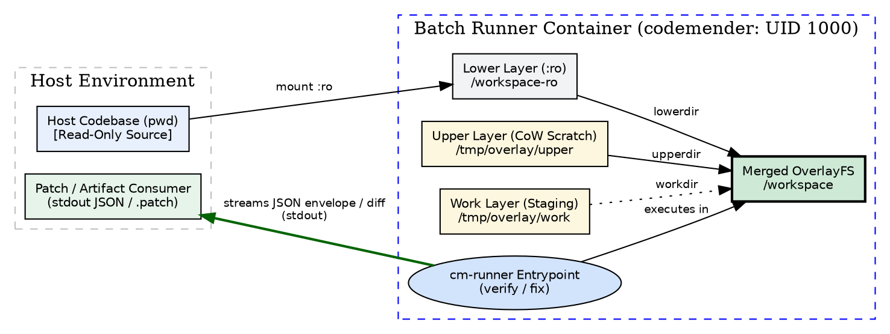

# ADR-0003: Ephemeral OverlayFS Workspace Isolation for verify and fix Lifecycle Phases

- **Status:** proposed
- **Date:** 2026-08-18
- **Decision Makers:** Charles LeDoux (ledoux@google.com)

**Shortlink:** go/cm-connect-adr-0003

## Context and Problem Statement

In `cm-connect`, container executions have historically mounted the host
workspace directly to `/workspace` via standard read-write bind mounts
(`-v $(pwd):/workspace`).

While batch scanning (`find`) performs passive static analysis and LLM queries,
the **`verify`** and **`fix`** lifecycle phases involve aggressive filesystem
mutations:

- **`verify` (Dynamic Exploit Verification):** Compiles codebases, installs
  package dependencies, executes exploit harnesses, spawns local service
  harnesses, and generates voluminous build artifacts (`target/`,
  `node_modules/`, `.o`, binary outputs, logs, socket files).
- **`fix` (Automated Remediation):** Directly mutates source files in-place to
  patch discovered vulnerabilities and re-runs compilation and automated test
  suites to confirm that the fix resolves the vulnerability without introducing
  regressions.

Allowing container agents and subprocesses to write directly to the host working
copy introduces severe reliability and safety risks:

1. **Working Copy Pollution:** Host repositories get littered with untracked
   build artifacts, intermediate test fixtures, and partial code edits.
1. **Permission Mangling:** Files created by the container user (`codemender`
   UID 1000) or root can lead to permission conflicts on the host filesystem.
1. **Irreversible Side Effects:** A failed or flawed remediation attempt could
   leave the developer's working tree in a broken, dirty, or corrupted state.

How should `cm-connect` isolate container workspace modifications during
`verify` and `fix` executions while providing unrestricted in-container
read/write capability and supporting deterministic patch extraction?

## Decision Drivers

- **Zero Host Working Tree Pollution:** The host working copy MUST remain 100%
  untouched and pristine across all container executions.
- **Unrestricted In-Container Execution:** Agents and subprocesses inside the
  container MUST retain standard read/write POSIX filesystem semantics to freely
  edit files, compile binaries, and execute tests in `/workspace`.
- **Deterministic Patch & Diff Extraction:** When `fix` completes, the system
  MUST provide a clean, standardized mechanism to export unified git diffs
  (`.patch`) or structured change manifests to the host without modifying host
  source files.
- **Zero Startup Copy Overhead:** Must scale to arbitrarily large codebases
  without upfront copy latency (e.g. avoiding massive `cp -a` or `rsync` delays
  on multi-gigabyte repositories).
- **Unprivileged Userspace Security:** Must function cleanly in non-root
  userspace environments under user `codemender` (UID 1000) without requiring
  `--privileged` container execution.

## Considered Options

- **Option 1: Ephemeral OverlayFS (Copy-on-Write) Sandbox (Chosen)** — Mount the
  host workspace as a read-only lower layer (`/workspace-ro:ro`) and overlay an
  ephemeral upper layer (`/tmp/overlay/upper`) with an associated work directory
  (`/tmp/overlay/work`) onto `/workspace` via OverlayFS (`fuse-overlayfs` in
  userspace or native kernel overlay). All modifications and build outputs
  accumulate in ephemeral scratch space and vanish on exit, while `git diff` or
  directory diffing extracts clean patches against the pristine baseline.
- **Option 2: Host-Side Ephemeral Git Worktree Management** — The host wrapper
  script (`bin/cm-runner`) creates a temporary isolated `git worktree` in
  `/tmp`, bind-mounts it read-write to the container, and extracts patches or
  deletes the worktree upon container exit.
- **Option 3: Full In-Container Ephemeral Directory Copy** — Mount the host
  directory read-only into `/workspace-src:ro` and execute an eager copy
  (`cp -a` or `rsync`) into an ephemeral in-container working directory
  `/workspace` at startup.
- **Option 4: Strict Read-Only Mount with Out-of-Tree Build Redirection** —
  Mount the host workspace strictly read-only (`:ro`) and redirect all tool
  outputs, build directories, and patches to separate scratch mounts (`/out`,
  `/tmp`).

## Decision Outcome

Chosen option: **Option 1: Ephemeral OverlayFS (Copy-on-Write) Sandbox**,
implemented via **`fuse-overlayfs`** (with kernel overlay fallback when
`CAP_SYS_ADMIN` is available).

### Justification

1. **Instantaneous Startup & Zero Storage Bloat:**
   - Unlike eager directory copying (Option 3), OverlayFS creates a virtual view
     instantly (~0ms) regardless of repository size.
   - Files are copied into the writable upper layer only when modified
     (Copy-on-Write).
1. **Transparent POSIX Read/Write Semantics:**
   - CodeMender, build systems (`make`, `cargo`, `go`, `npm`), and test runners
     operate on `/workspace` exactly as if it were a standard native directory.
   - No complex out-of-tree build flags or tool-specific redirection hacks are
     required.
1. **Pristine Host Protection:**
   - Because the host volume is mounted read-only (`:ro`), the host working tree
     cannot be modified by the container under any circumstances.
   - On container termination (`docker run --rm`), the ephemeral scratch layers
     are automatically discarded.
1. **Clean Patch Extraction for `fix`:**
   - The underlying Git repository remains read-only at HEAD in `lowerdir`.
   - Running `git diff` (with `git add -N` for newly created files) inside the
     merged `/workspace` generates the exact unified diff representing the
     remediation.
   - On non-Git directories, fallback directory diffing
     (`diff -u -r /workspace-ro /workspace`) produces equivalent unified
     patches.
   - `cm-runner fix` can stream this patch as a structured JSON envelope (e.g.
     `{"status": "FIXED", "patch": "...", "files_modified": [...]}`) to `stdout`
     or export raw `.patch` artifacts.

### Architecture & Isolation Boundary

```
+-------------------------------------------------------------------------------+
| Host Filesystem                                                               |
|   • Host Workspace ($(pwd)) [Pristine, Read-Only Source]                      |
|   • Patch / Artifact Consumer (stdout JSON envelope / .patch file)            |
+-------------------------------------------------------------------------------+
                                      │
                         -v $(pwd):/workspace-ro:ro
                         --device /dev/fuse
                                      ▼
+-------------------------------------------------------------------------------+
| Batch Runner Container Boundary (USER: codemender / UID 1000)                |
|                                                                               |
|   ┌───────────────────────────────────────────────────────────────────────┐   |
|   | Lower Layer (Read-Only Host Mount): /workspace-ro                    |   |
|   └───────────────────────────────────┬───────────────────────────────────┘   |
|                                       │                                       |
|   ┌───────────────────────────────────┴───────────────────────────────────┐   |
|   | Ephemeral Scratch Layer (Container Disk / tmpfs):                    |   |
|   |   • Upper Layer: /tmp/overlay/upper (CoW storage)                     |   |
|   |   • Work Layer:  /tmp/overlay/work  (Atomic staging directory)        |   |
|   └───────────────────────────────────┬───────────────────────────────────┘   |
|                                       ▼                                       |
|   ┌───────────────────────────────────────────────────────────────────────┐   |
|   | Merged Overlay Mount: /workspace (WORKDIR)                            |   |
|   |   • Transparent Read-Write POSIX Semantics                            |   |
|   |   • In-Place Code Editing (cm fix)                                    |   |
|   |   • Dynamic Build & Test Artifacts (cm verify)                        |   |
|   └───────────────────────────────────┬───────────────────────────────────┘   |
|                                       │                                       |
|                  ┌────────────────────┴────────────────────┐                  |
|                  ▼                                         ▼                  |
|   ┌───────────────────────────────┐       ┌───────────────────────────────┐   |
|   | cm verify Pipeline            |       | cm fix Pipeline               |   |
|   | • Compiles code & test suites |       | • Edits source files in CoW   |   |
|   | • Runs dynamic exploit tests  |       | • Validates via verify test   |   |
|   | • Artifacts stay in upperdir  |       | • Extracts patch / manifest   |   |
|   └───────────────────────────────┘       └───────────────┬───────────────┘   |
|                                                           │                   |
+-----------------------------------------------------------┼-------------------+
                                                            │
                                        Emits JSON change envelope / patch
                                                            ▼
                                                [Host / CI Orchestrator]
```

### Lifecycle Phase Contracts

| Phase        | Read/Write Requirements            | OverlayFS Behavior                                                                                                                         | Output Contract                                                                                                    |
| :----------- | :--------------------------------- | :----------------------------------------------------------------------------------------------------------------------------------------- | :----------------------------------------------------------------------------------------------------------------- |
| **`find`**   | Read-Only                          | Operates directly over read-only baseline; zero file writes.                                                                               | Structured JSON findings on `stdout`; logs on `stderr`.                                                            |
| **`verify`** | Read-Write (Heavy Build Artifacts) | Build outputs, logs, binaries, and test harnesses write to ephemeral `upperdir`. Scratch backed by container disk to avoid RAM exhaustion. | Verification verdict (`VERIFIED` / `UNVERIFIED`) JSON on `stdout`; zero host leakage.                              |
| **`fix`**    | Read-Write (Code Edits & Builds)   | Source code edits and test outputs write to `upperdir`.                                                                                    | Structured JSON envelope with diff (`.patch`) emitted on `stdout` or exported to file; host repo remains pristine. |

### Technical Details & Container Environment

1. **Overlay Mount Configuration:**
   - Mount Command:
     `fuse-overlayfs -o lowerdir=/workspace-ro,upperdir=/tmp/overlay/upper,workdir=/tmp/overlay/work /workspace`
   - Unprivileged Execution: Runs strictly as `codemender` (UID 1000).
1. **Container Image Dependencies (`docker/Dockerfile`):**
   - Runtime dependencies: `fuse-overlayfs` and `fuse3` installed via apt.
1. **Host Runner Arguments (`bin/cm-runner`):**
   - Host mount: `-v ${WORKSPACE_DIR}:/workspace-ro:ro`
   - Device node: `--device /dev/fuse`
1. **Scratch Storage Sizing:**
   - Scratch directories (`/tmp/overlay/upper`, `/tmp/overlay/work`) are
     allocated on the container root filesystem layer by default to accommodate
     multi-gigabyte build artifacts without consuming host RAM.
1. **Patch Extraction Contract (`fix`):**
   - **Git Workspaces:** Executes `git diff HEAD` (using `git add -N` to include
     newly created files while respecting `.gitignore`) to produce clean unified
     diffs.
   - **Non-Git Workspaces:** Executes
     `diff -u -r --exclude='.git' /workspace-ro /workspace` as a robust
     fallback.
   - **Machine-Readable Envelope:** Emits a structured JSON envelope on `stdout`
     containing status, files touched, and patch contents to maintain strict
     ADR-0001 machine-readable guarantees.

### Consequences

- **Good, because** host working trees are 100% protected against corruption,
  untracked build artifacts, and permissions mismatches.
- **Good, because** startup latency is instantaneous with zero upfront file
  copying.
- **Good, because** agents and build tools enjoy unrestricted in-container POSIX
  read-write semantics.
- **Good, because** generating clean patches for `fix` is trivial via `git diff`
  against the unmodified baseline.
- **Good, because** disk-backed scratch space avoids RAM exhaustion during heavy
  compilation passes.
- **Bad, because** running `fuse-overlayfs` requires forwarding the `/dev/fuse`
  device node (`--device /dev/fuse`) to the container invocation.
- **Neutral, because** modifications made during a run cannot be incrementally
  resumed across separate container runs unless an explicit persistent upperdir
  volume is mounted.

### Confirmation & Verification Strategy

Compliance and correctness will be verified through automated integration tests
in `tests/integration_test.sh`:

1. **Host Immutability Test (`verify` & `fix`):**
   - Record initial SHA-256 checksums and file tree of the host test workspace.
   - Execute `cm-runner verify` and `cm-runner fix` which create files, compile
     binaries, and modify source code inside `/workspace`.
   - Assert container exit status is `0`.
   - Assert host workspace checksums and file listing are completely identical
     to the initial state with zero created or modified files on the host.
1. **In-Container Read-Write Capability Test:**
   - Execute a test script inside `/workspace` creating new files, modifying
     existing files, running compilation, and deleting files.
   - Assert all operations succeed without `EPERM` or `EROFS` errors.
1. **Patch Generation & Application Test (`fix`):**
   - Execute `cm-runner fix` against a vulnerable target file.
   - Capture the emitted JSON change envelope / `.patch` from `stdout`.
   - Assert the captured patch applies cleanly to the host workspace via
     `git apply --check`.
1. **Non-Root UID 1000 Compatibility Test:**
   - Execute the overlayfs initialization inside the container under user
     `codemender` (UID 1000).
   - Assert overlay mount succeeds without requiring `root` or `--privileged`.
1. **Non-Git Workspace Fallback Test:**
   - Run `fix` against a non-git directory fixture.
   - Assert patch generation falls back cleanly to directory diffing.

## Pros and Cons of the Options

### Option 1: Ephemeral OverlayFS (Copy-on-Write) Sandbox (Chosen)

- **Good, because** zero host modification risk (host volume is `:ro`).
- **Good, because** instant startup with zero copy latency on large repos.
- **Good, because** full transparent POSIX filesystem semantics for build tools.
- **Good, because** patch extraction is native via `git diff` or directory diff.
- **Good, because** disk-backed scratch space scales safely to multi-gigabyte
  builds.
- **Bad, because** requires `--device /dev/fuse` in host runner `docker run`
  arguments.

### Option 2: Host-Side Ephemeral Git Worktree Management

- **Good, because** utilizes native Git tooling without container filesystem
  tricks.
- **Good, because** clean git-level branch isolation on the host.
- **Bad, because** strictly requires the host repository to be a valid Git
  repository (fails on arbitrary directories or unpacked tarballs).
- **Bad, because** host wrapper must manage lifecycle, locking, and cleanup of
  temporary directories and git worktree entries.

### Option 3: Full In-Container Ephemeral Directory Copy

- **Good, because** simple implementation without overlay or FUSE requirements.
- **Good, because** works with standard unprivileged Docker without extra device
  nodes.
- **Bad, because** startup latency scales poorly with repository size (copying
  multi-gigabyte repos takes seconds or minutes).
- **Bad, because** doubles memory/disk consumption per container instance.

### Option 4: Strict Read-Only Mount with Out-of-Tree Build Redirection

- **Good, because** completely eliminates write access to source directories.
- **Bad, because** many build systems and linters hardcode in-tree build outputs
  or require in-place source modification for fixing code.
- **Bad, because** highly brittle and requires custom configuration for every
  supported language toolchain.

## Architecture Diagram



## More Information

- [ADR-0001: CodeMender Headless Batch Runner Container Protocol](ADR-0001.md)
- [ADR-0002: Flag Parsing and Passthrough Strategy for Subprocess Execution](ADR-0002.md)
- [cm-batch-runner Capability Spec](../openspec/specs/runner/cm-batch-runner/spec.md)
- [cm-batch-runner Capability Design](../openspec/specs/runner/cm-batch-runner/design.md)
