# ADR-0004: Container Execution Mode and Sandbox Isolation Trade-offs

- **Status:** accepted
- **Date:** 2026-08-19
- **Decision Makers:** Charles LeDoux (ledoux@google.com)

**Shortlink:** go/cm-connect-adr-0004

## Context and Problem Statement

`cm-connect` executes CodeMender (`cm`) inside a single Docker container
designed for automated CI/CD pipelines (specifically GitHub Actions hosted
runners), managed container platforms (Cloud Run, GKE), and local developer
workstations.

CodeMender employs a two-process architecture:

1. **Control Plane / Dispatcher (`cm find`, `cm report`):** Runs the CLI
   coordinator and communicates over outbound HTTPS (`:443`) to Google Cloud
   (Vertex AI at `aiplatform.googleapis.com` and Resource Manager at
   `cloudresourcemanager.googleapis.com`).
1. **Data Plane / Worker (`cm __worker`):** Executes arbitrary tools
   (`list_dir`, `read_file`, `exec_cmd`), compiler invocations, and dynamic
   exploit PoCs emitted by the cloud reasoning engine.

To prevent untrusted agent tool executions from exfiltrating source code, making
SSRF calls to internal infrastructure, or contacting command-and-control (C2)
servers, CodeMender's internal sandbox (`exebox`) attempts to isolate the worker
using Linux kernel namespaces (`CLONE_NEWNET`, `CLONE_NEWNS`, `CLONE_NEWUSER`,
`CLONE_NEWPID`), mount private trees, and mount a fresh `procfs`.

Inside standard unprivileged Docker containers, nested namespace, mount, and
`procfs` operations fail by default with `operation not permitted`. We must
evaluate the architectural options for running `cm` inside Docker and analyze
the security risks, threat models, and trade-offs of each approach across all
target runtime environments without assuming external security layers.

## Decision Drivers

- **Agent Network Egress Prevention:** Prevent the worker subprocess and tools
  from making arbitrary outbound network requests (data exfiltration, SSRF to
  cloud metadata services, and C2 communication).
- **Host & Runner Security Posture:** Prevent container escape, host kernel
  compromise, raw device access, and privilege escalation on the CI runner host
  or workstation.
- **In-Container Filesystem Confinement:** Restrict the agent's file system
  visibility and write capabilities strictly to authorized workspace boundaries.
- **Cross-Environment Portability:** Evaluate trade-offs across GitHub Actions,
  Cloud Run Gen2, GKE (Standard/Autopilot), and local developer workstations.
- **Credential Compartmentalization:** Protect in-flight cloud credentials
  (`CLOUDSDK_AUTH_ACCESS_TOKEN`, ADC) from untrusted worker tool subprocesses.
- **Operational Simplicity:** Maintain a clean, maintainable single-container
  execution model.

______________________________________________________________________

## Considered Options

```dot
digraph G {
    rankdir=TB;
    node [shape=box, style="rounded,filled", fontname="Roboto,sans-serif", fontsize=10];
    edge [fontname="Roboto,sans-serif", fontsize=9];

    // External entities
    internet [label="External Network / Internet\n(SSRF / Exfiltration Target)", shape=ellipse, fillcolor="#ffe599", style="filled"];
    vertex [label="Google Cloud Vertex AI\n(aiplatform.googleapis.com)", shape=ellipse, fillcolor="#cfe2f3", style="filled"];

    subgraph cluster_opt1 {
        label = "Option 1: Docker --privileged";
        style = filled;
        color = "#ffcccc";
        node [fillcolor="#ffffff"];
        opt1_host [label="Host Kernel & Devices\n(EXPOSED / Trivial Breakout)"];
        opt1_cont [label="Container (Root / All Capabilities)"];
        opt1_sbox [label="exebox (CLONE_NEWNET Active)\n[Agent Egress Blocked]"];
        
        opt1_cont -> opt1_sbox [label="launches"];
        opt1_cont -> opt1_host [color="red", style="bold", label="Direct Host Escape"];
        opt1_cont -> vertex [color="blue", label="Dispatcher API"];
    }

    subgraph cluster_opt2 {
        label = "Option 2: Docker + Least-Privileged SYS_ADMIN";
        style = filled;
        color = "#fff2cc";
        node [fillcolor="#ffffff"];
        opt2_host [label="Host Kernel\n(Protected Devices, Wider Syscall Surface)"];
        opt2_cont [label="Container (UID 1000, CAP_SYS_ADMIN,\nUnconfined Seccomp/AppArmor/SystemPaths)"];
        opt2_sbox [label="exebox (CLONE_NEWNET Active)\n[Agent Egress Blocked]"];
        
        opt2_cont -> opt2_sbox [label="launches"];
        opt2_cont -> opt2_host [color="orange", label="Kernel Syscall Surface"];
        opt2_cont -> vertex [color="blue", label="Dispatcher API"];
    }

    subgraph cluster_opt3 {
        label = "Option 3: Standard Docker + cm --unrestricted";
        style = filled;
        color = "#d9ead3";
        node [fillcolor="#ffffff"];
        opt3_host [label="Host Kernel\n(HARDENED Default Docker Isolation)"];
        opt3_cont [label="Standard Container (UID 1000,\nDefault Seccomp / AppArmor / Masked /proc)"];
        opt3_worker [label="cm __worker (No exebox)\n[Unconfined Network & Proc Scope]"];
        
        opt3_cont -> opt3_worker [label="launches"];
        opt3_cont -> opt3_host [color="green", style="bold", label="Hardened Isolation"];
        opt3_worker -> internet [color="red", style="bold", label="Agent Network Egress Allowed"];
        opt3_cont -> vertex [color="blue", label="Dispatcher API"];
    }
}
```



______________________________________________________________________

### Option 1: Privileged Docker Container (`--privileged`)

Run the container with Docker's `--privileged` flag.

```bash
docker run --rm --privileged -v "$(pwd):/workspace" cm-runner:latest find .
```

- **Mechanism:** Docker grants all Linux kernel capabilities (`CAP_SYS_ADMIN`,
  `CAP_SYS_MODULE`, `CAP_SYS_RAWIO`, etc.), unmasks `/proc` and `/sys`, disables
  Seccomp and AppArmor, and mounts host `/dev` block devices.
- **Sandbox Behavior:** CodeMender's internal `exebox` runs without hindrance.
  The worker is unshared into `CLONE_NEWNET` (loopback only) and `CLONE_NEWNS`.

______________________________________________________________________

### Option 2: Least-Privileged `SYS_ADMIN` and Specific Security Options

Run the container as an unprivileged user (`codemender`, UID 1000) with strictly
the minimum capability set and security options required to enable nested Linux
namespaces.

```bash
docker run --rm \
    --cap-add SYS_ADMIN \
    --security-opt seccomp=unconfined \
    --security-opt apparmor=unconfined \
    --security-opt systempaths=unconfined \
    -v "$(pwd):/workspace" \
    cm-runner:latest find .
```

- **Mechanism:**
  - Does **not** pass `--privileged` and does **not** expose host `/dev` block
    devices.
  - Keeps user execution as non-root `codemender` (UID 1000).
  - Adds `CAP_SYS_ADMIN` to permit
    `clone(CLONE_NEWUSER | CLONE_NEWNET | CLONE_NEWNS)` and `mount` operations.
  - Disables Seccomp and AppArmor filters to permit unprivileged namespace
    creation and private mount propagation.
  - Unmasks `/proc` via `systempaths=unconfined` to permit mounting `procfs`
    inside the child PID namespace.
- **Sandbox Behavior:** CodeMender's internal `exebox` runs cleanly. The worker
  is placed inside `CLONE_NEWNET` and `CLONE_NEWNS`.

______________________________________________________________________

### Option 3: Standard Unprivileged Docker with `cm --unrestricted`

Run the container as a 100% standard, unprivileged Docker container with default
capabilities, default Seccomp profile, default AppArmor, and masked `/proc`.
Inside the container, run `cm` with `--unrestricted` (or
`sandbox.enabled: false`).

```bash
docker run --rm -v "$(pwd):/workspace" cm-runner:latest find . -- --unrestricted
```

- **Mechanism:**
  - Standard Docker isolation is 100% active (no `--cap-add`, default Seccomp
    filter active, AppArmor active, `/proc` masked).
  - CodeMender's internal `exebox` is disabled (`UnsafeNoSandbox: true`).
  - Worker tools execute directly in the container's process and network
    namespace.

______________________________________________________________________

## Environment-by-Environment Threat Assessment

```
┌────────────────────────────────────────────────────────────────────────────────────────────────────────┐
│                                   ENVIRONMENT THREAT PROFILES                                          │
├──────────────────────┬──────────────────────┬───────────────────────────────┬──────────────────────────┤
│ 1. GitHub Actions    │ 2. Cloud Run (Gen2)  │ 3. GKE (Standard & Autopilot) │ 4. Local Workstation     │
│ • Ephemeral VM       │ • Dedicated MicroVM  │ • Shared Multi-Tenant Nodes   │ • Persistent Bare Metal  │
│ • Single-Job Life    │ • Serverless Bounds  │ • Persistent Node Storage    │ • Personal Secrets & Dev │
│ • High IP / Code Risk│ • Cloud Metadata Risk│ • Node-to-Cluster Escalation  │ • Host Disk Overwrite    │
└──────────────────────┴──────────────────────┴───────────────────────────────┴──────────────────────────┘
```

### 1. GitHub Actions Hosted Runners (`ubuntu-latest`)

*Context: Single-tenant ephemeral Azure VM; destroyed immediately upon job
completion; holds repository source code, workflow secrets (`GITHUB_TOKEN`,
OIDC/GCP access tokens), and runner socket.*

- **Option 1 (`--privileged`):**
  - **Host Breakout:** Container root has direct access to host block devices
    (`/dev/sda1`). Can mount the runner disk, inspect
    `/home/runner/work/_temp/`, dump runner process memory, and extract all
    workflow secrets and cloud tokens.
  - **Blast Radius:** Confined to that single ephemeral job VM, but all secrets
    and network resources reachable from that VM are compromised.
- **Option 2 (`SYS_ADMIN` + SecOpts):**
  - **Agent Egress (Data Plane):** **Blocked.** The worker process is confined
    to `CLONE_NEWNET`. Rogue tool executions, reverse shells, or malicious
    exploit PoCs cannot exfiltrate code or call external webhooks.
  - **Host Kernel Attack Surface:** Unconfined seccomp and `CAP_SYS_ADMIN`
    expose the ephemeral VM's Linux kernel syscalls. A kernel 0-day could allow
    escape to the VM.
  - **Blast Radius:** VM compromise is limited to an ephemeral runner, while
    irreversible source code exfiltration is eliminated.
- **Option 3 (`cm --unrestricted`):**
  - **Host Protection:** Strong. Default Docker seccomp and capability dropping
    protect the runner VM kernel.
  - **Agent Egress (Data Plane):** **Unrestricted.** The worker has open network
    access. Malicious or rogue LLM tool calls can exfiltrate proprietary source
    code or environment secrets (`GITHUB_TOKEN`) to external servers.

______________________________________________________________________

### 2. Google Cloud Run (2nd Generation MicroVM)

*Context: Runs inside a dedicated Linux microVM; serverless lifecycle; has
access to Google Cloud Instance Metadata (`metadata.google.internal`) with the
Cloud Run Service Account identity.*

- **Option 1 (`--privileged`):**
  - **Platform Compatibility:** **Rejected.** Cloud Run rejects deployment of
    `--privileged` containers.
- **Option 2 (`SYS_ADMIN` + SecOpts):**
  - **Agent Egress (Data Plane):** **Blocked.** `CLONE_NEWNET` cuts off all
    outbound network access. Tool commands cannot reach external endpoints or
    the Google Cloud metadata server.
  - **Platform Compatibility:** Cloud Run Gen2 microVMs natively support
    unprivileged `CLONE_NEWUSER` / `CLONE_NEWNET`.
  - **Host Isolation:** Hypervisor-level microVM boundary (KVM) provides strong
    isolation from underlying physical infrastructure.
- **Option 3 (`cm --unrestricted`):**
  - **Host Protection:** Strong container boundary inside the microVM.
  - **Agent Egress (Data Plane):** **Unrestricted.** Agent tools can query
    `http://metadata.google.internal/computeMetadata/v1/` to extract runtime
    access tokens for the Cloud Run Service Account and exfiltrate data.

______________________________________________________________________

### 3. Google Kubernetes Engine (GKE Standard & Autopilot)

*Context: Multi-tenant or shared worker nodes; persistent node storage;
Kubernetes API server connectivity; Workload Identity.*

- **Option 1 (`--privileged`):**
  - **GKE Autopilot:** **Rejected** unconditionally by admission controllers.
  - **GKE Standard:** **Critical Cluster Risk.** Container root can mount node
    storage (`/dev/sda`), steal Kubelet tokens (`/var/lib/kubelet/pods`), trace
    adjacent Pods on the node, and escalate to full cluster takeover.
- **Option 2 (`SYS_ADMIN` + SecOpts):**
  - **GKE Autopilot:** **Rejected.** Autopilot forbids adding `CAP_SYS_ADMIN`.
  - **GKE Standard:**
    - **Agent Egress (Data Plane):** **Blocked.** `CLONE_NEWNET` prevents worker
      code from making network calls.
    - **Node Attack Surface:** `CAP_SYS_ADMIN` and disabled seccomp increase the
      attack surface against the shared GKE node kernel, creating risk for
      adjacent co-located Pods if a kernel vulnerability is exploited.
- **Option 3 (`cm --unrestricted`):**
  - **Platform Compatibility:** **Fully Supported** on both GKE Autopilot and
    GKE Standard (complies with `Restricted` Pod Security Standards).
  - **Node Protection:** Strongest possible protection for the shared Kubernetes
    node.
  - **Agent Egress (Data Plane):** **Unrestricted.** The agent can perform SSRF
    against internal Kubernetes services (ClusterIPs), query `kube-dns`, and
    probe adjacent VPC workloads.

______________________________________________________________________

### 4. Local Docker Run (Developer Workstations)

*Context: Persistent bare-metal or cloudtop workstation; contains personal
files, SSH keys (`~/.ssh`), credentials, corporate network access, and physical
hard drives.*

- **Option 1 (`--privileged`):**
  - **Host Risk: CRITICAL.** The container has raw access to host block devices
    (`/dev/sda`, `/dev/nvme0n1`). A compromised tool or exploit script can
    directly overwrite the developer's disk partitions, install persistent
    kernel rootkits, or read personal credentials.
- **Option 2 (`SYS_ADMIN` + SecOpts):**
  - **Agent Egress (Data Plane):** **Blocked.** `CLONE_NEWNET` prevents tools
    from probing the developer's local LAN (home router, corporate intranet,
    local development servers).
  - **Filesystem Isolation:** Confines worker operations strictly to
    `/workspace`, `/tmp`, and `~/.codemender`.
  - **Host Kernel Risk:** Exposes the workstation's kernel to unconfined
    syscalls via `CAP_SYS_ADMIN`.
- **Option 3 (`cm --unrestricted`):**
  - **Host Protection:** Strong. Standard Docker seccomp and capability limits
    protect the developer's workstation kernel and prevent host disk access.
  - **Agent Egress (Data Plane):** **Unrestricted.** The agent can connect to
    services running on the developer's local network (`localhost` or
    `192.168.x.x`) and exfiltrate workspace code to the internet.

______________________________________________________________________

## Comprehensive Threat Matrix Across Environments

| Environment                  | Threat Vector                  | Option 1: `--privileged`        | Option 2: `SYS_ADMIN` + SecOpts | Option 3: `cm --unrestricted`  |
| :--------------------------- | :----------------------------- | :------------------------------ | :------------------------------ | :----------------------------- |
| **GitHub Actions**           | **Host VM Escape**             | 🔴 High (Direct `/dev` access)  | 🟡 Moderate (Syscall surface)   | 🟢 Low (Default Seccomp)       |
|                              | **Code / Secret Exfiltration** | 🟢 Blocked (`CLONE_NEWNET`)     | 🟢 **Blocked** (`CLONE_NEWNET`) | 🔴 High (Open Net)             |
|                              | **Runner Secret Theft**        | 🔴 High (Host memory dump)      | 🟢 Low (Container confined)     | 🟡 Moderate (In-container env) |
| **Cloud Run (Gen2)**         | **Platform Support**           | ❌ Not Supported                | 🟢 **Native MicroVM**           | 🟢 Supported                   |
|                              | **Metadata Service SSRF**      | N/A                             | 🟢 **Blocked** (`CLONE_NEWNET`) | 🔴 High (Can query IMDS)       |
|                              | **MicroVM Escape**             | N/A                             | 🟢 Low (Hypervisor boundary)    | 🟢 Low (Hypervisor boundary)   |
| **GKE (Standard/Autopilot)** | **Platform Support**           | ❌ Blocked on Autopilot         | ❌ Blocked on Autopilot         | 🟢 **Supported Everywhere**    |
|                              | **Node / Cluster Escape**      | 🔴 Critical (Node takeover)     | 🟡 Moderate (Kernel surface)    | 🟢 Low (Standard sandbox)      |
|                              | **Cluster Internal SSRF**      | 🟢 Blocked (`CLONE_NEWNET`)     | 🟢 **Blocked** (`CLONE_NEWNET`) | 🔴 High (Probes ClusterIPs)    |
| **Local Workstation**        | **Host Disk Overwrite**        | 🔴 Critical (`/dev/sda` access) | 🟢 **Protected** (No host devs) | 🟢 Protected (No host devs)    |
|                              | **Corporate LAN Probing**      | 🟢 Blocked (`CLONE_NEWNET`)     | 🟢 **Blocked** (`CLONE_NEWNET`) | 🔴 High (LAN reachable)        |
|                              | **Workstation Kernel Risk**    | 🔴 Critical (Root + All Caps)   | 🟡 Moderate (`SYS_ADMIN`)       | 🟢 Low (Standard Seccomp)      |

______________________________________________________________________

## Host-Side CI Review Integration and Token Compartmentalization

In CI/CD automation pipelines (such as the GitHub Actions PR review workflow in
`cm-pr-workflow`), automated PR comment publishing introduces an important
security boundary:

1. **Credential Compartmentalization:**
   - The write-scoped repository token (`GITHUB_TOKEN` or PR comment token)
     MUST NOT be mounted or injected into the container environment executing
     `cm-runner` or untrusted agent tools.
   - The container strictly ingests code artifacts and emits structured
     `ChangeEnvelope` records to `stdout`.

2. **Host-Side Zero-Setup Publisher (`publish_comments.py`):**
   - The CI runner processes `ChangeEnvelope` records and interacts with the
     GitHub REST API exclusively on the host runner using a standalone Python 3
     standard library script (`github-actions/scripts/publish_comments.py`).
   - Using Python 3 standard library (`urllib.request`, `json`, `os`, `sys`)
     guarantees **zero host setup** (no `node`/`npm`, `pip`, or container builds
     required), enables sub-second hermetic integration testing via Go's native
     `httptest.Server`, and maintains total separation between container
     remediation and GitHub API mutation.

______________________________________________________________________

## Confirmation / Verification Strategy

Compliance and isolation behavior MUST be validated via automated test scenarios
in `tests/integration_test.sh`:

1. **Agent Network Egress Isolation Test:**

   - Execute `docker run` in Option 2 mode against a fixture triggering an
     outbound network probe (`curl -s -I --connect-timeout 2 https://google.com`
     or raw TCP connect).
   - The worker tool output MUST fail with `Network is unreachable`.
   - Execute the same fixture in Option 3 mode and assert the network probe MUST
     succeed.

1. **Instance Metadata Service (IMDS / SSRF) Protection Test:**

   - Execute a tool step attempting
     `curl -s -I --connect-timeout 2 http://169.254.169.254/computeMetadata/v1/`.
   - Under Option 2, the request MUST fail immediately with
     `Network is unreachable` inside the worker subprocess.
   - Option 3 MUST be documented as vulnerable to IMDS access unless host-level
     network filters are applied.

1. **In-Container Filesystem Boundary Test:**

   - Execute a tool step attempting to write to `/tmp/outside_workspace` and
     `/home/codemender/.escape_test`.
   - Under Option 2 (`exebox` active), writes MUST be isolated to ephemeral
     tmpfs and MUST NOT persist across worker sessions.
   - Under Option 3, writes persist across the container lifecycle.

1. **Host Device Node Protection Test:**

   - Execute `docker run --rm <image> ls -la /dev`.
   - Option 1 MUST expose host disk devices (`/dev/sda*`, `/dev/nvme*`).
   - Options 2 & 3 MUST NOT expose any host block devices, containing only
     standard virtual container nodes (`/dev/null`, `/dev/ptmx`, `/dev/shm`).

1. **Deterministic Exit Code Propagation:**

   - Assert `cm-runner` exits with status `0` (clean) or `1` (findings detected)
     across all supported modes without encountering unexpected `EPERM` panics
     during cleanup.

______________________________________________________________________

## References

- [ADR-0001: CodeMender Headless Batch Runner Container Protocol](ADR-0001.md)
- [ADR-0002: Flag Parsing and Passthrough Strategy for Subprocess Execution](ADR-0002.md)
- [ADR-0003: Ephemeral OverlayFS Workspace Isolation for Remediation](ADR-0003.md)
- [CIS Docker Benchmark v1.6.0](https://www.cisecurity.org/benchmark/docker)
- [Cloud Run Execution Environments](https://cloud.google.com/run/docs/about-execution-environments)
- [GitHub Actions Workflow Syntax: `container.options`](https://docs.github.com/en/actions/writing-workflows/workflow-syntax-for-github-actions#jobsjob_idcontaineroptions)
- [Kubernetes Pod Security Standards](https://kubernetes.io/docs/concepts/security/pod-security-standards/)
