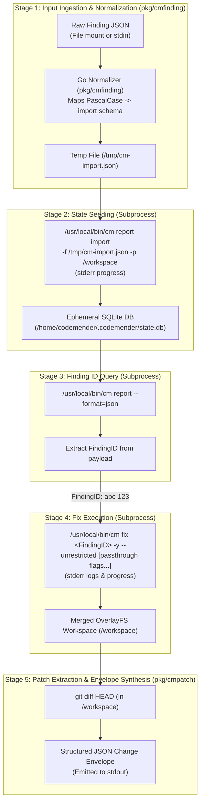
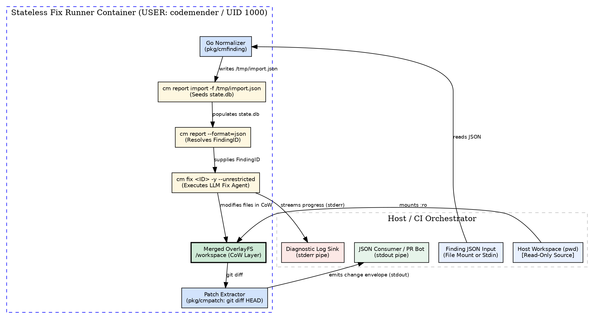

# ADR-0005: Stateless Finding Ingestion and Patch Generation Container Protocol (fix)

- **Status:** proposed
- **Date:** 2026-08-20
- **Decision Makers:** Charles LeDoux (ledoux@google.com)

**Shortlink:** go/cm-connect-adr-0005

## Context and Problem Statement

In `cm-connect`, the container execution environment was initially standardized
for interactive developer sandboxes (`cm-docker-container`) and headless batch
vulnerability scanning (`cm-batch-runner` executing `find`). Automated CI/CD
pipelines (e.g. GitHub Actions PR review bots, automated triage workflows)
require a complementary, stateless **Fix Runner Protocol** dedicated to the
**`fix`** remediation lifecycle phase.

In production CI/CD architectures, scanning and remediation are decoupled across
distinct execution steps or parallel matrix jobs:

1. `cm-runner find` executes in Container A, producing a structured JSON finding
   report.
1. The CI orchestrator slices or passes a finding to Container B
   (`cm-runner fix`), which starts from a **blank slate** without persistent
   host state mounts (`~/.codemender`).

CodeMender's native `cm fix <finding-id>` CLI command requires the target
finding to already exist inside the local SQLite state database (`state.db`).
Furthermore, `cm report -f json` exports findings with PascalCase schema keys
(`FilePath`, `StartLine`, `Title`, `Analysis`, `Severity`, `VulnType`,
`Snippet`), whereas CodeMender's native ingestion command
(`cm report import -f <file>`) expects lowercase keys (`file_path`, `line`,
`title`, `message`, `severity`, `vuln_type`, `snippet`).

How should `cm-connect` ingest finding payloads into an ephemeral container
environment, execute the remediation agent, isolate workspace modifications
during builds and test runs, and deliver reviewable patches to CI/CD systems?

## Decision Drivers

- **Zero Host State Dependency:** The container MUST execute completely
  statelessly without requiring mounted host state (`~/.codemender`).
- **Single-Finding Granularity:** The protocol MUST target a single finding per
  invocation, enabling trivial CI/CD matrix parallelization, bounded timeouts,
  and zero multi-finding patch collision risks.
- **Closed-Loop Schema Compatibility:** The protocol MUST seamlessly consume the
  JSON finding output produced by `cm report -f json` without manual data
  transformation by the user.
- **Dependency-Free Architecture:** The Go entrypoint runner (`cm-runner`) MUST
  remain 100% dependency-free in `go.mod`, avoiding third-party SQLite CGO or
  pure-Go database drivers.
- **Verbatim Subprocess Passthrough:** All unowned CLI arguments passed after
  the POSIX `--` delimiter MUST be forwarded directly and verbatim to `cm fix`.
- **Pristine Host Protection:** The host repository MUST remain 100% untouched
  and read-only during container execution (leveraging Ephemeral OverlayFS per
  ADR-0003 for patch extraction).
- **Machine-Readable Output Contract:** `stdout` MUST emit exclusively a
  structured JSON change envelope containing unified diffs and modified file
  lists for downstream CI PR review suggestion bots.
- **Exit Code Fidelity:** The container MUST propagate unambiguous exit codes:
  `0` (patch generated), `1` (unresolved / no fix produced), `2` (CLI / parsing
  error), and `>2` (fatal tooling error).

## Considered Options

### Option 1: Go Schema Normalizer + Native Subprocess Ingestion + Ephemeral State Query (Chosen)

The Go runner (`cm-runner fix <path-or-stdin>`) reads the single finding JSON,
normalizes it to the `cm report import` schema via an in-memory converter
(`pkg/cmfinding`), writes a temporary import file (`/tmp/cm-import.json`), and
executes `/usr/local/bin/cm report import -f /tmp/cm-import.json -p /workspace`
to populate the ephemeral `state.db`.

Because `state.db` starts completely clean in the stateless container,
`cm-runner` immediately queries `/usr/local/bin/cm report --format=json` to
resolve the single imported `FindingID`, and invokes:
`/usr/local/bin/cm fix <FindingID> -y --unrestricted [passthrough flags...]`.

File modifications are captured via `git diff HEAD` inside the OverlayFS CoW
layer and emitted as a structured JSON change envelope to `stdout`.

- **Good, because** `go.mod` stays 100% dependency-free using only the Go
  standard library.
- **Good, because** it reuses CodeMender's native import logic (fingerprinting,
  snippet validation, session initialization) without schema duplication.
- **Good, because** resolving the `FindingID` via `cm report` takes
  $\<2\\text{ms}$ in a single-item ephemeral database.
- **Good, because** it decouples `cm-runner` from upstream SQLite schema
  migrations in `state.db`.
- **Bad, because** it involves two quick helper subprocess invocations
  (`cm report import` and `cm report`) prior to `cm fix`.

### Option 2: Direct SQLite Database Seeding via Embedded Go Driver

Embed a pure-Go SQLite driver (e.g. `modernc.org/sqlite`) or CGO SQLite binding
into `cm-runner`, directly opening `/home/codemender/.codemender/state.db` and
executing SQL `INSERT` statements into `sessions` and `findings` tables.

- **Good, because** it avoids invoking `cm report import` as a subprocess.
- **Good, because** the `FindingID` can be set or known directly prior to
  invocation.
- **Bad, because** it introduces heavy third-party dependencies into `go.mod`,
  violating the project's zero-dependency standard (ADR-0002).
- **Bad, because** it tightly couples `cm-runner` to CodeMender's internal
  SQLite schema versions (`v2`, `v3`, `v4` columns and trigger tables), creating
  silent breakage whenever upstream `cm` updates database migrations.
- **Bad, because** it requires re-implementing snippet extraction and finding
  fingerprinting in Go.

### Option 3: Persistent State Volume Mounting (`~/.codemender`)

Require callers to mount a populated `~/.codemender` directory from a preceding
`cm find` run into the fix container
(`-v ~/.codemender:/home/codemender/.codemender`).

- **Good, because** no finding ingestion step is needed.
- **Bad, because** it fails in stateless CI/CD environments (GitHub Actions,
  ephemeral cloud runners) where jobs execute across different runner VMs.
- **Bad, because** sharing a single SQLite database across concurrent matrix
  jobs causes database lock contention (`database is locked`).
- **Bad, because** stale session state and historical findings accumulate
  indefinitely in the persistent volume.

## Decision Outcome

Chosen option: **Option 1: Go Schema Normalizer + Native Subprocess Ingestion +
Ephemeral State Query**.

### Justification

Option 1 provides the cleanest, most resilient architecture:

1. **Zero Third-Party Dependencies:** `cm-runner` remains a lightweight,
   stdlib-only binary compiled with `CGO_ENABLED=0`.
1. **Upstream Schema Immunity:** Upstream changes to `state.db` (new columns,
   indexes, or tables) are handled seamlessly by `cm report import` without
   requiring updates or recompilation of `cm-runner`.
1. **Stateless CI/CD Composability:** CI pipelines can pass finding artifacts
   via file mounts or standard input (`stdin`), enabling massive parallelization
   without volume locking or shared filesystem state.
1. **Deterministic Single-Finding Resolution:** Because each container execution
   begins with an empty `state.db`, the imported finding is unambiguously the
   sole record in the database, making `FindingID` resolution instantaneous and
   fail-safe.

## Protocol Specification

### 1. Host $\\leftrightarrow$ Container Communication Channels

```
+-----------------------------------------------------------------------------------------------+
| Host / Orchestrator / CI Runner                                                               |
|   • Channel 1 (Workspace):    -v $(pwd):/workspace-ro:ro (Read-Only Source)                   |
|   • Channel 2 (Device):       --device /dev/fuse (Ephemeral OverlayFS CoW Scratch)            |
|   • Channel 3 (Auth):         -e CLOUDSDK_AUTH_ACCESS_TOKEN / -v ~/.config/gcloud:ro          |
|   • Channel 4 (Finding):      -v $(pwd)/finding.json:/tmp/finding.json:ro (or stdin pipe)     |
|   • Channel 5 (CLI Args):     fix /tmp/finding.json -- -c "Use parameterized query"           |
|                                                                                               |
|   • Channel A (stdout):       Pure JSON Change Envelope -> jq / GitHub PR Suggestion Bot      |
|   • Channel B (stderr):       Operational Diagnostics, LLM Spinners, Build Logs               |
|   • Channel C (Exit Code):    0: Fixed, 1: Unresolved, 2: CLI/Parse Error, >2: Fatal Tool Error|
+-----------------------------------------------------------------------------------------------+
```

### 2. Multi-Stage Execution Lifecycle



### 3. Ingestion Normalization Rules (`pkg/cmfinding`)

The converter maps fields between `cm report -f json` and `cm report import`:

| `cm report -f json` Field | `cm report import` Field | Type     | Transformation Rule                                             |
| :------------------------ | :----------------------- | :------- | :-------------------------------------------------------------- |
| `FilePath` / `file_path`  | `file_path`              | `string` | Strips `file://` scheme; validates path exists in `/workspace`. |
| `StartLine` / `line`      | `line`                   | `int`    | Integer $\\ge 1$; defaults to `1` if omitted or `0`.            |
| `Title` / `title`         | `title`                  | `string` | Headline summary; falls back to `"Security Finding"`.           |
| `Analysis` / `message`    | `message`                | `string` | Remediation guidance; falls back to `Snippet` or `Title`.       |
| `Severity` / `severity`   | `severity`               | `string` | Uppercase string (`CRITICAL`, `HIGH`, `MEDIUM`, `LOW`).         |
| `VulnType` / `VulnID`     | `vuln_type`              | `string` | Classification (e.g. `CWE-89`, `XXE`).                          |
| `Snippet` / `snippet`     | `snippet`                | `string` | Embedded snippet; avoids disk snippet re-extraction failure.    |
| `Status` / `status`       | `status`                 | `string` | Defaults to `"OPEN"`.                                           |

### 4. Structured Output Envelope (`stdout`)

```json
{
  "finding_id": "478a8868-b05a-5258-99ac-aa9e932374a7",
  "status": "FIXED",
  "vuln_type": "CWE-89",
  "title": "SQL Injection in User Lookup",
  "summary": "Replaced raw string concatenation with db.QueryRowContext and parameterized placeholders ($1).",
  "files_modified": [
    "pkg/auth/store.go"
  ],
  "patch": "diff --git a/pkg/auth/store.go b/pkg/auth/store.go\nindex 4b825dc..a3f12bc 100644\n--- a/pkg/auth/store.go\n+++ b/pkg/auth/store.go\n@@ -42,3 +42,3 @@\n-    query := fmt.Sprintf(\"SELECT * FROM users WHERE id = '%s'\", id)\n+    query := \"SELECT * FROM users WHERE id = $1\"\n-    row := db.QueryRow(query)\n+    row := db.QueryRowContext(ctx, query, id)\n",
  "hunks": [
    {
      "file_path": "pkg/auth/store.go",
      "start_line": 42,
      "end_line": 45,
      "original": "    query := fmt.Sprintf(\"SELECT * FROM users WHERE id = '%s'\", id)\n    row := db.QueryRow(query)\n",
      "replacement": "    query := \"SELECT * FROM users WHERE id = $1\"\n    row := db.QueryRowContext(ctx, query, id)\n"
    }
  ]
}
```

## Architecture Diagram



## Consequences

- **Good, because** automated CI/CD PR gating workflows can remediate findings
  in parallel without shared filesystem state or lock contention.
- **Good, because** `cm-runner` remains a dependency-free Go binary with zero
  third-party SQLite library overhead.
- **Good, because** host working trees are 100% protected against corruption,
  untracked build files, or dirty edits.
- **Good, because** `stdout` provides machine-readable unified diffs and hunks
  directly usable for GitHub PR inline review suggestions.
- **Good, because** unowned flags passed after `--` are forwarded verbatim to
  `cm fix`.
- **Neutral, because** executing two short helper subprocesses adds ~10-20ms of
  setup overhead before the LLM fix agent runs (negligible compared to LLM
  inference latency).

## Confirmation / Verification Strategy

Compliance will be verified via automated integration tests in
`tests/integration_test.sh`:

1. **Schema Normalization & Import Test:**
   - Execute `cm-runner fix` with a `cm report -f json` finding payload.
   - Assert `cm report import` executes successfully and populates `state.db`.
1. **Finding ID Resolution Test:**
   - Verify `cm-runner` resolves the generated `FindingID` and invokes `cm fix`
     with the exact ID.
1. **Double-Dash Passthrough Test:**
   - Execute
     `cm-runner fix /tmp/finding.json -- -c "Focus on auth" --architecture=3-1`.
   - Assert `cm fix` receives `["-c", "Focus on auth", "--architecture=3-1"]`.
1. **Host Immutability Test:**
   - Assert host workspace files remain 100% byte-for-byte identical after `fix`
     runs with OverlayFS.
1. **Stdout Machine-Readable Output Test:**
   - Assert `stdout` is valid JSON parseable by `jq .` containing `patch` and
     `files_modified`.
   - Assert `stderr` contains scanner and compiler diagnostic output.
1. **Exit Code Evaluation Test:**
   - Assert exit code `0` on successfully generated patches.
   - Assert exit code `2` on invalid/missing finding JSON inputs.

## More Information

- [ADR-0001: CodeMender Headless Batch Runner Container Protocol](ADR-0001.md)
- [ADR-0002: Flag Parsing and Passthrough Strategy for Subprocess Execution](ADR-0002.md)
- [ADR-0003: Ephemeral OverlayFS Workspace Isolation for Remediation](ADR-0003.md)
- [cm-fix-runner Capability Spec](../openspec/specs/runner/cm-fix-runner/spec.md)
- [cm-fix-runner Capability Design](../openspec/specs/runner/cm-fix-runner/design.md)
