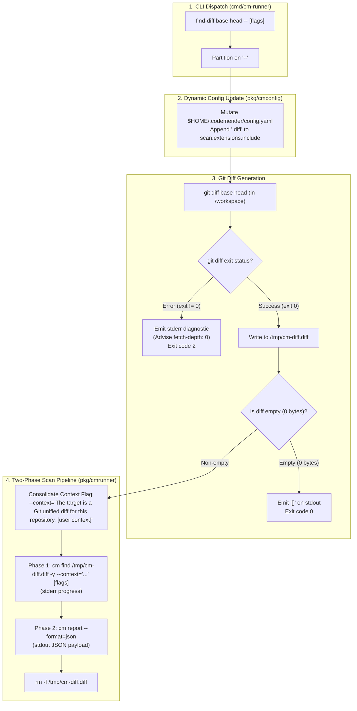
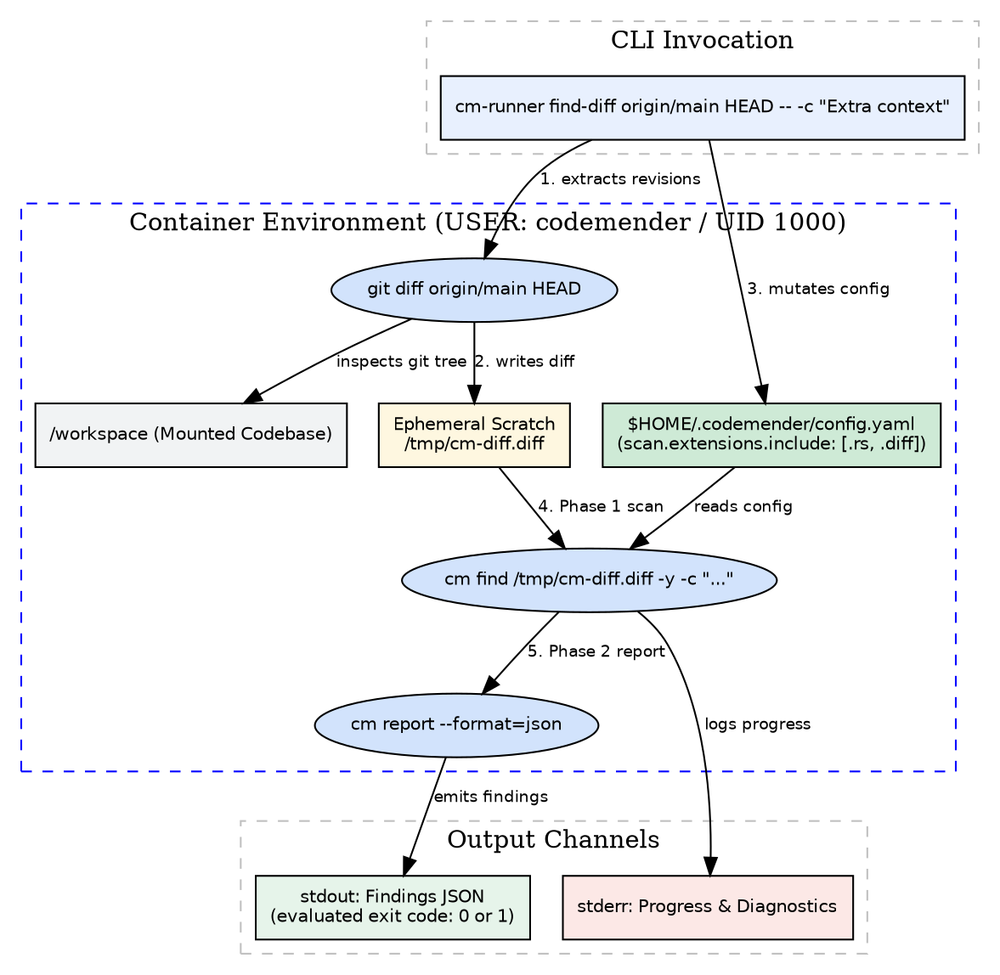

# ADR-0007: Native Diff-Aware Vulnerability Scanning Container Protocol (find-diff)

- **Status:** accepted
- **Date:** 2026-08-22
- **Decision Makers:** Charles LeDoux (ledoux@google.com)

**Shortlink:** go/cm-connect-adr-0007

## Context and Problem Statement

In `cm-connect`, the container execution environment was standardized for
headless batch vulnerability scanning across full repositories (`find` per
ADR-0001, ADR-0002) and stateless single-finding remediation (`fix` per
ADR-0005).

In CI/CD pull request review workflows (`cm-pr-workflow`), scanning the entire
codebase introduces severe noise on pre-existing, untouched legacy code. In
early prototypes, pull request diffs were extracted externally on the host
runner into a workspace file (`git diff ... > commit.diff`) and passed into
`cm-runner find .`.

This external diff file approach introduces critical failure modes:

1. **`git clean` Deletion Collision**: CodeMender (`cm find`) executes internal
   repository preparation routines, including `git clean -fdx` or working tree
   resets. An untracked `commit.diff` file located in the workspace is wiped out
   mid-execution.
1. **Fix Patch Pollution (`cmpatch.ExtractPatch`)**: During remediation
   (`cm-runner fix`), `cmpatch.ExtractPatch` captures modifications via
   `git add -N . && git diff HEAD` in the copy-on-write workspace. Any untracked
   diff file remaining in `/workspace` pollutes the synthesized `ChangeEnvelope`
   unified diff.
1. **Scanned File Extension Gating**: CodeMender enforces a strict allowlist of
   scanned file extensions (`scan.extensions.include`). Diff files (`.diff` /
   `.patch`) are ignored by default unless dynamically registered in
   configuration.
1. **LLM Diff Grounding**: Without explicit contextual prompting, CodeMender's
   reasoning engine evaluates a `.diff` file as arbitrary plain text rather than
   understanding that it represents an incoming patch relative to the repository
   mounted at `/workspace`.

How should `cm-connect` natively compute, stage, configure, and execute
diff-scoped vulnerability scanning inside the container?

## Decision Drivers

- **Zero Host Workspace Pollution**: The diff generation and scanning process
  MUST NOT create untracked files in `/workspace`, protecting subsequent `fix`
  patch extractions from diff artifact pollution.
- **`git clean` Immunity**: The staged diff file MUST reside in container
  scratch space (`/tmp/`) completely outside `/workspace`, guaranteeing it
  cannot be deleted by `cm find` workspace cleanup routines.
- **Exact Subcommand Dispatch & `--` Partitioning (ADR-0002 Compliance)**: The
  CLI contract MUST use a dedicated top-level subcommand (`find-diff`) where all
  arguments before `--` are forwarded directly to `git diff`, and all arguments
  after `--` are forwarded to `cm find`.
- **Dynamic `.diff` Extension Registration**: The runner MUST dynamically ensure
  `.diff` is registered in `scan.extensions.include` within
  `$HOME/.codemender/config.yaml` using the reusable AST mutator
  (`pkg/cmconfig`) exclusively during diff scan invocations.
- **Minimal High-Density Context Prompt**: Injects a concise context flag
  (`--context="The target is a Git unified diff for this repository."`) to
  ground the reasoning model without prompt bloat, while appending any
  user-supplied context flags.
- **Empty Diff Short-Circuiting**: If `git diff` produces an empty patch (zero
  bytes modified), the runner MUST short-circuit immediately, emitting `[]` on
  `stdout` and exiting with status `0` without invoking remote LLM APIs.
- **Defensive Git Error Discrimination**: If `git diff` exits with non-zero
  status (e.g. shallow clone, missing refs), the runner MUST fail fast with exit
  code `2` and emit actionable remediation guidance (e.g. advising
  `fetch-depth: 0` in GitHub Actions).
- **Clean Stream Separation & Standard Exit Codes**: Emits machine-readable JSON
  findings on `stdout`, progress and logs on `stderr`, and propagates standard
  exit codes (`0` clean, `1` findings detected, `2` usage error, `>2` fatal
  error).

## Considered Options

- **Option 1: Dedicated Top-Level `find-diff` Subcommand with Ephemeral Staging
  and AST Config Mutation (Chosen)** —
  `cm-runner find-diff <git-diff-args...> [-- <cm-flags...>]` executes
  `git diff` inside `/workspace`, saves the patch to `/tmp/cm-diff.diff`,
  mutates `$HOME/.codemender/config.yaml` to include `.diff`, injects the
  consolidated context flag, executes the two-phase scan/report sequence
  (`cm find /tmp/cm-diff.diff` -> `cm report --format=json`), and cleans up
  scratch artifacts.
- **Option 2: Flag-Based Diff Mode on Existing `find` Subcommand
  (`cm-runner find --diff-base=<base>`)** — Add dedicated diff flags to `find`.
  (Rejected: violates ADR-0002's zero-flag-parsing principle for `find` and
  introduces complex flag validation).
- **Option 3: External Host-Side Stdin Piping
  (`git diff ... | cm-runner find -`)** — Require the host to compute the diff
  and pipe it via stdin. (Rejected: forces CI runners to duplicate git logic and
  manage stdin TTY edge cases across Docker invocations).

______________________________________________________________________

## Decision Outcome

Chosen option: **Option 1: Dedicated Top-Level `find-diff` Subcommand with
Ephemeral Staging and AST Config Mutation**.

### Justification

1. **Robust Workspace Isolation**: By staging the diff at `/tmp/cm-diff.diff`,
   `git clean` inside `/workspace` cannot delete the diff, and `git diff HEAD`
   inside `cm-runner fix` remains 100% pristine.
1. **Transparent Git Diff Passthrough**: `cm-runner find-diff` treats all tokens
   before `--` as arguments for `git diff` (e.g. `main HEAD`,
   `origin/main...HEAD`, `a1b2c3d e4f5g6h`, `main`), supporting all native Git
   revision syntax without custom parsing logic.
1. **Reusable Configuration Mutation**: Reuses `pkg/cmconfig` to dynamically
   append `.diff` to `scan.extensions.include` in
   `$HOME/.codemender/config.yaml`, ensuring CodeMender scans the patch file
   without permanently bloating the default image configuration.
1. **Zero-Overhead Empty Diff Bypass**: Avoids spawning LLM reasoning sessions
   when pull requests contain only non-scannable or empty diffs.
1. **Actionable CI Diagnostics**: Discriminates between empty diffs (success
   exit `0`) and broken Git references (usage error exit `2` with
   `fetch-depth: 0` troubleshooting guidance).

______________________________________________________________________

## Protocol Specification

### 1. CLI Invocation Syntax

```bash
cm-runner find-diff [git-diff-args...] [-- <cm-find-flags...>]
```

- **Before `--` (Git Diff Domain)**: Optional revision specifiers, commit
  hashes, or pathspecs passed verbatim to `git diff` (e.g. `origin/main HEAD`,
  `origin/main...HEAD`, `main`). If omitted, defaults to `HEAD`.
- **After `--` (CodeMender Domain)**: Passthrough flags forwarded verbatim to
  `cm find` (e.g. `-c "Focus on auth"`, `--model=gemini-1.5-pro`).

### 2. Multi-Stage Execution Lifecycle



### 3. Context Prompt Consolidation Specification

- **Base Context String**:
  `"The target is a Git unified diff for this repository."`
- **Context Merging Rule**: If the caller passes `-c` or `--context` in
  `afterDash` (e.g. `-- -c "Check SQL injection"`), `cm-runner` merges the
  strings into a single parameter:
  `--context="The target is a Git unified diff for this repository. Check SQL injection"`
  The standalone user context flag is stripped from the passthrough slice to
  avoid multiple `--context` flag collision in CodeMender.

______________________________________________________________________

## Pros and Cons of the Options

### Option 1: Dedicated `find-diff` Subcommand (Chosen)

- **Good, because** keeps the diff outside `/workspace`, completely preventing
  `git clean` deletion.
- **Good, because** prevents fix diff pollution in `cmpatch.ExtractPatch`.
- **Good, because** supports all native Git revision syntax without custom
  parser code.
- **Good, because** dynamically enables `.diff` scanning via reusable
  `pkg/cmconfig`.
- **Good, because** minimal context prompt provides exact grounding without
  token bloat.
- **Good, because** empty diffs short-circuit instantly with zero cloud API
  latency.
- **Good, because** fails fast with clear troubleshooting guidance if Git
  history is shallow.
- **Bad, because** requires Git CLI to be installed inside the container runtime
  (already satisfied by `git` 2.45+ requirement).

### Option 2: Flag-Based Diff Mode on `find`

- **Good, because** avoids adding a new top-level subcommand name.
- **Bad, because** violates ADR-0002 and adds brittle flag parsing loops to
  `find`.

### Option 3: External Stdin Piping

- **Good, because** container does not need to execute `git diff`.
- **Bad, because** forces CI workflows to manage intermediate shell pipes and
  stdin TTY flags.

______________________________________________________________________

## Architecture Diagram



______________________________________________________________________

## Confirmation / Verification Strategy

Compliance and correctness MUST be verified via automated integration tests in
`tests/integration/`:

1. **Native Git Diff Extraction Test**:
   - Execute `cm-runner find-diff HEAD~1 HEAD` against a Git repository with
     known commits.
   - Assert `/tmp/cm-diff.diff` is created outside `/workspace` and deleted upon
     exit.
1. **Revision Range Syntax Test**:
   - Execute `cm-runner find-diff origin/main...HEAD`.
   - Assert `git diff` receives `origin/main...HEAD`.
1. **Empty Diff Fast-Path Test**:
   - Execute `cm-runner find-diff HEAD HEAD` (empty diff).
   - Assert process terminates immediately with exit code `0` and emits `[]` on
     `stdout`.
1. **Git Error Discrimination Test**:
   - Execute `cm-runner find-diff non-existent-ref`.
   - Assert process exits with code `2` and logs diagnostic error advising git
     revision validity.
1. **Dynamic `.diff` Extension Mutation Test**:
   - Verify `$HOME/.codemender/config.yaml` contains `.diff` in
     `scan.extensions.include` after `find-diff` runs.
1. **Context Prompt Appending Test**:
   - Execute `cm-runner find-diff main HEAD -- -c "Extra check"`.
   - Assert `cm find` receives
     `--context="The target is a Git unified diff for this repository. Extra check"`.
1. **Workspace Immutability Test**:
   - Assert zero untracked files are created in `/workspace` during or after
     `find-diff` execution.

______________________________________________________________________

## More Information

- [ADR-0001: CodeMender Headless Batch Runner Container Protocol](ADR-0001.md)
- [ADR-0002: Flag Parsing and Passthrough Strategy for Subprocess Execution](ADR-0002.md)
- [ADR-0005: Stateless Finding Ingestion and Patch Generation Container Protocol (fix)](ADR-0005.md)
- [cm-batch-runner Capability Spec](../openspec/specs/runner/cm-batch-runner/spec.md)
- [cm-pr-workflow Capability Spec](../openspec/specs/workflow/cm-pr-workflow/spec.md)
