# ADR-0008: Git Integration Architecture: Subprocess Execution (os/exec) and High-Value Go Libraries

- **Status:** proposed
- **Date:** 2026-08-24
- **Decision Makers:** Charles LeDoux (ledoux@google.com)

**Shortlink:** go/cm-connect-adr-0008

## Context and Problem Statement

In `cm-connect`, the Go runner binary (`cm-runner`) and associated orchestration
packages (`pkg/cmrunner`, `pkg/cmpatch`, `cmd/cm-runner`) interact directly with
Git repositories across two primary operational phases:

1. **Headless Batch Scanning & Diff Ingestion (`find`, `find-diff` per
   [ADR-0001](ADR-0001.md), [ADR-0007](ADR-0007.md)):**
   - Extracting unified diffs via `git diff <base> <head>` into ephemeral
     container scratch space (`/tmp/cm-diff.diff`).
   - Handling diverse repository configurations, including shallow clones
     (`fetch-depth: 0` vs. shallow history), submodule boundaries, detached
     heads in CI environments, and modern Git storage formats such as Git 2.45+
     reftables (`refstorage=reftable`).
1. **Stateless Remediation & Patch Extraction (`fix` per
   [ADR-0003](ADR-0003.md), [ADR-0005](ADR-0005.md)):**
   - Tracking modified and newly created files in ephemeral copy-on-write
     workspaces via `git add -N . && git diff HEAD`.
   - Parsing unified diffs and Git hunks into structured JSON `ChangeEnvelope`
     records.
   - Managing working tree status and clean isolation without host repository
     pollution.

Per [ADR-0002](ADR-0002.md), `cm-connect` embraces high-value dependencies while
avoiding unnecessary abstraction layers and operational liabilities. When
architecting Git integration for `cm-runner`, we must evaluate where Go
libraries add substantial engineering value and where native subprocess
execution is required for operational correctness.

The primary architectural choices are:

- Calling the system `git` CLI binary via Go's standard library `os/exec`
  (`exec.CommandContext`).
- Using a pure-Go re-implementation of the Git protocol and object store, such
  as `go-git` (`github.com/go-git/go-git/v5`).
- Using Go CGo bindings to the C `libgit2` library, such as `git2go`
  (`github.com/libgit2/git2go`).
- Adopting specialized high-value Go libraries for specific sub-domains (e.g.
  diff/patch AST parsing via `go-gitdiff` / `pkg/cmpatch`, or in-memory mock
  repositories for hermetic unit testing).

Which Git integration architecture should `cm-connect` standardize on across all
current and future Go packages and runners?

______________________________________________________________________

## Decision Drivers

- **100% Modern Git Feature & Format Parity:** The system MUST natively support
  all modern Git features without lag or behavioral drift, specifically Git
  2.45+ reftables (`refstorage=reftable`), shallow clones (`--depth`), sparse
  checkouts, `.gitconfig` parsing, `includeIf`, and `safe.directory`
  enforcement.
- **Zero CGo & Pure Go Portability (`CGO_ENABLED=0`):** The Go runner binary
  MUST compile statically with zero external C toolchain dependencies,
  eliminating dynamic linking issues (`glibc` vs `musl`), multi-architecture
  cross-compilation friction, and runtime container crashes.
- **High-Value Dependency Alignment:** Third-party Go dependencies MUST be
  evaluated strictly on whether they provide substantial, tangible engineering
  value (e.g. robust diff parsing, in-memory testing fixtures) without
  introducing unacceptable operational limitations or security risks.
- **Strict Process Isolation & Timeout Governance:** All Git operations MUST
  support context-driven timeout bounds (`context.WithTimeout`), process group
  management (`Setpgid: true`), and signal propagation (`SIGINT`, `SIGTERM`) to
  prevent hanging zombie processes during CI runs.
- **Memory Efficiency on Large Codebases:** Operations on multi-gigabyte
  repositories with hundreds of thousands of files MUST NOT cause Go heap memory
  bloat, high garbage collection pressure, or out-of-memory (OOM) aborts.
- **Deterministic Stream Separation & Clean Error Discrimination:** Standard
  output (`stdout`) and standard error (`stderr`) MUST be strictly separated,
  allowing clean extraction of diffs and machine-readable output while surfacing
  actionable diagnostic logs on errors.
- **Future Multi-VCS Migration Readiness (Decoupled Boundary):** Internal
  package architecture MUST avoid tight coupling to Git-specific CLI semantics,
  enabling future multi-VCS adoption (e.g. `Masterminds/vcs`, Mercurial `hg`,
  Jujutsu `jj`, or Piper) without downstream caller refactoring.

______________________________________________________________________

## Considered Options

### Option 1: Layered Hybrid Architecture: Native CLI for Repository Execution + High-Value Go Libraries for Diff Parsing & In-Memory Testing (Chosen)

Standardize on native `git` CLI execution (`os/exec`) for all working tree and
repository lifecycle operations, while leveraging focused, high-value pure-Go
libraries (like `pkg/cmpatch`, `go-gitdiff`, or `go-git` in test mocks) for
in-memory AST manipulation and hermetic unit testing.

- **Mechanism:**
  - **Repository & Workspace Layer:** Standardizes on `exec.CommandContext` with
    tokenized argument slices (e.g. `[]string{"diff", baseSHA, headSHA}`) for
    all repository interactions (`diff`, `add`, `config`, `fetch`, `status`).
  - **In-Memory Parsing Layer:** Uses focused Go diff/patch parsers
    (`pkg/cmpatch` / `go-gitdiff`) to convert raw unified diff streams into
    strongly typed `ChangeEnvelope`, `File`, and `Hunk` structures.
  - **Testing & Mocking Layer:** Allows in-memory virtual Git repositories
    (`go-git` / `memfs`) within unit tests for sub-millisecond, disk-free test
    fixture generation.
- **Good, because 100% Format & Feature Parity:** Native Git CLI guarantees
  immediate compatibility with all upstream Git features, configuration formats,
  and storage engines (including Git 2.45+ reftables, sparse checkouts,
  credential helpers, and `safe.directory`) with zero library lag.
- **Good, because Pure Go Toolchain (`CGO_ENABLED=0`):** Compiles cleanly to a
  single static binary without requiring `gcc`, `clang`, `cmake`, or C header
  files during Docker multi-stage builds.
- **Good, because Kernel-Level Memory Reclamation:** Memory allocated during
  heavy Git operations (packfile indexing, large delta diffing) is managed in
  the external `git` process and immediately reclaimed by the OS upon process
  exit, keeping Go process RSS under 20MB.
- **Good, because High-Value Domain Separation:** Captures the best of both
  worlds: robust system Git capabilities for repository execution, paired with
  type-safe Go data structures for in-memory AST and diff manipulation.
- **Bad, because Process Spawn Overhead:** Incurs a ~5–15ms process fork/exec
  latency per invocation on Linux. However, in batch scanning, container
  dispatch, and CI workflows, this overhead is negligible compared to cloud LLM
  roundtrips (~2–10s) and compiler executions.
- **Bad, because Runtime Dependency on `git` Binary:** Requires the `git` CLI
  binary to be installed in the runtime environment (already pre-installed and
  verified in `cm-connect`'s base image and all standard CI runners).

______________________________________________________________________

### Option 2: Full In-Process Git Engine via `go-git` (`github.com/go-git/go-git/v5`)

Adopt `go-git` as the primary Git engine for all repository, working tree, and
object store operations in `cm-connect`.

- **Mechanism:**
  - Uses `go-git`'s in-process object store, index manipulator, and plumbing
    APIs for all Git interactions.
- **Good, because Pure Go & Zero CGo:** Does not require CGo or external C
  compilers; supports `CGO_ENABLED=0` cross-compilation.
- **Good, because Zero Process Spawning:** Executes in-process within the Go
  runtime, eliminating process fork overhead for micro-operations.
- **Good, because Pluggable In-Memory Storage:** Supports custom in-memory file
  systems (`memfs`) and custom object storage backends.
- **Bad, because Critical Modern Git Feature Gaps (Functional Blockers):**
  - **Git 2.45+ Reftables:** Lacks mature support for Git 2.45+ reftables
    (`refstorage=reftable`), failing when attempting to open repositories
    initialized with modern reference storage.
  - **Shallow CI Clones:** Known stability issues with shallow clones,
    frequently throwing "object not found" errors during pull/fetch operations
    in CI environments.
  - **Configuration Evaluation:** Does not fully evaluate complex `.gitconfig`
    hierarchies, `includeIf`, `safe.directory`, or external smudge filters (Git
    LFS).
- **Bad, because High Heap Memory Overhead on Large Repositories:**
  Instantiating Go heap objects for every tree entry, commit, and blob on
  repositories with >100k files triggers severe garbage collection pressure and
  risk of container OOM aborts.
- **Neutral, because Dependency Footprint:** Adds `go-git` and its transitive
  packages (`golang.org/x/crypto`, `sha1cd`, `ssh_config`, `go-diff`). While
  dependencies are welcomed when they add value, in this case the library
  introduces functional blockers for production repository operations.

______________________________________________________________________

### Option 3: CGo Bindings to Libgit2 via `git2go` (`github.com/libgit2/git2go`)

Adopt `git2go` as the primary Git engine, embedding Go CGo bindings to the
C-based `libgit2` library.

- **Mechanism:**
  - Wraps C `libgit2` data structures and functions via Go CGo.
- **Good, because High C Engine Performance:** Leverages the battle-tested,
  hyper-optimized C implementation of Git plumbing for in-process execution.
- **Good, because Deep Plumbing Access:** Provides programmatic access to Git
  object databases, trees, and commit graphs.
- **Bad, because Severe CGo Build & Cross-Compilation Overhead:**
  - Requires `CGO_ENABLED=1`, C toolchains (`gcc`/`clang`), `pkg-config`,
    `cmake`, and system libraries (`openssl`, `libssh2`, `zlib`).
  - Cross-compilation across architectures (`darwin/arm64`, `linux/amd64`,
    `linux/arm64`) requires heavy multi-arch build containers or Zig toolchains.
  - Generating fully static binaries requires intricate linking flags
    (`-extldflags=-static`) and often fails on modern Linux distributions.
- **Bad, because Unrecoverable Crashes & Memory Leak Risks:**
  - C-level segmentation faults or out-of-memory panics inside `libgit2` crash
    the entire Go process immediately with an unrecoverable core dump (bypassing
    Go `recover()`).
  - C heap memory is outside the Go garbage collector and requires manual
    `Free()` lifecycle management, introducing memory leak risks in long-running
    processes.

______________________________________________________________________

### Option 4: Generic Go CLI Wrapper Libraries (e.g. `go-git-cmd-wrapper`, `amzn/golang-gitoperations`, `Masterminds/vcs`)

Adopt a third-party typed Go wrapper package or polyglot VCS library
immediately.

- **Mechanism:**
  - Wraps `os/exec` command generation behind external Go interfaces (e.g.
    `Masterminds/vcs.Repo` or `gitoperations.GitOperations`).
- **Good, because Retains Native Git CLI Fidelity:** Executes the system `git`
  binary, retaining 100% feature and format support.
- **Good, because Pure Go (No CGo):** Preserves `CGO_ENABLED=0` static
  compilation.
- **Good, because Polyglot VCS Abstraction (`Masterminds/vcs`):** Provides a
  single interface capable of driving Git, Mercurial (`hg`), Subversion (`svn`),
  and Bazaar (`bzr`).
- **Bad, because YAGNI Violation Today:** `cm-connect` currently targets Git
  repositories in Docker/CI containers. Adopting a full multi-VCS framework
  today adds unnecessary interface complexity and third-party dependencies
  before non-Git requirements exist.
- **Bad, because Obscures Low-Level Process Control:** Many generic wrapper
  libraries do not expose fine-grained control over `syscall.SysProcAttr` (such
  as `Setpgid: true` for process group signal isolation) or custom buffer stream
  splitting.

______________________________________________________________________

## Decision Outcome

Chosen option: **Option 1 (Layered Hybrid Architecture: Native CLI for
Repository Execution + High-Value Go Libraries for Diff Parsing & Testing)**,
paired with a **Migration-Ready Decoupled Boundary**.

### Justification

This decision is driven by **functional capability, format compatibility, and
operational reliability**:

1. **Functional Correctness Over Incomplete Abstractions:**
   - The choice of native `os/exec` for repository interactions is necessitated
     by the fact that `go-git` and `git2go` cannot reliably handle Git 2.45+
     reftables and shallow CI clones. Native `git` ensures `cm-connect` operates
     reliably across all enterprise repositories and modern Git defaults.
1. **Pragmatic Dependency Adoption (Value-Driven per ADR-0002):**
   - Dependencies are adopted wherever they provide clear, high-value
     abstractions:
     - **In-Memory Diff Parsing:** Pure-Go diff/patch libraries (such as
       `pkg/cmpatch` or `github.com/gitleaks/go-gitdiff`) provide rich AST
       representation and 1-click review suggestion formatting.
     - **Hermetic Testing:** `go-git` and in-memory filesystems (`memfs`) are
       permitted and encouraged within unit test suites to create fast,
       disk-free test repositories.
1. **Zero CGo & Frictionless Static Compilation:**
   - Avoiding CGo libraries (`git2go`) preserves `CGO_ENABLED=0`, enabling
     instantaneous cross-compilation (`darwin/arm64`, `linux/amd64`,
     `linux/arm64`) and fully static, self-contained container binaries.
1. **Kernel-Level Memory Reclamation & Process Isolation:**
   - Heavy Git operations (large tree diffs, status indexing) run in dedicated
     OS processes with strict timeouts (`context.WithTimeout`) and process group
     cancellation (`Setpgid: true`), keeping the Go runner's memory footprint
     bounded (\<20MB) and immune to heap bloat.

______________________________________________________________________

## Comparative Architectural Matrix

```dot
digraph GitExecutionStrategyMatrix {
    rankdir=TB;
    compound=true;
    node [shape=box, style="rounded,filled", fontname="Helvetica,sans-serif", fontsize=10];
    edge [fontname="Helvetica,sans-serif", fontsize=9];

    subgraph cluster_legend {
        label = "Evaluation Dimensions";
        style = filled;
        color = "#f3f4f6";
        node [fillcolor="#ffffff"];
        leg1 [label="CGo & Build Complexity"];
        leg2 [label="Git Feature & Reftable Parity"];
        leg3 [label="Engineering Value vs Cost"];
        leg4 [label="Process & Memory Isolation"];
        leg1 -> leg2 -> leg3 -> leg4 [style=invis];
    }

    subgraph cluster_opt1 {
        label = "Option 1: Layered Hybrid (CHOSEN)";
        style = filled;
        color = "#d1e7dd";
        node [fillcolor="#ffffff"];
        opt1_arch [label="Native os/exec for Repo Ops\n+ High-Value Go Diff/Test Libs"];
        opt1_pros [label="✔ Pure Go (CGO_ENABLED=0)\n✔ 100% Modern Git / Reftable Parity\n✔ Bounded memory & process isolation\n✔ High-value in-memory diff AST", shape=note, fillcolor="#e8f5e9"];
        opt1_arch -> opt1_pros [style=dotted];
    }

    subgraph cluster_opt2 {
        label = "Option 2: Full go-git Engine";
        style = filled;
        color = "#fff3cd";
        node [fillcolor="#ffffff"];
        opt2_arch [label="github.com/go-git/go-git/v5\n(All-in-One In-Process Engine)"];
        opt2_cons [label="✖ Incomplete reftable support\n✖ Shallow clone CI fetch errors\n✖ High heap allocation on large repos", shape=note, fillcolor="#fffde7"];
        opt2_arch -> opt2_cons [style=dotted];
    }

    subgraph cluster_opt3 {
        label = "Option 3: git2go / libgit2 (CGo)";
        style = filled;
        color = "#f8d7da";
        node [fillcolor="#ffffff"];
        opt3_arch [label="github.com/libgit2/git2go\n+ C libgit2 Shared/Static Lib"];
        opt3_cons [label="✖ Requires CGo & C toolchains\n✖ Fragile cross-compilation\n✖ Unrecoverable C segfault crashes\n✖ Manual C memory management", shape=note, fillcolor="#ffebee"];
        opt3_arch -> opt3_cons [style=dotted];
    }

    subgraph cluster_opt4 {
        label = "Option 4: Generic Go CLI Wrappers / Masterminds";
        style = filled;
        color = "#e2e3e5";
        node [fillcolor="#ffffff"];
        opt4_arch [label="Multi-VCS / Wrapper Package\n(e.g. Masterminds/vcs, ldez/wrapper)"];
        opt4_cons [label="✖ Premature abstraction (YAGNI)\n✖ Redundant dependency today\n✖ Obscures process group control", shape=note, fillcolor="#f8f9fa"];
        opt4_arch -> opt4_cons [style=dotted];
    }
}
```



### Feature and Operational Comparison

| Capability / Metric            | Option 1: Layered Hybrid (Chosen)  | Option 2: `go-git` (v5)            | Option 3: `git2go` (`libgit2`)      | Option 4: Go CLI Wrappers / Masterminds |
| :----------------------------- | :--------------------------------- | :--------------------------------- | :---------------------------------- | :-------------------------------------- |
| **CGo Required**               | **No** (`CGO_ENABLED=0`)           | **No** (`CGO_ENABLED=0`)           | **Yes** (`CGO_ENABLED=1`)           | **No** (`CGO_ENABLED=0`)                |
| **Static Binary Compilation**  | **Trivial** (single static binary) | **Trivial** (single static binary) | **Very Complex** (static C linking) | **Trivial** (single static binary)      |
| **Git 2.45+ Reftables**        | **Full / Native**                  | Experimental / In-Progress         | Partial / C-dependent               | **Full / Native**                       |
| **Shallow Clone Stability**    | **100% Reliable**                  | Known "object not found" bugs      | High                                | **100% Reliable**                       |
| **Go Heap Memory Overhead**    | **Negligible** (\<20MB RSS)        | **High** (Go heap object trees)    | Moderate (C heap)                   | **Negligible** (\<20MB RSS)             |
| **In-Memory Diff Parsing**     | **High** (Typed Go AST)            | **High** (Typed Go AST)            | **High** (C/Go structs)             | None (Raw strings)                      |
| **Timeout & Signal Isolation** | **Native** (`context` + `Setpgid`) | In-process context only            | In-process / unrecoverable          | Varies by wrapper library               |
| **Multi-VCS Readiness**        | **High** (Decoupled interface)     | Low (Git only)                     | Low (Git only)                      | **Native** (`Masterminds/vcs`)          |
| **Process Fork Latency**       | ~5–15ms per call                   | ~0ms (in-process)                  | ~0ms (in-process C call)            | ~5–15ms per call                        |

______________________________________________________________________

## VCS Decoupling & Future Multi-VCS Migration Readiness

To ensure `cm-connect` does not become permanently coupled to Git-specific CLI
semantics while strictly avoiding YAGNI over-engineering today, the codebase
establishes four architectural invariants:

### 1. Consumer-Defined Interfaces

Consuming packages (`cmd/cm-runner`, `pkg/cmrunner`) define small,
caller-focused interfaces rather than importing concrete Git execution structs:

```go
// DiffEngine defines the minimal capability required for diff scanning.
type DiffEngine interface {
    Diff(ctx context.Context, base, head string) ([]byte, error)
}

// PatchExtractor defines the capability required for working tree diff extraction.
type PatchExtractor interface {
    WorkingTreeDiff(ctx context.Context, workspaceDir, fallbackDir string) (string, error)
}
```

- **Today:** The default implementation executes native `git` CLI commands via
  `os/exec`.
- **Future Migration:** If support for Mercurial (`hg`), Subversion (`svn`),
  Jujutsu (`jj`), or Google Piper is required, an adapter wrapping
  `Masterminds/vcs.Repo` can be injected directly into the caller without
  modifying `cmd/cm-runner` or runner orchestration logic.

### 2. Universal Data Contract (Unified Diff)

The patch and remediation engine ([`pkg/cmpatch`](pkg/cmpatch/patch.go))
operates exclusively on the standard **Unified Diff format (`diff -u`)**.
Because Unified Diff is universally emitted by Git, Mercurial (`hg diff`),
Subversion (`svn diff`), Jujutsu (`jj diff`), and standard Unix `diff`, the
parsing, hunk manipulation, and `ChangeEnvelope` synthesis layers remain **100%
VCS-agnostic**.

### 3. Error Normalization

VCS CLI interactions normalize underlying tool errors into typed Go sentinel
errors (e.g. `ErrShallowHistory`, `ErrRevisionNotFound`, `ErrDirtyWorkspace`),
shielding caller logic from VCS-specific exit codes or stderr formatting.

### 4. Consolidated Execution Choke Point

All direct VCS command executions are isolated within dedicated helper functions
(such as `execGitDiffFn` in `main.go` and `cmpatch.ExtractPatch`). No generic
package outside these boundary points invokes raw `exec.Command("git", ...)`.

______________________________________________________________________

## Implementation Guidelines & Safety Mandates

When executing Git commands via `os/exec` in `cm-connect`, all implementations
MUST adhere to the following standards:

1. **Tokenized Arguments (Zero Shell Interpolation):**
   - Commands MUST be invoked with explicit argument slices (e.g.
     `exec.CommandContext(ctx, "git", "diff", "--", path)`).
   - Executing Git through shell strings (e.g.
     `exec.Command("sh", "-c", "git ...")`) is **STRICTLY PROHIBITED** to
     prevent shell injection.
1. **Mandatory Context Timeouts:**
   - Every Git invocation MUST accept a `context.Context` governed by a
     defensive timeout envelope (e.g.
     `context.WithTimeout(ctx, 30*time.Second)`).
1. **Process Group Signal Isolation & Cancellation:**
   - Subprocess executions MUST configure
     `SysProcAttr: &syscall.SysProcAttr{Setpgid: true}` and forward signals to
     `-cmd.Process.Pid` (or configure
     `cmd.Cancel = func() error { return syscall.Kill(-cmd.Process.Pid, syscall.SIGKILL) }`
     on Go 1.20+) to guarantee child subprocess tree termination on
     cancellation.
1. **Explicit Directory Binding:**
   - `cmd.Dir` MUST be explicitly set to the target workspace path.
1. **Standardized Stream Handling:**
   - Diagnostic messages on `stderr` MUST be captured separately from structured
     data on `stdout`.
1. **Non-Interactive Environment Hardening:**
   - Subprocesses MUST enforce non-interactive execution by setting
     `GIT_TERMINAL_PROMPT=0` and disabling pagers (`--no-pager` or `PAGER=cat`,
     `GIT_PAGER=cat`) in `cmd.Env`.
1. **Option Injection Prevention (Flag Disambiguation):**
   - Positional revisions and file paths MUST be separated using the double-dash
     delimiter (`--`) or pre-validated against standard Git ref/SHA patterns to
     prevent option injection vulnerabilities (such as branch names starting
     with `-`).
1. **Repository Ownership (`safe.directory`):**
   - Container entrypoint environments MUST pre-configure
     `git config --global --add safe.directory "*"` or ensure
     `GIT_CONFIG_GLOBAL` is set to avoid `fatal: detected dubious ownership`
     failures across differing host/container UIDs.
1. **External Smudge Filter Disabling:**
   - Diff extraction operations in large repositories SHOULD pass
     `GIT_LFS_SKIP_SMUDGE=1` in the execution environment to avoid unneeded
     smudge filter latency.
1. **Bounded Output Buffering:**
   - Large diffs MUST be streamed directly to ephemeral scratch files (e.g.
     `/tmp/cm-diff.diff` per [ADR-0007](ADR-0007.md)) or read through bounded
     readers (`io.LimitReader`) to prevent Go heap exhaustion.

______________________________________________________________________

## Confirmation and Verification Strategy

The correctness and adherence to this ADR are validated through automated test
suites in `cm-connect`:

1. **High-Value Dependency Audit (`go.mod`):**
   - Presubmit checks verify that dependencies in `go.mod` provide distinct,
     documented architectural value and do not include CGo-dependent packages.
1. **Static Compilation Verification (`make build`):**
   - CI build scripts compile `cm-runner` with `CGO_ENABLED=0` to ensure static
     binary generation.
1. **Timeout & Process Group Cancellation Verification (`tests/integration/`):**
   - `helper_test.go`: Verifies context-bound subprocess execution, timeout
     cancellation, and process group signal forwarding (`Setpgid: true`).
1. **Modern Storage Format & Reftable Compatibility Test:**
   - Verifies scanner and diff operations succeed against repositories
     initialized with `git init --ref-format=reftable`.
1. **Argument Tokenization & Injection Safety Test:**
   - Verifies revisions and paths containing spaces or shell metacharacters are
     safely executed without shell expansion errors.
1. **Integration Test Coverage (`tests/integration/`):**
   - `workflow_find_diff_test.go`: Verifies `git diff` execution, empty diff
     fast-path, and git error handling.
   - `fix_runner_test.go`: Verifies `git add -N . && git diff HEAD` patch
     extraction and `ChangeEnvelope` generation in copy-on-write workspaces.
   - `workflow_fixtures_test.go`: Verifies unified diff parsing against
     multi-file commit diffs.

______________________________________________________________________

## References and Related Decisions

- [ADR-0001: CodeMender Headless Batch Runner Container Protocol](ADR-0001.md)
- [ADR-0002: Flag Parsing and Passthrough Strategy for Subprocess Execution](ADR-0002.md)
- [ADR-0003: Ephemeral OverlayFS Workspace Isolation for verify and fix Lifecycle Phases](ADR-0003.md)
- [ADR-0005: Stateless Finding Ingestion and Patch Generation Container Protocol (fix)](ADR-0005.md)
- [ADR-0007: Native Diff-Aware Vulnerability Scanning Container Protocol (find-diff)](ADR-0007.md)
