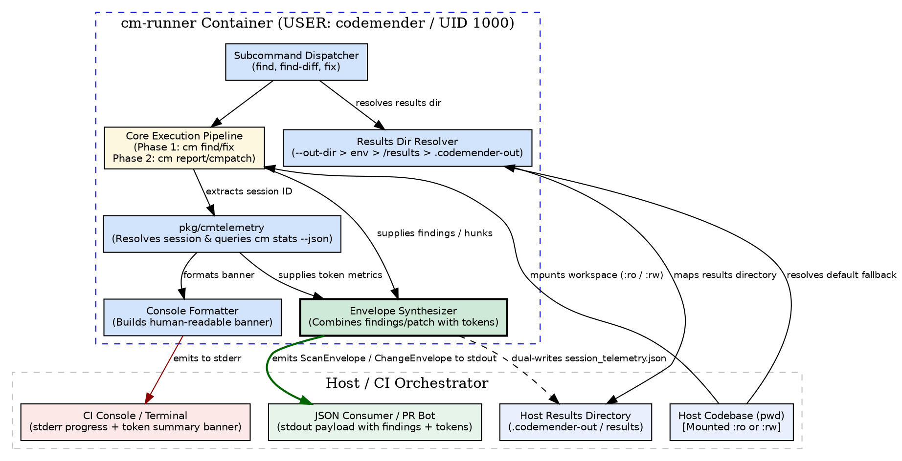

# ADR-0009: In-Band Token Telemetry and Host-Mapped Results Directory Protocol

- **Status:** proposed
- **Date:** 2026-09-01
- **Decision Makers:** Charles LeDoux (ledoux@google.com)

**Shortlink:** go/cm-connect-adr-0009

## Context and Problem Statement

In `cm-connect`, the container runner (`cm-runner`) orchestrates CodeMender (`cm`) CLI executions for batch vulnerability scanning (`find`, `find-diff` per [ADR-0001](ADR-0001.md), [ADR-0007](ADR-0007.md)) and stateless remediation (`fix` per [ADR-0003](ADR-0003.md), [ADR-0005](ADR-0005.md)).

While these commands successfully emit vulnerability findings and patch envelopes, callers currently have zero visibility into LLM resource consumption:
1. **No Token Metrics:** Callers cannot observe input tokens, output tokens, prompt cache hit percentages, or Gemini reasoning/thinking tokens consumed during a command run.
2. **Heterogeneous Payload Contracts:** `find` emits a raw JSON array `[...]`, whereas `fix` emits a JSON object (`ChangeEnvelope`). This prevents uniform metadata/telemetry attachment.
3. **Empty Diff Inconsistency (Amending ADR-0007):** ADR-0007 specified emitting raw `[]` on an empty git diff; to achieve contract uniformity, empty diffs must also emit a structured envelope. ADR-0009 supersedes ADR-0007 in this specific regard.
4. **Lack of Standardized Results Storage:** Benchmarks and analytical reporting tools require an output directory mapped to the host to store raw logs, state snapshots, and detailed multi-run artifacts without polluting the primary `stdout` data stream.

How should `cm-connect` deliver token telemetry back to users across commands while establishing a clean, extensible results directory protocol for future reporting tools?

## Decision Drivers

- **Stream Isolation (ADR-0001, ADR-0002):** The machine-readable data contract on `stdout` MUST NOT be corrupted by log lines, progress indicators, or human-readable banners.
- **Self-Contained Data Payloads:** Primary CI consumers (e.g. `publish_comments.py`) SHOULD receive actionable token metrics directly within the primary output payload without requiring multi-file artifact synchronization.
- **Uniform Output Architecture:** All core execution commands (`find`, `find-diff`, `fix`) SHOULD share a consistent top-level JSON object pattern with dedicated telemetry blocks.
- **Backward Compatibility for Downstream Tooling:** Downstream consumers (such as `filter_findings.jq` per [ADR-0006](ADR-0006.md) and PR comment bots) MUST gracefully handle both legacy arrays and new envelope structures without breaking.
- **Zero Third-Party Dependencies (ADR-0002):** The Go entrypoint runner MUST remain 100% dependency-free in `go.mod`, relying exclusively on the Go standard library and CodeMender's native `cm stats` CLI.
- **Resilient Telemetry (Graceful Degradation):** Telemetry collection is non-functional observability data. A failure during token discovery, session resolution, or `cm stats` execution MUST NEVER block, abort, or fail the primary scan or fix operation.
- **FinOps & Cost Governance:** Token telemetry provides essential visibility for model routing, prompt optimization, cache warming verification, thinking token containment, and organizational cost attribution.
- **Deterministic Results Directory Resolution:** The system MUST provide clear, predictable precedence for mapping an artifacts/results directory to the host across local developer runs, Docker containers, and GitHub Actions runners.
- **Separation of Concerns:** In-band `stdout` payloads MUST remain lightweight and focused on the immediate task, while the results directory is reserved for deep, specialized analysis (session logs, SQLite snapshots, CSV ledgers).

## Considered Options

### Option 1: Unified In-Band JSON Telemetry with Dedicated Results Directory (Chosen)

Emits token telemetry in-band directly on `stdout`:
- `find` and `find-diff` emit a **Scan Envelope** object: `{"findings": [...], "tokens": {...}}`.
- `fix` enriches `ChangeEnvelope` with a `"tokens"` block.
- At command completion, `cm-runner` captures the session ID, queries `/usr/local/bin/cm stats --session <id> --json`, formats a human-readable telemetry summary to `stderr`, and populates the in-band `"tokens"` block.
- Resolves an artifacts/results directory (`--out-dir`, `CM_OUTPUT_DIR`, mounted `/results`, or `<workspace>/.codemender-out`) reserved for specialized multi-run reports and raw debug artifacts.

### Option 2: Out-of-Band Sidecar File Generation Only (`tokens.json`)

Keep `stdout` strictly unchanged (raw findings array on `find`) and write token metrics exclusively to an external sidecar file (`tokens.json`) in the results directory.

- **Good, because** it avoids altering the top-level shape of `find`'s `stdout`.
- **Bad, because** downstream consumers like `publish_comments.py` must manage file paths, synchronization, and volume mounts to display token usage in pull request summaries.
- **Bad, because** piping `stdout` to a consumer does not carry token context.

### Option 3: Human-Readable `stderr` Scraping Only

Only print token metrics to `stderr` in human-readable table format; do not include tokens in structured JSON.

- **Good, because** zero changes to JSON payloads.
- **Bad, because** automated CI reporting tools and metric dashboards cannot reliably or programmatically parse token data without fragile regex scraping of diagnostic logs.

## Decision Outcome

Chosen option: **Option 1: Unified In-Band JSON Telemetry with Dedicated Results Directory**.

### Justification

1. **Self-Contained Payloads:** By including `"tokens"` inside the primary JSON payload, any tool capturing `stdout` (e.g. `findings.json` in GitHub Actions) has immediate, guaranteed access to the execution's token metrics without file discovery heuristics.
2. **Harmonized Contract:** Standardizes all commands (`find`, `find-diff`, `fix`) on a uniform top-level JSON object.
3. **Clean Separation of Concerns:** In-band `stdout` stays lean for immediate gating, while the host-mapped results directory is kept clean and reserved for heavy multi-run benchmarks, raw session logs, and SQLite snapshots.
4. **Trivial Downstream Backward Compatibility:** A 1-line normalization in `filter_findings.jq` and `publish_comments.py` allows existing workflows to process both envelopes and legacy arrays seamlessly.

## Architecture & Data Flow



## Protocol & Schema Specification

### 1. CLI Grammar & Wrapper Flag Interception

To comply with ADR-0002's `os.Args[1]` dispatch and passthrough boundaries:

1. **Canonical Grammar:**
   ```
   cm-runner <subcommand> [--out-dir=<path> | --results-dir=<path>] [subcommand-args...] [-- [cm-flags...]]
   ```
2. **Wrapper-Domain Flag Interception:**
   - In `cmd/cm-runner/dispatch.go`, wrapper-level results directory flags (`--out-dir=<path>`, `--out-dir <path>`, `--results-dir=<path>`, and `--results-dir <path>`) MUST be extracted and stripped *prior* to subcommand positional partitioning.
   - For `find-diff`, stripped wrapper flags MUST NEVER be forwarded into `gitDiffArgs` (preventing git fatal errors).
   - For `fix`, stripped wrapper flags MUST NEVER be interpreted as the positional `<finding.json | ->` target.
3. **Lazy Directory Creation:**
   - To prevent unnecessary filesystem churn or premature permission errors, `cm-runner` MUST only create the resolved results directory when an artifact is actually written to disk.

### 2. Results Directory Precedence & Permission Fallback

The results directory MUST be resolved using the following order of precedence:
1. **CLI Flag:** Explicit `--out-dir=<path>` or `--results-dir=<path>` passed to `cm-runner`.
2. **Environment Variable:** `CM_OUTPUT_DIR` or `CM_RESULTS_DIR`.
3. **Standard Container Volume Mount:** `/results` (if it exists and is an active directory).
4. **Default Workspace Fallback:** `<workspace>/.codemender-out` (automatically created if not present).
5. **Permission & Read-Only Fallback:** If the resolved directory cannot be created or is not writable (e.g. read-only filesystem `EROFS` under OverlayFS or permission denied `EACCES`), `cm-runner` MUST automatically fall back to `/tmp/.codemender-out` and emit an informational log to `stderr`.

**Dual-Write Telemetry Persistence:** While `stdout` serves as the primary contract for CI orchestration, `cm-runner` SHOULD also write `session_telemetry.json` (and the synthesized envelope JSON) into the resolved results directory upon completion for artifact uploaders (`actions/upload-artifact`).

### 3. Session ID Discovery & Graceful Degradation Protocol

1. **Discovery Without Third-Party Drivers:** To preserve ADR-0002's zero-dependency guarantee in `go.mod`, `cm-runner` MUST NOT link against CGO SQLite drivers. Instead, it extracts the active session ID by parsing the standard log notification line emitted to `stderr` by CodeMender (`Session log: .../<TIMESTAMP>_<SESSION_ID>.log`).
2. **Precision Stats Resolution:** Invokes `/usr/local/bin/cm stats --session <session_id> --json` in an isolated subprocess.
3. **Deterministic Graceful Degradation:** If session extraction fails or `cm stats` returns a non-zero exit code, `cm-runner` MUST:
   - Emit an informational warning to `stderr` (`Warning: failed to resolve token telemetry: <err>`).
   - Populate the envelope with a fully-typed zeroed `TokenMetrics` object (`total_tokens: 0`, `duration_seconds: 0.0`) to avoid downstream `AttributeError` / null dereference exceptions.
   - **Crucially:** Preserve the underlying command's original exit code (`0` clean, `1` findings/unresolved). Telemetry resolution failure MUST NEVER fail a CI build or mask security findings.

### 4. Token Metrics Schema (`TokenMetrics`)

```json
{
  "input_tokens": 78412,
  "output_tokens": 1840,
  "cached_tokens": 24190,
  "thought_tokens": 5210,
  "total_tokens": 85462,
  "cache_hit_percent": 30.85,
  "think_ratio_percent": 283.15,
  "duration_seconds": 18.42,
  "duration_formatted": "18.4s"
}
```

### 5. Scan Envelope Schema (`find` and `find-diff`)

```json
{
  "findings": [
    {
      "FindingID": "478a8868-b05a-5258-99ac-aa9e932374a7",
      "Title": "SQL Injection in User Lookup",
      "FilePath": "/workspace/pkg/auth/store.go",
      "Severity": "CRITICAL",
      "Confidence": 100,
      "Analysis": "...",
      "Snippet": "...",
      "VulnType": "SQL_INJECTION",
      "VulnID": "CWE-89",
      "StartLine": 42,
      "EndLine": 45,
      "Status": "OPEN"
    }
  ],
  "tokens": {
    "input_tokens": 78412,
    "output_tokens": 1840,
    "cached_tokens": 24190,
    "thought_tokens": 5210,
    "total_tokens": 85462,
    "cache_hit_percent": 30.85,
    "think_ratio_percent": 283.15,
    "duration_seconds": 18.42,
    "duration_formatted": "18.4s"
  }
}
```

**Empty Diff & Clean Scan Contract (Amending ADR-0007):** On a clean codebase with 0 findings or when `find-diff` encounters an empty diff (0 modified bytes), `cm-runner` MUST emit `{"findings": [], "tokens": {...}}` on `stdout` and exit with code `0`. For empty-diff short-circuits where CodeMender was not executed, all token values MUST be zeroed (`total_tokens: 0`, `duration_seconds: 0.0`). Raw `[]` output is deprecated in favor of envelope uniformity.

### 6. ChangeEnvelope Schema (`fix`)

```json
{
  "finding_id": "478a8868-b05a-5258-99ac-aa9e932374a7",
  "status": "FIXED",
  "vuln_type": "CWE-89",
  "title": "SQL Injection in User Lookup",
  "summary": "...",
  "files_modified": ["pkg/auth/store.go"],
  "patch": "diff --git ...",
  "hunks": [...],
  "tokens": {
    "input_tokens": 12450,
    "output_tokens": 850,
    "cached_tokens": 8200,
    "thought_tokens": 1200,
    "total_tokens": 14500,
    "cache_hit_percent": 65.8,
    "think_ratio_percent": 141.18,
    "duration_seconds": 12.3,
    "duration_formatted": "12.3s"
  }
}
```

### 7. Stderr Diagnostic Banner Format

```
┌─────────────────────────────────────────────────────────────┐
│ 🪙  CodeMender Token Telemetry (Session: abc-123)           │
├───────────────────────┬─────────────────────────────────────┤
│ Input Tokens          │ 78,412 (78.4k)                      │
│ Cached Tokens         │ 24,190 (24.2k) [30.8% cache hit]    │
│ Output Tokens         │  1,840 (1.8k)                       │
│ Thought Tokens        │  5,210 (5.2k)                       │
│ Grand Total           │ 85,462 (85.5k)                      │
│ Duration              │ 18.4s                               │
└───────────────────────┴─────────────────────────────────────┘
```

*Note on Terminal Capabilities:* When running under non-UTF8 locales or when `NO_COLOR` is set, `cm-runner` MUST fall back to standard 7-bit ASCII borders (`+`, `-`, `|`) and omit emojis to prevent terminal mojibake.

## Consequences

- **Good, because** developers and CI pipelines gain immediate, transparent visibility into LLM token consumption and caching efficiency.
- **Good, because** `stdout` remains 100% parseable JSON, while operational diagnostics are cleanly kept on `stderr`.
- **Good, because** in-band telemetry eliminates the need for separate file coordination in CI PR review bots.
- **Good, because** establishing the results directory hierarchy provides an extensible home for future multi-run benchmark aggregators and deep analytics.
- **Good, because** zeroed fallback metrics ensure downstream CI pipelines never crash due to telemetry lookup failures.
- **Neutral, because** `find`'s top-level payload transitions from a raw array to an object; however, downstream tools in `github-actions/` are updated to support both schemas transparently.

## Confirmation / Verification Strategy

Compliance will be verified via automated unit and integration tests:

1. **In-Band Token Telemetry Test (`find` & `find-diff`):**
   - Execute `cm-runner find` against a fixture with known findings.
   - Assert `stdout` parses as valid JSON matching `ScanEnvelope` schema.
   - Assert `findings` is a non-empty array and exit code equals `1`.
   - Assert `tokens.input_tokens > 0`, `tokens.output_tokens > 0`, `tokens.total_tokens > 0`, and `tokens.duration_seconds > 0`.

2. **Clean Scan & Empty Diff Uniformity Test:**
   - Execute `cm-runner find` on a clean codebase (0 findings); assert exit code `0` and `stdout` is `{"findings": [], "tokens": {...}}`.
   - Execute `cm-runner find-diff origin/main HEAD` with an empty diff (0 modified bytes); assert exit code `0`, `stdout` is `{"findings": [], "tokens": {...}}`, and `tokens.total_tokens == 0`.

3. **In-Band Token Telemetry Test (`fix`):**
   - Execute `cm-runner fix /tmp/finding.json` for a resolvable finding.
   - Assert `stdout` parses as `ChangeEnvelope` with `status: "FIXED"` and a populated `tokens` object.
   - Execute `cm-runner fix /tmp/unresolvable.json`; assert `stdout` contains `status: "UNRESOLVED"` and a populated `tokens` object.

4. **Graceful Degradation & Exit Code Preservation Test:**
   - Mock `/usr/local/bin/cm stats` to exit with status `1` (simulating stats failure).
   - Execute `cm-runner find` on a vulnerable codebase.
   - Assert the process terminates with status code `1` (finding detection preserved).
   - Assert `stderr` contains `Warning: failed to resolve token telemetry`.
   - Assert `stdout` remains valid JSON with zeroed `tokens` block.

5. **Stderr Diagnostic Banner & Locale Fallback Test:**
   - Verify standard run emits UTF-8 boxed table with emoji (`🪙`) and metric notation (`78.4k`, `%`) to `stderr`.
   - Execute with `NO_COLOR=1` or `LC_ALL=C`; assert `stderr` table uses ASCII borders (`+`, `-`, `|`) and emojis are omitted.

6. **Results Directory Precedence & Fallback Test:**
   - Pass `--out-dir=/custom/results`; assert resolution selects `/custom/results`.
   - Set `CM_OUTPUT_DIR=/env/results`; assert resolution selects `/env/results` (overridden by `--out-dir`).
   - Mock volume mount at `/results`; assert resolution selects `/results` when no flag or env var is present.
   - Execute without flags/env on a standard workspace; assert `<workspace>/.codemender-out` is created.
   - Mock `/workspace` as read-only filesystem (`EROFS`); assert resolution falls back to `/tmp/.codemender-out` and logs an informational notice to `stderr`.
   - Assert `session_telemetry.json` is written into the resolved results directory upon completion.

7. **CLI Flag Isolation & Subcommand Dispatch Test:**
   - Execute `cm-runner find-diff --out-dir=/tmp/out origin/main HEAD -- -c 5`.
   - Assert `--out-dir` is intercepted by wrapper and **not** forwarded to `git diff` or `cm find`.
   - Assert `cm-runner --out-dir=/tmp/out find` fails with `unrecognized subcommand` (preserving ADR-0002 exact `os.Args[1]` dispatch).

8. **Downstream Backward Compatibility & PR Reporting Test:**
   - Execute `filter_findings.jq` against both `ScanEnvelope` (`{"findings": [...]}`) and legacy array (`[...]`); assert identical filtered finding matrices.
   - Execute `publish_comments.py --mode=summary` with a `ScanEnvelope`; assert the summary markdown contains both the Finding Breakdown table and the **Token Ledger** table.

## References

- [ADR-0001: CodeMender Headless Batch Runner Container Protocol](ADR-0001.md)
- [ADR-0002: Flag Parsing and Passthrough Strategy for Subprocess Execution](ADR-0002.md)
- [ADR-0005: Stateless Finding Ingestion and Patch Generation Container Protocol (fix)](ADR-0005.md)
- [ADR-0006: Diff-Scoped Finding Filtering and Dynamic Matrix Generation Strategy](ADR-0006.md)
- [ADR-0007: Native Diff-Aware Vulnerability Scanning Container Protocol (find-diff)](ADR-0007.md)
- [ADR-0008: Git Integration Architecture](ADR-0008.md)
- [cm-token-reporting Proposal](../openspec/proposals/cm-token-reporting/proposal.md)
