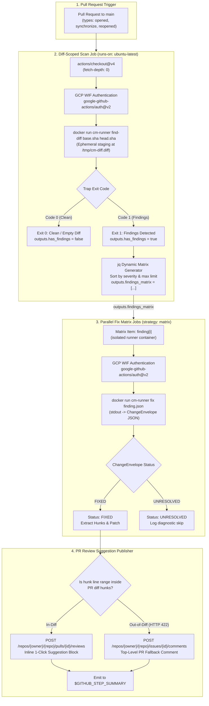
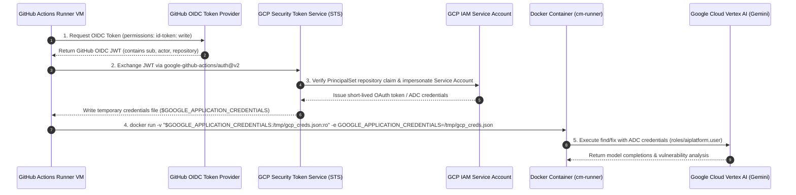

# CodeMender GitHub Actions CI/CD PR Review Workflow

Automated, AI-powered security scanning and patch remediation workflow for GitHub Pull Requests powered by CodeMender (`cm`) and Google Cloud Vertex AI.

---

## Why CodeMender Connect?

Integrating security analysis into developer workflows is often friction-heavy: full-repository scans are slow and noisy, remediations require context switching, and CI pipelines become brittle. 

**CodeMender Connect** provides an opinionated, production-grade GitHub Actions integration designed to catch and fix vulnerabilities directly within the Pull Request lifecycle without slowing down development:

* **Diff-Scoped Scanning (`find-diff`):** Scans only the modified lines and hunks in the pull request. Rather than rescanning the entire repository on every commit (which is expensive, slow, and creates alert fatigue), CodeMender ensures that incoming code changes do not introduce new vulnerabilities or degrade existing security posture. Pre-existing issues outside the PR diff are captured as non-blocking advisory summaries that keep CI green.
* **Parallel Fix Remediation:** Detected vulnerabilities are partitioned and dispatched across parallel GitHub Actions matrix jobs. Remediation is distributed rather than serialized in a monolithic run—if one fix fails, times out, or remains unresolved, it does not block or impact other fixes.
* **1-Click Apply Suggested Edits:** Remediations are published directly to the Pull Request review interface as native GitHub review suggestions (` ```suggestion ` blocks). Developers can inspect, review, and apply the AI-generated patches with a single click. If changes fall outside the diff boundary, the workflow gracefully falls back to top-level issue comments and step summaries.
* **Containerized Userspace Sandbox & Keyless WIF:** Zero host toolchain installation. All scanner and fix agent tasks execute unprivileged inside a hardened Docker container (`cm-runner`) authenticated via keyless Google Cloud Workload Identity Federation (ADC). No static API keys or persistent service account credentials are stored in GitHub secrets.

---

## Architecture Overview & Workflow Lifecycle

The CodeMender review pipeline executes as a distributed two-stage workflow on every pull request targeting the default branch (`main`).



### 1. Diff-Scoped Vulnerability Scanning (`scan`)

1. **Native Diff-Aware Scanning (`find-diff`):** The scan job extracts the PR base and head commit SHAs and executes `cm-runner find-diff`:
   ```bash
   docker run --rm \
     --user "$(id -u):$(id -g)" \
     -v "$(pwd):/workspace" \
     -v "${GOOGLE_APPLICATION_CREDENTIALS}:/tmp/gcp_creds.json:ro" \
     -e GOOGLE_APPLICATION_CREDENTIALS=/tmp/gcp_creds.json \
     -e NO_COLOR=1 \
     -e TERM=dumb \
     ghcr.io/cledoux/cm-runner:latest find-diff "${{ github.event.pull_request.base.sha }}" "${{ github.event.pull_request.head.sha }}" > .codemender-out/findings.json
   ```
2. **Ephemeral Scratch Staging & `git clean` Immunity:** Unified diffs are generated and staged in container scratch space (`/tmp/cm-diff.diff`), completely isolated from `/workspace`. This protects against internal scanner cleanup routines (`git clean -fdx`) and prevents leftover diff files from polluting subsequent patch extraction.
3. **Scanner Exit Code Trapping:**
   * **Exit Code 0 (Clean / Empty Diff):** No vulnerabilities found or PR diff was 0 bytes. Sets `has_findings=false` and terminates successfully without spawning downstream fix jobs.
   * **Exit Code 1 (Findings Detected):** Captures findings JSON to `.codemender-out/findings.json` and sets `has_findings=true`.
   * **Exit Code > 1 (Error):** Fatal Git, CLI, or runtime error (e.g. shallow clone requiring `fetch-depth: 0`); fails the CI step.
4. **Dynamic Matrix Partitioning (`filter_findings.jq`):** The scan job cross-references finding locations against the PR diff:
   * **In-Diff Findings:** Sorted by severity (`CRITICAL` > `HIGH` > `MEDIUM` > `LOW`), bounded to the top $M$ items (default: 10), and exported as `outputs.findings_matrix` for the downstream fix matrix.
   * **Out-of-Diff Preexisting Findings:** Captured and posted as non-blocking advisory comments and step summary cards, keeping the PR status green.

### 2. Parallel Stateless Patch Remediation (`fix`)

1. **Dynamic Matrix Dispatch:** GitHub Actions dynamically spawns parallel jobs using:
   ```yaml
   strategy:
     fail-fast: false
     matrix:
       finding: ${{ fromJson(needs.scan.outputs.findings_matrix) }}
   ```
2. **Stateless Agent Execution:** Each matrix job pipes a single finding JSON payload into `cm-runner fix -` and captures the structured `ChangeEnvelope` JSON from `stdout`.
3. **Remediation Status:**
   * `status == "FIXED"`: Formats diff hunks into 1-click apply review suggestions.
   * `status == "UNRESOLVED"`: Logs a diagnostic summary and completes cleanly without failing the check run.

### 3. PR Review Suggestions & Fallback Handling (`publish_comments.py`)

* **1-Click Apply Review Comments:** For modified hunks within the pull request diff, posts an inline review comment using `POST /repos/{owner}/{repo}/pulls/{id}/reviews` with a markdown suggestion:
  ````markdown
  ### 🛡️ CodeMender Fix: SQL Injection in User Lookup

  Replaced string concatenation with parameterized query.

  ```suggestion
      query := "SELECT * FROM users WHERE id = $1"
      row := db.QueryRowContext(ctx, query, id)
  ```
  ````
* **Diff-Boundary Fallback (HTTP 422 Mitigation):** If the GitHub API rejects an inline comment with HTTP `422 Unprocessable Entity` (line outside PR diff hunks), the publisher automatically catches the error and posts a top-level issue comment via `POST /repos/{owner}/{repo}/issues/{id}/comments` and writes the patch to `$GITHUB_STEP_SUMMARY`.

---

## How to Set Up in Your Own Repository

### Prerequisites

1. **Google Cloud Project:** With billing and Vertex AI API (`aiplatform.googleapis.com`) enabled:
   ```bash
   gcloud services enable aiplatform.googleapis.com --project="my-gcp-project"
   ```
2. **Target GitHub Repository:** With GitHub Actions enabled.
3. **GitHub CLI (`gh`):** Authenticated with `write:packages` scope if building and pushing the container image to GHCR:
   ```bash
   gh auth refresh -s write:packages
   ```

---

### Step 1: Install Workflow & Assets using `install.sh`

From the `cm-connect` repository, run `./github-actions/install.sh` pointing to your target repository path:

```bash
# Full automated build, GHCR push, workflow templating, and asset installation:
./github-actions/install.sh /path/to/target-repository
```

`install.sh` performs the following steps automatically:
1. Auto-discovers the target repository slug (`owner/repo`) from `git remote origin`.
2. Authenticates Docker to `ghcr.io` using `gh auth token`.
3. Builds the `cm-runner` container image locally with OCI image source labels.
4. Pushes the container image to `ghcr.io/<owner>/<repo>/cm-runner:latest`.
5. Templates `workflows/codemender.yml` with the resolved image tag and writes it to `<target-repo>/.github/workflows/codemender.yml`.
6. Copies companion helper scripts (`filter_findings.jq`, `publish_comments.py`, `setup-wif.sh`) into `<target-repo>/.github/scripts/`.
7. Copies the Terraform WIF module into `<target-repo>/.github/terraform/`.

#### Flag Options

* `--skip-build`: Skip local Docker building and GHCR pushing (useful if the image is already built or using a pre-existing registry image):
  ```bash
  ./github-actions/install.sh --skip-build /path/to/target-repo
  ```
* `--image <tag>`: Override the container image reference in the templated workflow:
  ```bash
  ./github-actions/install.sh --image custom-registry.io/org/cm:v1 /path/to/target-repo
  ```
* `--repo <slug>`: Explicitly specify the target repository slug (`owner/repo`) instead of auto-discovering:
  ```bash
  ./github-actions/install.sh --repo my-org/my-app /path/to/target-repo
  ```

---

### Step 2: Provision Google Cloud Workload Identity Federation (WIF) & IAM

Choose one of two methods to provision Google Cloud WIF resources and IAM bindings:

#### Option A: Declarative Terraform Module (Recommended)

Navigate to the copied Terraform directory in your target repository (or `github-actions/terraform/` in `cm-connect`):

```bash
cd .github/terraform # or cd github-actions/terraform
cp terraform.tfvars.example terraform.tfvars
```

Edit `terraform.tfvars`:
```hcl
project_id  = "my-gcp-project"
github_repo = "my-org/my-target-repo"
```

Initialize and apply:
```bash
terraform init
terraform apply
```

Terraform outputs the generated secret values:
```
Outputs:
gcp_service_account = "codemender-runner@my-gcp-project.iam.gserviceaccount.com"
gcp_wif_provider = "projects/123456789012/locations/global/workloadIdentityPools/codemender-pool/providers/codemender-provider"
```

#### Option B: Automated CLI Helper Script

Alternatively, execute the automated `setup-wif.sh` helper script with active `gcloud` credentials:

```bash
# Run WIF automated setup script:
./.github/scripts/setup-wif.sh \
    --project="my-gcp-project" \
    --repo="my-org/my-target-repo" \
    --pool-name="codemender-pool" \
    --provider-name="codemender-provider" \
    --service-account="codemender-runner"
```

To view the commands before executing, add `--dry-run`:
```bash
./.github/scripts/setup-wif.sh --project="my-gcp-project" --repo="my-org/my-target-repo" --dry-run
```

---

### Step 3: Add GitHub Repository Secrets

Configure the two required repository secrets in your target GitHub repository under **Settings > Secrets and variables > Actions**:

| Secret Name | Description | Example Format |
| :--- | :--- | :--- |
| `GCP_WIF_PROVIDER` | Full resource path of the Workload Identity Provider | `projects/123456789012/locations/global/workloadIdentityPools/codemender-pool/providers/codemender-provider` |
| `GCP_SERVICE_ACCOUNT` | Email address of the dedicated GCP Service Account | `codemender-runner@my-gcp-project.iam.gserviceaccount.com` |

---

### Step 4: Verify on a Pull Request

1. Create a feature branch in your target repository and introduce code changes.
2. Open a Pull Request targeting `main`.
3. Verify that the **Scan PR Diff for Vulnerabilities** job executes.
4. If findings are detected, observe parallel **Fix Finding** jobs launch concurrently and attach inline ````suggestion```` comments to the Pull Request.

---

## Reference & Technical Architecture

### Google Cloud Workload Identity Federation (WIF) Sequence

The workflow establishes a keyless trust relationship between GitHub Actions OIDC tokens and Google Cloud Vertex AI:



### Required Workflow Permissions

The templated GitHub Actions workflow requires the following permissions in the job definitions:

```yaml
permissions:
  contents: read        # Read repository code and commit history (actions/checkout)
  id-token: write       # Request GitHub OIDC JWT for GCP WIF authentication
  packages: read        # Pull cm-runner container image from GHCR
  pull-requests: write  # Publish review comments, PR suggestions, and summaries
```

### Required Google Cloud IAM Roles

The provisioned GCP Service Account and Workload Identity Provider require:

1. **`roles/aiplatform.user`:** Granted to the Service Account on the GCP project hosting Vertex AI models.
2. **`roles/iam.workloadIdentityUser`:** Bound on the Service Account to the Workload Identity Pool PrincipalSet:
   ```
   principalSet://iam.googleapis.com/projects/<PROJECT_NUM>/locations/global/workloadIdentityPools/<POOL>/attribute.repository/<OWNER>/<REPO>
   ```

### Package Directory Structure

```
github-actions/
├── README.md               # Quickstart onboarding, architecture, and configuration guide
├── install.sh              # One-command installer (builds/pushes image & templates workflow)
├── scripts/
│   ├── filter_findings.jq  # jq filter for diff-scoped matrix partitioning
│   ├── publish_comments.py # PR inline suggestion and fallback comment publisher
│   └── setup-wif.sh        # GCP IAM & WIF automated CLI setup script
├── terraform/              # Declarative GCP WIF & IAM Terraform module
│   ├── main.tf             # WIF pool, provider, SA, and IAM member resources
│   ├── outputs.tf          # Output values for GitHub secrets
│   ├── variables.tf        # Configurable variables (project_id, github_repo, etc.)
│   ├── versions.tf         # Terraform and Google provider version constraints
│   ├── terraform.tfvars.example # Example variable definitions
│   └── README.md           # Terraform usage guide
└── workflows/
    └── codemender.yml      # Standalone GitHub Actions workflow template
```

> **Note on Repository Isolation:** All workflow template assets are maintained under `github-actions/` rather than `.github/` within `cm-connect` to prevent unintentional CI executions on the development repository itself. Running `install.sh` copies and configures them into `.github/` inside target repositories.
