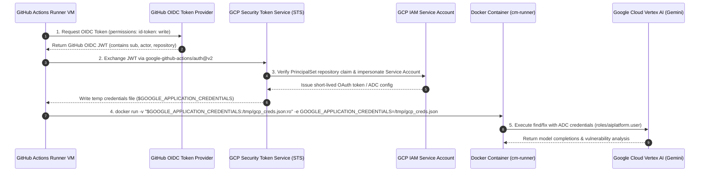

# CodeMender GitHub Actions CI/CD PR Review Workflow

This directory provides an opinionated, production-grade GitHub Actions CI/CD
workflow template and setup tooling for automated CodeMender (`cm`) security
scanning and patch remediation on pull requests.

For architectural background and specification details, see:

- [cm-pr-workflow Specification](../openspec/specs/workflow/cm-pr-workflow/spec.md)
- [cm-pr-workflow Design Document](../openspec/specs/workflow/cm-pr-workflow/design.md)
- [cm-pr-workflow Proposal](../openspec/proposals/cm-pr-workflow/proposal.md)
- [ADR-0001: Headless Batch Scanner](../adrs/ADR-0001.md)
- [ADR-0005: Stateless Fix Runner Protocol](../adrs/ADR-0005.md)

______________________________________________________________________

## Architecture Overview

The CodeMender review pipeline executes as a distributed two-stage workflow on
every pull request targeting the default branch (`main`).

````mermaid
flowchart TD
    subgraph Trigger["1. Pull Request Trigger"]
        PR["Pull Request to main<br>(types: opened, synchronize, reopened)"]
    end

    subgraph ScanJob["2. Scan Job (runs-on: ubuntu-latest)"]
        direction TB
        Checkout["actions/checkout@v4<br>(fetch-depth: 0)"]
        DiffExtract["Dump Pull Request Diff<br>git diff ${{ github.event.pull_request.base.sha }} ${{ github.event.pull_request.head.sha }} > commit.diff"]
        WIFScan["GCP WIF Authentication<br>google-github-actions/auth@v2"]
        DockerFind["docker run cm-runner find .<br>(stdout -> findings.json)"]
        ExitTrap{"Trap Exit Code"}
        CleanExit["Exit 0: Clean<br>outputs.has_findings = false"]
        FindingsExit["Exit 1: Findings Detected<br>outputs.has_findings = true"]
        MatrixGen["jq Dynamic Matrix Generator<br>Filter by commit.diff & sort by severity<br>outputs.findings_matrix = [...]"]

        Checkout --> DiffExtract --> WIFScan --> DockerFind --> ExitTrap
        ExitTrap -->|Code 0| CleanExit
        ExitTrap -->|Code 1| FindingsExit --> MatrixGen
    end

    subgraph FixMatrixJob["3. Parallel Fix Matrix Jobs (strategy: matrix)"]
        direction TB
        MatrixItem["Matrix Item: finding[i]<br>(isolated VM / container)"]
        WIFFix["GCP WIF Authentication<br>google-github-actions/auth@v2"]
        DockerFix["docker run cm-runner fix finding.json<br>(stdout -> ChangeEnvelope JSON)"]
        FixVerdict{"ChangeEnvelope Status"}
        Fixed["Status: FIXED<br>Extract Hunks & Patch"]
        Unresolved["Status: UNRESOLVED<br>Log diagnostic skip"]

        MatrixItem --> WIFFix --> DockerFix --> FixVerdict
        FixVerdict -->|FIXED| Fixed
        FixVerdict -->|UNRESOLVED| Unresolved
    end

    subgraph ReviewBot["4. PR Review Suggestion Publisher"]
        direction TB
        DiffCheck{"Is hunk line range inside<br>commit.diff hunks?"}
        PostInline["POST /repos/{owner}/{repo}/pulls/{id}/reviews<br>Inline ```suggestion``` block"]
        PostFallback["POST /repos/{owner}/{repo}/issues/{id}/comments<br>Top-Level PR Comment with ```diff```"]
        StepSummary["Emit to $GITHUB_STEP_SUMMARY"]

        Fixed --> DiffCheck
        DiffCheck -->|Yes (In-Diff)| PostInline
        DiffCheck -->|No (Out-of-Diff)| PostFallback
        PostInline & PostFallback --> StepSummary
    end

    PR --> ScanJob
    MatrixGen -->|outputs.findings_matrix| FixMatrixJob
````

### 1. Diff-Scoped Vulnerability Scanning (`scan`)

- **Diff Ingestion via `commit.diff`:** Checks out full history
  (`fetch-depth: 0`) and dumps the exact pull request diff:
  ```bash
  git diff ${{ github.event.pull_request.base.sha }} ${{ github.event.pull_request.head.sha }} > commit.diff
  ```
  Scoping analysis strictly to modified lines eliminates developer review
  fatigue caused by pre-existing legacy issues.
- **Keyless GCP WIF Authentication:** Uses `google-github-actions/auth@v2` with
  the runner's OIDC token (`id-token: write`) to generate short-lived
  Application Default Credentials (ADC).
- **Scanner Execution & Exit Code Trapping:** Executes `cm-runner find .`:
  - **Exit Code 0 (Clean):** Zero vulnerabilities found. Sets
    `has_findings=false` and terminates successfully.
  - **Exit Code 1 (Findings Detected):** Captures findings JSON to
    `.codemender-out/findings.json` and sets `has_findings=true`.
  - **Exit Code > 1 (Error):** Fatal CLI/runtime error; fails the step.
- **Dynamic Matrix Partitioning:** Parses findings with `jq`, filters items
  intersecting `commit.diff`, sorts remaining findings by severity (`CRITICAL` >
  `HIGH` > `MEDIUM` > `LOW`), bounds to the top $M$ items (default: 10), and
  emits the JSON payload array to `outputs.findings_matrix`.

### 2. Parallel Stateless Patch Remediation (`fix`)

- **Dynamic Matrix Execution:** Dispatches concurrent runner jobs using
  `strategy: matrix: { finding: ${{ fromJson(needs.scan.outputs.findings_matrix) }} }`
  with `fail-fast: false`.
- **Stateless Agent Fix:** Each job feeds a single finding payload into
  `cm-runner fix` and captures the structured `ChangeEnvelope` JSON from
  `stdout`.
- **Remediation Status:**
  - `status == "FIXED"`: Formats diff hunks into 1-click apply review
    suggestions.
  - `status == "UNRESOLVED"`: Logs diagnostic summary and completes cleanly
    without failing the check run.

### 3. PR Review Suggestions & Fallback Handling

- **1-Click Apply Review Comments:** For each modified hunk located within the
  pull request diff, posts an inline review comment using
  `POST /repos/{owner}/{repo}/pulls/{id}/reviews` with a markdown suggestion:
  ````markdown
  ### 🛡️ CodeMender Auto-Fix Suggestion: SQL Injection in User Lookup
  > **Vulnerability:** CWE-89 | **Severity:** HIGH | **Status:** FIXED

  Replaced string concatenation with parameterized query.

  ```suggestion
      query := "SELECT * FROM users WHERE id = $1"
      row := db.QueryRowContext(ctx, query, id)
  ```
  ````
- **Diff-Boundary Fallback (HTTP 422 Mitigation):** If the GitHub API rejects an
  inline comment with HTTP `422 Unprocessable Entity` (line outside PR diff),
  the step catches the error and posts a top-level issue comment via
  `POST /repos/{owner}/{repo}/issues/{id}/comments` and writes the patch to
  `$GITHUB_STEP_SUMMARY`.

______________________________________________________________________

## Authentication: Google Cloud Workload Identity Federation (WIF)

The workflow connects keylessly to Google Cloud Vertex AI using Workload
Identity Federation, eliminating persistent service account keys.



______________________________________________________________________

## Prerequisites & Required Configuration

### GitHub Repository Secrets

Configure the following repository secrets under **Settings > Secrets and
variables > Actions**:

| Secret Name           | Description                                          | Example Format                                                                                    |
| :-------------------- | :--------------------------------------------------- | :------------------------------------------------------------------------------------------------ |
| `GCP_WIF_PROVIDER`    | Full resource name of the Workload Identity Provider | `projects/123456789/locations/global/workloadIdentityPools/github-pool/providers/github-provider` |
| `GCP_SERVICE_ACCOUNT` | Email address of the dedicated GCP Service Account   | `codemender-runner@my-gcp-project.iam.gserviceaccount.com`                                        |

### Required Workflow Permissions

The workflow requires the following permissions in the job definition:

```yaml
permissions:
  contents: read # Read repository code and commit history
  id-token: write # Request GitHub OIDC JWT for GCP WIF authentication
  pull-requests: write # Publish review comments and PR suggestions
```

### Required Google Cloud IAM Roles

The GCP Service Account and Workload Identity Provider require:

1. **`roles/aiplatform.user`:** Granted to the Service Account on the GCP
   project hosting Vertex AI models.
1. **`roles/iam.workloadIdentityUser`:** Bound on the Service Account to the
   Workload Identity Pool PrincipalSet:
   `principalSet://iam.googleapis.com/projects/<PROJECT_NUM>/locations/global/workloadIdentityPools/<POOL>/attribute.repository/<OWNER>/<REPO>`

______________________________________________________________________

## Quickstart Setup Guide

### Step 1: Install Workflow Template in Target Repository

Use the provided `install.sh` script to copy the workflow template to your
target repository:

```bash
# From the cm-connect repository:
./github-actions/scripts/install.sh /path/to/target-repository
```

This copies `workflows/codemender.yml` into `.github/workflows/codemender.yml`
in the target repository.

### Step 2: Provision GCP WIF & IAM via Helper Script

Run the automated `setup-wif.sh` helper script with `gcloud` credentials to
provision the Workload Identity Pool, Provider, Service Account, and IAM
bindings:

```bash
# Run WIF automated setup script:
./github-actions/scripts/setup-wif.sh \
  --project="my-gcp-project" \
  --repo="my-org/my-target-repo" \
  --pool-name="codemender-pool" \
  --provider-name="github-provider" \
  --service-account="codemender-runner"
```

The script outputs the values for `GCP_WIF_PROVIDER` and `GCP_SERVICE_ACCOUNT`.

### Step 3: Add GitHub Repository Secrets

Add the values returned by `setup-wif.sh` to your target GitHub repository:

1. Navigate to **Settings > Secrets and variables > Actions**.
1. Click **New repository secret**.
1. Create `GCP_WIF_PROVIDER` with the provider resource name.
1. Create `GCP_SERVICE_ACCOUNT` with the service account email.

### Step 4: Verify on Pull Request

1. Create a feature branch and commit changes.
1. Open a pull request targeting `main`.
1. Verify that the `scan` job triggers, evaluates `commit.diff`, and launches
   parallel `fix` matrix jobs to post inline suggestions when findings occur.

______________________________________________________________________

## Package Directory Structure

```
github-actions/
├── README.md               # Quickstart onboarding and configuration guide
├── scripts/
│   ├── install.sh          # One-command installer copying workflow to target repo
│   └── setup-wif.sh        # GCP IAM & Workload Identity Federation configuration script
└── workflows/
    └── codemender.yml      # Standalone GitHub Actions workflow template
```

> **Note on Repository Isolation:** All workflow files are maintained under
> `github-actions/` rather than `.github/` to prevent unintentional automated CI
> execution on `cm-connect`.
