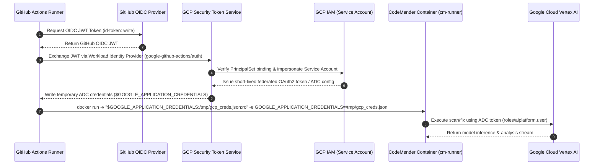

# Proposal: CodeMender GitHub Actions CI/CD PR Review Workflow

**Change ID:** `cm-pr-workflow` \
**Status:** In Review \
**Author:** Charles LeDoux \
**Target Spec:** `openspec/specs/workflow/cm-pr-workflow/spec.md` \
**Governing ADR:** `adrs/ADR-0005.md`

## Why

Automated CI/CD pull request review gating requires a turnkey, zero-friction
GitHub Actions workflow that continuously validates incoming code changes
against security vulnerabilities without generating noise on untouched legacy
code.

With the completion of the headless batch scanner (`cm-runner find` per
ADR-0001) and the stateless remediation runner (`cm-runner fix` per ADR-0005),
`cm-connect` possesses the core engine to detect vulnerabilities and synthesize
structured, hunk-level patches (`ChangeEnvelope`).

To operationalize these capabilities for development teams, we need an
opinionated, standalone example GitHub Actions workflow template and setup
protocol. The workflow must execute on pull requests to `main`, scope its
analysis strictly to the pull request diff, dynamically partition findings
across parallel fix runner jobs, and post review suggestions directly onto the
pull request with 1-click apply diff blocks.

To prevent accidental activation on the `cm-connect` repository itself, the
workflow is maintained as a standalone template under `examples/workflows/` for
developers to copy into their target repositories.

## What Changes

- Create an example GitHub Actions workflow template
  (`examples/workflows/codemender.yml`) and setup guide
  (`examples/workflows/README.md`) implementing a distributed two-stage CI/CD
  pipeline:
  1. **Diff-Scoped Scan Stage (`scan`):**
     - Checks out the pull request codebase with full history
       (`fetch-depth: 0`).
     - Extracts modified files and diff hunks between the base branch and PR
       head (`git diff --name-only origin/main...HEAD`).
     - Authenticates to Google Cloud via Workload Identity Federation (WIF).
     - Executes `cm-runner find` targeting changed paths or filters the findings
       payload strictly to modified lines in the pull request diff, eliminating
       noise from pre-existing untouched codebase vulnerabilities.
     - Emits `findings.json`.
  1. **Partitioning & Dynamic Matrix Dispatch:**
     - Evaluates the scanner exit code and findings array using `jq`.
     - If clean (0 findings in diff), completes immediately with a success
       check.
     - If findings exist ($N \\ge 1$), dynamically constructs a GitHub Actions
       job matrix payload (`outputs.findings_matrix`) containing individual
       finding records.
  1. **Parallel Fix Stage (`fix` with `strategy: matrix`):**
     - Launches $N$ isolated matrix jobs in parallel (with configurable
       `max-parallel` bounds).
     - Each job executes `cm-runner fix` statelessly on a single finding payload
       to generate a structured `ChangeEnvelope` JSON record containing unified
       diff hunks.
  1. **PR Review Suggestion Bot:**
     - Translates `ChangeEnvelope` hunk records into GitHub Pull Request Review
       comments (`POST /repos/{owner}/{repo}/pulls/{id}/reviews`) with markdown
       ```` ```suggestion ```` blocks for instant review and 1-click application
       by developers.
- Maintain the example workflow outside `.github/`:
  - Placed under `examples/workflows/codemender.yml` (and
    `examples/workflows/README.md`) so it serves strictly as an exportable
    template without turning on automated runs in `cm-connect`.
- Provide concrete **Google Cloud Workload Identity Federation (WIF)**
  architecture and authentication setup:
  - Keyless authentication via `google-github-actions/auth@v2` using GitHub's
    OIDC token (`id-token: write`).
  - Exchanges GitHub OIDC token with GCP Security Token Service (STS) to
    impersonate a dedicated Service Account with `roles/aiplatform.user`
    permissions on the CodeMender Vertex AI project.
  - Passes short-lived Application Default Credentials (ADC) securely into the
    Docker container via volume mount
    (`-v "${GOOGLE_APPLICATION_CREDENTIALS}:/tmp/gcp_creds.json:ro"` and
    `-e GOOGLE_APPLICATION_CREDENTIALS=/tmp/gcp_creds.json`), avoiding
    long-lived service account keys in repository secrets.
- Provide comprehensive repository setup and onboarding documentation
  (`examples/workflows/README.md`) covering GCP IAM configuration, Workload
  Identity Pool creation, GitHub repository secrets (`GCP_WIF_PROVIDER`,
  `GCP_SERVICE_ACCOUNT`), and workflow permissions (`pull-requests: write`,
  `id-token: write`, `contents: read`).

## Authentication Architecture



## Capabilities (The Core Contract)

### New Capabilities

- `cm-pr-workflow`: Standalone GitHub Actions CI/CD workflow template and setup
  protocol orchestrating diff-scoped pull request vulnerability scanning,
  dynamic matrix parallel patch remediation via `cm-runner fix`, keyless GCP
  Workload Identity Federation authentication, and automated PR review comment
  generation with inline suggestion diffs. Maps to
  `openspec/specs/workflow/cm-pr-workflow/spec.md`.

### Modified Capabilities

- None.

## Impact

- Provides a clean, exportable GitHub Actions workflow in `examples/workflows/`
  that repository owners can copy and configure in minutes.
- Ensures developer feedback is strictly bounded to the code modified in the
  pull request diff, eliminating review fatigue from legacy repository findings.
- Delivers rapid, parallelized security feedback to developers directly inside
  the GitHub Pull Request UI with 1-click apply remediation patches.
- Guarantees zero credential persistence in GitHub by using Workload Identity
  Federation for all Vertex AI model interactions.
