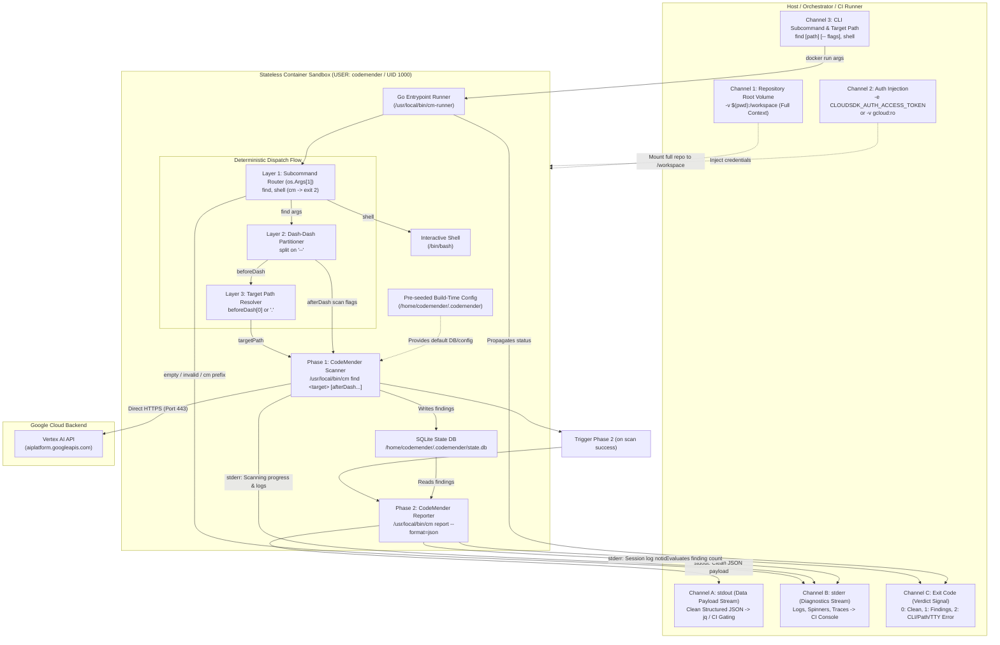

# CodeMender Headless Batch Scanner Container Design (`find`)

## 1. Context & Objectives

To support automated CI/CD gating (e.g. GitHub Actions PR workflows) and
programmatic security analysis, `cm-batch-runner` establishes a headless,
deterministic, and completely stateless Docker scanner container for CodeMender
(`cm`).

Implementing [ADR-0001](../../../../adrs/ADR-0001.md) and
[ADR-0002](../../../../adrs/ADR-0002.md), this capability is focused strictly on
the **`find`** vulnerability scanner phase while establishing an extensible
**Host $\\leftrightarrow$ Container Communication Protocol**:

1. **Exact Subcommand Dispatch (`os.Args[1]`):** `cm-runner` requires an
   explicit subcommand (`find`, `shell`) as `os.Args[1]`. Redundant `cm`
   prefixes are rejected as errors.
1. **Dedicated Structured JSON Output:** `cm-runner find` always emits pure,
   machine-readable JSON on `stdout` by executing `cm report --format=json` in
   Phase 2. It does not accept format flags (`--format`, `-f`).
1. **Clean `--` Delimiter Partitioning:** The CLI contract separates the
   optional target path from unowned subprocess flags via `--`:
   `cm-runner find [path] [-- <cm-find-flags...>]`.
1. **Two-Phase Scan & Report Orchestration:**
   - **Phase 1 (`cm find`):** Performs LLM-driven vulnerability discovery
     against `/workspace` (with progress on `stderr`) and persists findings in
     SQLite (`state.db`).
   - **Phase 2 (`cm report`):** Queries SQLite and emits structured JSON
     findings on `stdout`.
1. **Finding-Aware Exit Codes:** `0` for clean codebases, `1` when findings are
   detected, `2` for usage errors, `>2` for fatal errors.

Dynamic exploit verification (`verify`) and patch remediation (`fix`) are
explicitly scoped out of this design:

- `verify` requires repo-specific application runtime environments and will be
  addressed in a dedicated follow-up capability.
- `fix` requires a dedicated finding import mechanism to populate CodeMender's
  internal database prior to remediation and will also be handled in a separate
  spec.

### Goals

- Establish an unambiguous, extensible Host $\\leftrightarrow$ Container
  Communication Protocol.
- Implement a two-phase scan and report execution pipeline (`cm find`
  $\\rightarrow$ SQLite $\\rightarrow$ `cm report`).
- Guarantee structured, machine-readable JSON output on `stdout`
  (`cm report --format=json`).
- Forward unowned subprocess flags passed after `--` verbatim to `cm find`
  (`-c 5`, `-y`, `--unrestricted`).
- Route all progress spinners, diagnostic logs, and session log paths strictly
  to `stderr`.
- Support both full repository scans (`.`) and scoped sub-path scans (e.g.
  `src/auth`) while always retaining full repository context in `/workspace`.
- Pre-initialize default configuration at container build time and establish
  headless configuration defaults (`.rs` extension inclusion,
  `output.format: json`, `tools.confirm_commands: false`,
  `tools.confirm_writes: false`) via a reusable configuration method so runtime
  `cm init` is never required and unattended scans run without interactive
  stalls.
- Require an explicit subcommand (`find`, `shell`), rejecting ambiguous empty
  invocations or `cm` prefixes with exit code 2.
- Provide interactive debugging support via `shell` with strict TTY validation.
- Provide instant startup (\<1ms) and robust process group signal handling via a
  compiled Go entrypoint binary.
- Support multi-mode authentication (ADC directory mount or
  `CLOUDSDK_AUTH_ACCESS_TOKEN` / `GOOGLE_APPLICATION_CREDENTIALS`).
- Enforce strict unprivileged userspace execution (user `codemender`, UID 1000).

### Non-Goals

- Executing `verify` (deferred to repo-specific runtime runner capability).
- Executing `fix` (deferred to finding ingestion and remediation capability).
- Format negotiation or flag extraction on `find` (guaranteed JSON output).
- Stripping `cm` prefixes dynamically from invocations (enforcing exact
  subcommands).
- Running container processes or shells as `root`.
- Host-level network egress proxying or firewall configuration (CodeMender
  handles sandbox isolation internally).

______________________________________________________________________

## 2. Host $\\leftrightarrow$ Container Communication Protocol

The communication protocol defines formal, isolated channels across the
host-container boundary:



### 2.1 Input Channels (Host $\\rightarrow$ Container)

1. **Workspace Channel (Full Repository Context):**
   - The entire host repository is mounted to `/workspace` (container
     `WORKDIR`).
   - For `find`, read-only (`:ro`) or read-write mounts are supported.
   - Retaining the full repository root gives CodeMender access to root build
     files, dependency manifests, and workspace symbols even when scanning a
     specific sub-module.
1. **Scan Target Path Resolution:**
   - **Full Repository Scan (Default):** If the caller runs `find` without a
     positional path (e.g. `docker run <image> find`), `cm-runner` targets `.`.
   - **Scoped Sub-Path Scan:** If the caller specifies a sub-path (e.g.
     `docker run <image> find src/auth`), `cm-runner` validates that the
     directory/file exists inside `/workspace` and targets that path while
     keeping `/workspace` as the root context.
   - **Path Error:** If the sub-path does not exist in `/workspace`, `cm-runner`
     terminates immediately with exit code 2 and outputs an error to `stderr`.
1. **Authentication Channel:**
   - **Access Token:**
     `-e CLOUDSDK_AUTH_ACCESS_TOKEN="$(gcloud auth print-access-token)"` (ideal
     for ephemeral CI runners).
   - **Workload Identity:**
     `-e GOOGLE_APPLICATION_CREDENTIALS=/auth/creds.json -v /host/path:/auth/creds.json:ro`.
   - **Host ADC Directory:**
     `-v ~/.config/gcloud:/home/codemender/.config/gcloud:ro` (ideal for local
     development).
1. **Command & Argument Channel:**
   - Explicit CLI tokens passed to `docker run <image> <subcommand> [flags]`.
   - Partitioned by `--`: target path before `--`, uninspected `cm find` flags
     after `--`.

### 2.2 Output Channels (Container $\\rightarrow$ Host)

1. **Data Payload Stream (`stdout`):**
   - Exclusively reserved for structured machine-readable JSON emitted by
     `cm report --format=json`.
   - Guaranteed zero log contamination (no banner headers, progress text, or
     ANSI escape codes).
   - Pipeable directly to `jq`, artifact uploaders, or downstream CI steps.
1. **Diagnostics Stream (`stderr`):**
   - Captures all human-readable diagnostic messages, progress spinners, LLM
     reasoning telemetry, session log paths, and error traces from both phases.
   - Redirectable to CI step logs (`2> run.log`).
1. **Verdict & Status Channel (Exit Codes):**
   - `0`: Scan completed cleanly with zero findings.
   - `1`: Scan completed with findings detected (actionable CI PR gating
     signal).
   - `2`: Invocation / CLI error (missing subcommand, non-existent target path,
     unrecognized flag, `cm` prefix, or `shell` invoked without pseudo-TTY).
   - `> 2`: Fatal tooling or authentication error.

______________________________________________________________________

## 3. Structured Output & Configuration Schemas

### 3.1 Default JSON Finding Schema (`cm report --format=json`)

`cm-runner find` always emits a valid JSON array of finding objects on `stdout`:

```json
[
  {
    "FindingID": "478a8868-b05a-5258-99ac-aa9e932374a7",
    "SessionID": "ChAyYWI5YWYzYjg0MTc0YzgwEAgaATAqBG1haW4",
    "Title": "XML External Entity (XXE) Injection via File Upload",
    "FilePath": "/workspace/lib/xml.ts",
    "Severity": "CRITICAL",
    "Confidence": 100,
    "Analysis": "An XML External Entity (XXE) Injection vulnerability exists in the XML file upload handling logic...",
    "Snippet": "export async function parseXmlString (data: string, timeoutMs = 2000): Promise<string> {\n  const libxml2 = await loadLibxml2()...",
    "VulnType": "XXE",
    "VulnID": "CWE-611",
    "Fingerprint": "",
    "Status": "OPEN",
    "SourceStage": "",
    "FindingJSON": "",
    "UpdatedAt": "",
    "StartLine": 29,
    "EndLine": 38,
    "DismissReason": "",
    "ConfidenceLevel": ""
  }
]
```

### 3.2 Loosely-Coupled In-Place Configuration Mutation & Validation (`config.yaml`)

CodeMender creates `/home/codemender/.codemender/config.yaml` during `cm init`.
Rather than generating a configuration file from scratch (which would tightly
couple `cm-connect` to CodeMender's full schema), the container build process
executes `cm init` to establish the baseline configuration and then applies
minimal, in-place targeted mutations using a loosely-coupled YAML mutator
(`pkg/cmconfig`):

```
+-------------------------------------------------------------------------------+
| 1. Baseline Generation (cm init)                                              |
|    • Generates full upstream config.yaml with all native options & comments   |
+-------------------------------------------------------------------------------+
                                      │
                                      ▼
+───────────────────────────────────────────────────────────────────────────────+
| 2. Critical Key Presence Assertion (Fail-Fast Build Validation)               |
|    • Assert presence of:                                                      |
|        - scan.extensions.include                                              |
|        - output.format                                                        |
|        - tools.confirm_commands                                               |
|        - tools.confirm_writes                                                 |
|    • If any critical key is missing/relocated -> Exit non-zero (Fail Build)   |
+───────────────────────────────────────────────────────────────────────────────+
                                      │
                                      ▼
+───────────────────────────────────────────────────────────────────────────────+
| 3. Loosely-Coupled In-Place Mutation (Generic YAML Node / AST Manipulation)   |
|    • Mutate scan.extensions.include -> append ".rs"                           |
|    • Mutate output.format -> "json"                                           |
|    • Mutate tools.confirm_commands -> false                                   |
|    • Mutate tools.confirm_writes -> false                                     |
|    • Pass through ALL unmanaged existing & newly added upstream keys untouched|
+───────────────────────────────────────────────────────────────────────────────+
```

#### Reusable Configuration Mutator Design (`pkg/cmconfig`)

A reusable configuration package (`pkg/cmconfig`) performs targeted in-place
mutation on YAML document trees:

- **Loose Coupling via Generic Node AST:** Uses generic YAML node tree
  manipulation (`yaml.Node` / document AST) rather than rigid Go structs. Any
  new options, sections, comments, or formatting generated by future versions of
  `cm init` are preserved completely untouched without requiring code changes in
  `cm-connect`.
- **Fail-Fast Critical Option Assertion:** Queries the parsed document tree for
  required critical option paths (`scan.extensions.include`, `output.format`,
  `tools.confirm_commands`, `tools.confirm_writes`). If upstream CodeMender
  renames or moves any of these options (e.g. restructuring `tools:`), the
  mutator halts immediately with an actionable error message on `stderr` and a
  non-zero exit code, failing the Docker build fast and preventing silent drift.
- **Build-Time & Runtime Reusability:** Invoked during image build
  (`cm-runner init`) to bake baseline defaults into
  `/home/codemender/.codemender/config.yaml`, and available in Go runtime for
  future per-run configuration overrides.

______________________________________________________________________

## 4. Decisions & Rationale

### 4.1 Decision 1: Two-Phase Scan & Report Orchestration

- **Choice:** `cm-runner find` executes `cm find <path>` (Phase 1) followed by
  `cm report --format=json` (Phase 2).
- **Rationale:** CodeMender's `cm find` command is designed for scanning and
  updating local state; it does not natively support direct structured JSON
  output on stdout. In contrast, `cm report` specializes in querying the SQLite
  state database and exporting cleanly formatted findings. By coordinating both
  phases inside the Go runner, we provide callers with a single, seamless `find`
  command that directly returns machine-readable results.

### 4.2 Decision 2: Dedicated JSON Output & Zero Flag Parsing on `find` (ADR-0002)

- **Choice:** `cm-runner find` takes no format flags. It always invokes
  `cm report --format=json`. Arguments before `--` define the target path
  (default `.`), and all arguments after `--` are forwarded directly to
  `cm find`.
- **Rationale:** Aligns with ADR-0002. Eliminates custom token stripping, flag
  parsers, and regexes. Guarantees that automated CI/CD pipelines always receive
  consistent JSON on `stdout`.

### 4.3 Decision 3: Finding-Aware Exit Code Evaluation

- **Choice:** `cm-runner` inspects the report payload:
  - If findings array is non-empty (`len > 0`): Exits with code `1`
    (`ExitFindings`).
  - If findings array is empty (`[]` or `null`): Exits with code `0`
    (`ExitClean`).
  - If a command fails: Propagates error exit code (`2` for usage, `>2` for
    fatal).
- **Rationale:** Provides standard CI/CD security gating semantics where exit
  code `1` signals actionable policy violations / security findings, while exit
  code `0` signals a clean bill of health.

### 4.4 Decision 4: Exact Subcommand Dispatch on `os.Args[1]` (ADR-0002)

- **Choice:** `cm-runner` requires `os.Args[1]` to be an exact subcommand
  (`find`, `shell`, `init`). Prefix stripping for `cm` is eliminated; passing
  `cm` returns an unrecognized subcommand error (code 2).
- **Rationale:** Aligns with ADR-0002. Eliminates $O(N)$ string slicing loops,
  avoids accidental mutation of arguments containing whitespace, and maintains a
  strict, predictable CLI contract.

### 4.5 Decision 5: Explicit `shell` Subcommand with TTY Enforcement

- **Choice:** An explicit `shell` subcommand launches `/bin/bash`. If standard
  input is not a terminal (missing `-it`), `cm-runner` terminates immediately
  with exit code 2.
- **Rationale:** Running a non-interactive shell hangs batch scripts
  indefinitely waiting for EOF or input. Detecting TTY presence upfront prevents
  pipeline stalls.

### 4.6 Decision 6: Build-Time Configuration Pre-Initialization

- **Choice:** During Docker build, `cm init` is executed under user `codemender`
  to generate default configuration and database structures in
  `/home/codemender/.codemender`.
- **Rationale:** Eliminates any prerequisite `cm init` step at runtime. Scans
  are completely stateless and work immediately upon container boot.

### 4.7 Decision 7: Loosely-Coupled In-Place Configuration Mutation with Fail-Fast Validation

- **Choice:** Execute `cm init` to generate the baseline
  `~/.codemender/config.yaml` and mutate it in-place using a loosely-coupled
  YAML tree mutator (`pkg/cmconfig`) that:
  1. Validates the existence of critical keys (`scan.extensions.include`,
     `output.format`, `tools.confirm_commands`, `tools.confirm_writes`), failing
     the build immediately if any critical option is missing, renamed, or
     relocated.
  1. Applies targeted overrides: appends `".rs"` to `scan.extensions.include`,
     sets `output.format` to `"json"`, and sets `tools.confirm_commands` /
     `tools.confirm_writes` to `false`.
  1. Preserves all other unmanaged and newly introduced upstream options without
     data loss.
- **Rationale:** Creating configuration from scratch would tightly couple
  `cm-connect` to CodeMender's internal schema, requiring code modifications
  whenever CodeMender adds new options. Conversely, relying on `cm init` alone
  leaves interactive human prompts enabled (`confirm_commands: true`,
  `confirm_writes: true`, `output.format: table`) that hang headless batch
  pipelines on `stdin`. In-place AST mutation provides the minimal necessary
  diff while fail-fast validation guarantees that any breaking upstream schema
  changes are caught immediately at container build time.

______________________________________________________________________

## 5. Multi-Stage Dockerfile Architecture

```dockerfile
# Stage 1: Build Go runner binary
FROM golang:1.24-bookworm AS builder
WORKDIR /app
COPY cmd/cm-runner /app/cmd/cm-runner
COPY pkg/cmrunner /app/pkg/cmrunner
COPY pkg/cmconfig /app/pkg/cmconfig
COPY go.mod go.sum* /app/
RUN CGO_ENABLED=0 GOOS=linux GOARCH=amd64 go build -ldflags="-s -w" -o /app/bin/cm-runner ./cmd/cm-runner

# Stage 2: Runtime image
FROM debian:bookworm-slim

ENV DEBIAN_FRONTEND=noninteractive

# Install core build and developer tools
RUN apt-get update && apt-get install -y --no-install-recommends \
    ca-certificates \
    curl \
    unzip \
    git \
    python3 \
    python3-pip \
    build-essential \
    make \
    jq \
    && rm -rf /var/lib/apt/lists/*

# Download and install CodeMender CLI
ARG CM_DOWNLOAD_URL="https://artifactregistry.googleapis.com/download/v1/projects/cmoc-prod/locations/us/repositories/codemender-cli-production/files/cm%3Astable%3Acm-linux-amd64.zip:download?alt=media"
RUN curl -fsSL -o /tmp/cm-linux-amd64.zip "${CM_DOWNLOAD_URL}" \
    && unzip /tmp/cm-linux-amd64.zip -d /tmp/cm-bin \
    && chmod +x /tmp/cm-bin/cm \
    && mv /tmp/cm-bin/cm /usr/local/bin/cm \
    && rm -rf /tmp/cm-linux-amd64.zip /tmp/cm-bin

# Install compiled Go entrypoint runner from builder stage
COPY --from=builder /app/bin/cm-runner /usr/local/bin/cm-runner
RUN chmod +x /usr/local/bin/cm-runner

# Create unprivileged user codemender and directories
RUN groupadd -g 1000 codemender \
    && useradd -u 1000 -g codemender -m -s /bin/bash codemender \
    && mkdir -p /workspace /home/codemender/.codemender /home/codemender/.config/gcloud \
    && chown -R codemender:codemender /workspace /home/codemender

# Switch to codemender and pre-initialize default config at build time
USER codemender
WORKDIR /workspace

# Run build-time initialization to pre-seed default config and apply headless overrides
RUN cm init \
    && /usr/local/bin/cm-runner init

ENTRYPOINT ["/usr/local/bin/cm-runner"]
```

______________________________________________________________________

## 6. Risks & Mitigations

| Risk                                                                            | Mitigation                                                                                                                                                                 |
| :------------------------------------------------------------------------------ | :------------------------------------------------------------------------------------------------------------------------------------------------------------------------- |
| **Pipeline stalls when `shell` is invoked in non-interactive CI**               | `cm-runner` inspects terminal status and exits immediately with code 2 if `isatty(0)` is false.                                                                            |
| **Exit code 1 causes CI scripts with `set -e` to fail prematurely on findings** | Document clear pattern in CI templates to capture exit code (e.g. `set +e` or `status=$?`).                                                                                |
| **User specifies non-existent target path**                                     | `cm-runner` validates path existence in `/workspace` upfront and emits clear error on `stderr` with code 2.                                                                |
| **Unowned subprocess flags conflict with runner flags**                         | Use standard POSIX `--` delimiter to cleanly separate target path from unowned `cm find` flags (`-c 5`, `--unrestricted`).                                                 |
| **Session state pollution across runs in persistent mounts**                    | `cm-runner` can filter by active session ID or invoke `cm clean` if non-persistent behavior is requested.                                                                  |
| **Child toolchain orphaned processes on cancellation**                          | `cm-runner` uses process group signaling (`Setpgid: true` with `syscall.Kill(-pid, sig)`) to terminate child analyzer trees cleanly.                                       |
| **CodeMender upstream moves or renames critical configuration keys**            | The mutator actively validates the presence of critical keys (`tools.confirm_commands`, `output.format`, etc.) before mutating and exits non-zero, failing the build fast. |
| **New upstream configuration options added to `cm init`**                       | The mutator operates via generic YAML node manipulation rather than rigid Go structs, preserving all unmanaged and newly added fields verbatim.                            |

______________________________________________________________________

## 7. Verification Strategy

1. **Two-Phase Scan Execution Test:** Run
   `docker run --rm -v $(pwd):/workspace <image> find`; verify Phase 1 executes
   `cm find` (progress to `stderr`) and Phase 2 executes
   `cm report --format=json` (clean JSON to `stdout`).
1. **Default Machine-Readable Output Test:** Pipe `stdout` directly to `jq .`;
   assert valid JSON with zero syntax errors.
1. **Passthrough with Double-Dash Test:** Run
   `docker run -v $(pwd):/workspace <image> find src/auth -- -c 5 --unrestricted`;
   verify `cm find` receives `["src/auth", "-c", "5", "--unrestricted"]` and
   `cm report` receives `--format=json`.
1. **Prefix Rejection Test:** Run `docker run <image> cm find`; assert exit code
   2 and `Error: unrecognized subcommand 'cm'`.
1. **Clean Codebase Exit Code Test:** Scan clean codebase; verify exit code `0`
   and empty findings array.
1. **Vulnerability Detection Exit Code Test:** Scan vulnerable codebase; verify
   exit code `1` and populated findings array.
1. **Scoped Sub-Path Test:** Run
   `docker run -v $(pwd):/workspace <image> find src/auth`; verify targeted scan
   with workspace root preserved.
1. **Invalid Sub-Path Test:** Run `docker run <image> find non/existent/path`;
   assert immediate exit code 2 and path error on `stderr`.
1. **Missing TTY Test:** Run `docker run <image> shell` without `-it`; assert
   immediate exit code 2 and descriptive TTY error on `stderr`.
1. **Interactive TTY Test:** Run `docker run -it <image> shell`; assert
   interactive `/bin/bash` prompt in `/workspace` as user `codemender`.
1. **Build-Time Pre-Init Test:** Launch fresh container with only
   `-v $(pwd):/workspace`; execute `find` without `cm init` and assert scan
   succeeds.
1. **Signal Handling Test:** Send `SIGINT`/`SIGTERM` to running container;
   verify clean shutdown within 500ms.
1. **Unprivileged User Test:** Execute `docker run <image> id -u && id -g` to
   verify strict UID/GID 1000 enforcement.
1. **Headless Config Overwrite Verification Test:** Inspect
   `/home/codemender/.codemender/config.yaml` in built container; verify
   `scan.extensions.include` contains `".rs"`, `output.format` is `"json"`, and
   `tools.confirm_commands` and `tools.confirm_writes` are both `false`.
1. **Unattended Execution Confirmation Test:** Verify tool invocations run
   without prompt blocking on `stdin`.
1. **Unmanaged Upstream Option Passthrough Test:** Run mutator against a
   `config.yaml` containing unmanaged/new keys; verify all unmanaged keys and
   comments are preserved verbatim.
1. **Critical Option Schema Drift Fail-Fast Test:** Run mutator against a
   `config.yaml` missing `tools.confirm_commands` or `output.format`; assert
   immediate non-zero exit code and descriptive missing-key error on `stderr`.
