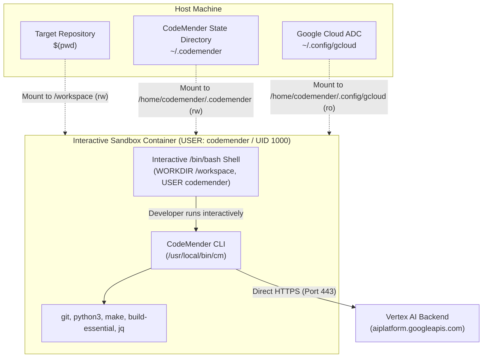

# CodeMender Interactive Sandbox Container Design

## 1. Context & Objectives

To streamline local testing and rapid experimentation with CodeMender (`cm`),
the container architecture is an unprivileged **Interactive Sandbox**. The
container drops the developer into an interactive shell running as an
unprivileged userspace user (`codemender` / UID 1000) with `cm` pre-installed,
mounting the host workspace, state directory, and Google Cloud credentials.

### Goals

- Run strictly in userspace as a non-root user (`codemender`, UID 1000, GID
  1000).
- Drop developer directly into an interactive `/bin/bash` shell in `/workspace`.
- Persist CodeMender state, sessions, and configuration across container runs by
  mounting `/home/codemender/.codemender`.
- Authenticate to Vertex AI (`aiplatform.googleapis.com`) using mounted host
  Google Cloud ADC (`~/.config/gcloud` $\\rightarrow$
  `/home/codemender/.config/gcloud:ro`).
- Prevent file permission issues on the host by matching standard non-root
  UID/GID ownership.
- Maintain unconstrained outbound network access in initial phases for direct
  connectivity.

### Non-Goals

- Running commands or shells as `root`.
- Headless CI/CD gating and orchestration (handled by separate future
  capabilities).
- Egress proxy / DNS filtering (deferred to post-connectivity hardening).

______________________________________________________________________

## 2. Architecture & Interactive Flow



______________________________________________________________________

## 3. Container File Structure

```
cm-connect/
├── docker/
│   └── Dockerfile
├── bin/
│   └── cm-sandbox          # Convenience host launcher script
└── openspec/
    └── specs/
        └── runner/
            └── cm-docker-container/
                ├── spec.md
                └── design.md
```

______________________________________________________________________

## 4. Dockerfile Implementation (Non-Root Userspace)

The Dockerfile installs the toolchain as root, creates an unprivileged user
`codemender` (UID/GID 1000), sets up mount directories with proper permissions,
and switches to `USER codemender`:

```dockerfile
FROM ubuntu:24.04

ENV DEBIAN_FRONTEND=noninteractive
ENV CM_TELEMETRY_OPT_OUT=1

# Install core build and developer tools
RUN apt-get update && apt-get install -y --no-install-recommends \
    ca-certificates \
    curl \
    unzip \
    git \
    python3 \
    python3-pip \
    build-essential \
    make \
    jq \
    && rm -rf /var/lib/apt/lists/*

# Download and install CodeMender CLI from Artifact Registry
ARG CM_DOWNLOAD_URL="https://artifactregistry.googleapis.com/download/v1/projects/cmoc-prod/locations/us/repositories/codemender-cli-production/files/cm%3Astable%3Acm-linux-amd64.zip:download?alt=media"

RUN curl -fsSL -o /tmp/cm-linux-amd64.zip "${CM_DOWNLOAD_URL}" \
    && unzip /tmp/cm-linux-amd64.zip -d /tmp/cm-bin \
    && chmod +x /tmp/cm-bin/cm \
    && mv /tmp/cm-bin/cm /usr/local/bin/cm \
    && rm -rf /tmp/cm-linux-amd64.zip /tmp/cm-bin

# Create unprivileged userspace user and mount directories
ARG USER_UID=1000
ARG USER_GID=1000

RUN groupadd -g "${USER_GID}" codemender \
    && useradd -u "${USER_UID}" -g codemender -m -s /bin/bash codemender \
    && mkdir -p /workspace /home/codemender/.codemender /home/codemender/.config/gcloud \
    && chown -R codemender:codemender /workspace /home/codemender

# Switch to unprivileged userspace user
USER codemender
WORKDIR /workspace

# Drop directly into interactive shell
CMD ["/bin/bash"]
```

## 5. Usage: Build & Run Division

### 5.1 Build Automation (`Makefile`)

The root `Makefile` is dedicated to building and managing the Docker image:

```makefile
IMAGE_NAME ?= cm-sandbox
TAG ?= latest

.PHONY: help build clean

help: ## Show this help message
	@grep -E '^[a-zA-Z_-]+:.*?## .*$$' $(MAKEFILE_LIST) | sort | awk 'BEGIN {FS = ":.*?## "}; {printf "\033[36m%-15s\033[0m %s\n", $$1, $$2}'

build: ## Build the CodeMender interactive sandbox Docker image
	docker build -t $(IMAGE_NAME):$(TAG) -f docker/Dockerfile .

clean: ## Remove the sandbox Docker image
	docker rmi -f $(IMAGE_NAME):$(TAG) || true
```

### 5.2 Runtime Launcher (`bin/cm-sandbox`)

The launcher script is dedicated strictly to running the prebuilt container
image with userspace mounts:

```bash
#!/usr/bin/env bash
set -euo pipefail

IMAGE_NAME="${CM_IMAGE_NAME:-cm-sandbox:latest}"
STATE_DIR="${HOME}/.codemender"
GCLOUD_DIR="${HOME}/.config/gcloud"
WORKSPACE_DIR="$(pwd)"

# Ensure state directory exists on host
mkdir -p "${STATE_DIR}"

if [ -t 0 ]; then
    DOCKER_TTY_FLAGS="-it"
else
    DOCKER_TTY_FLAGS="-i"
fi

exec docker run ${DOCKER_TTY_FLAGS} --rm \
  --name "cm-sandbox-$(date +%s)" \
  -v "${WORKSPACE_DIR}:/workspace" \
  -v "${STATE_DIR}:/home/codemender/.codemender" \
  -v "${GCLOUD_DIR}:/home/codemender/.config/gcloud:ro" \
  "${IMAGE_NAME}" \
  "$@"
```

### 5.3 Developer Workflow

1. **Build image**: `make build`
1. **Launch sandbox**: `./bin/cm-sandbox`
1. **Execute inside container**:
   ```bash
   codemender@container:/workspace$ cm init --verify
   codemender@container:/workspace$ cm find
   codemender@container:/workspace$ cm verify
   codemender@container:/workspace$ cm fix
   ```
