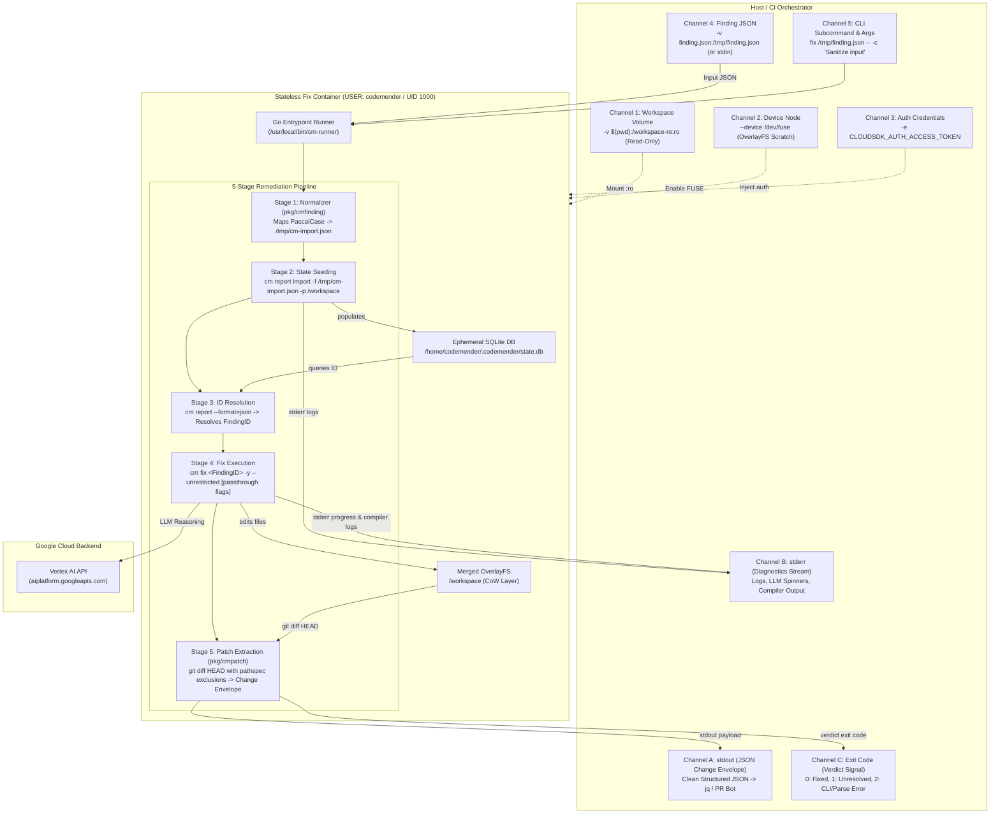

# CodeMender Stateless Fix Runner Container Design (`fix`)

## 1. Context & Objectives

To support automated PR gating and remediation bots (e.g. GitHub Actions review
comment generators, automated fix PR workflows), `cm-fix-runner` establishes a
stateless, deterministic, and isolated Docker container protocol for CodeMender
(`cm`) patch generation.

Implementing [ADR-0001](../../../../adrs/ADR-0001.md),
[ADR-0002](../../../../adrs/ADR-0002.md),
[ADR-0003](../../../../adrs/ADR-0003.md), and
[ADR-0005](../../../../adrs/ADR-0005.md), this capability focuses on the
**`fix`** remediation lifecycle phase:

1. **Closed-Loop Schema Ingestion:** Directly consumes the output of
   `cm report -f json`, normalizes PascalCase keys to CodeMender's import schema
   via `pkg/cmfinding`, and writes a temporary import manifest.
1. **Subprocess State Seeding:** Executes `/usr/local/bin/cm report import` to
   populate the ephemeral in-container SQLite database (`state.db`) without
   requiring persistent host state mounts (`~/.codemender`) or third-party Go
   database drivers.
1. **Single-Finding Resolution & Dispatch:** Queries `state.db` via `cm report`
   to resolve the generated `FindingID` and executes
   `cm fix <FindingID> -y --unrestricted`.
1. **Verbatim Passthrough:** Forwards all arguments specified after `--`
   directly to `cm fix`.
1. **OverlayFS Workspace Isolation:** Executes over a read-only host mount
   (`/workspace-ro:ro`) with an ephemeral container scratch layer
   (`fuse-overlayfs`), keeping the host pristine while capturing unified diffs
   via `git diff HEAD`.
1. **Structured Output on `stdout`:** Synthesizes a machine-readable JSON change
   envelope with unified diffs and file hunks on `stdout` while routing all
   operational logs to `stderr`.

### Goals

- Provide a completely stateless fix execution environment that works from a
  blank slate per container invocation.
- Process a single vulnerability finding per container execution for seamless CI
  parallelization.
- Support both file mount and standard input (`stdin`) finding ingestion
  channels.
- Keep `cm-runner` 100% dependency-free in `go.mod` using Go standard library
  only.
- Protect the host workspace against build artifacts, intermediate test
  fixtures, and corrupted edits via Ephemeral OverlayFS CoW.
- Emit pure, machine-readable JSON change envelopes on `stdout` ready for
  downstream GitHub Actions PR suggestions and `git apply`.
- Forward unowned flags after `--` verbatim to `cm fix`.
- Enforce strict unprivileged userspace execution (`codemender`, UID 1000).

### Non-Goals

- In-place modification of host repository files (deferred to future explicit
  `--in-place` capabilities; default is strictly patch extraction).
- Batch multi-finding execution in a single container (orchestration across
  multiple findings is handled by CI matrix jobs).
- Arbitrary format negotiation on `fix` (guaranteed JSON change envelope on
  `stdout`).

______________________________________________________________________

## 2. Host $\\leftrightarrow$ Container Communication Protocol



### 2.1 Input Channels (Host $\\rightarrow$ Container)

1. **Workspace Channel:** `-v $(pwd):/workspace-ro:ro` mounts the pristine host
   codebase. Combined with `--device /dev/fuse`, the entrypoint establishes a
   writable `fuse-overlayfs` view at `/workspace`.
1. **Finding Ingestion Channel:**
   - **Positional File Path:** `cm-runner fix /tmp/finding.json` reads from a
     mounted file artifact.
   - **Standard Input:** `cm-runner fix -` reads from standard input.
1. **Authentication Channel:** Injected via `CLOUDSDK_AUTH_ACCESS_TOKEN`,
   `GOOGLE_APPLICATION_CREDENTIALS`, or mounted host ADC (`.config/gcloud:ro`).
1. **Passthrough Flag Channel:** Arguments after `--` are partitioned and
   forwarded verbatim to `cm fix`.

### 2.2 Output Channels (Container $\\rightarrow$ Host)

1. **Data Payload Stream (`stdout`):** Pure JSON change envelope containing
   remediation status, modified file paths, full unified diffs, and structured
   hunks.
1. **Diagnostics Stream (`stderr`):** Progress indicators, LLM reasoning
   telemetry, compiler logs, and error traces.
1. **Verdict Channel (Exit Codes):**
   - `0`: Remediation successful, non-empty patch generated.
   - `1`: Remediation attempted, but LLM agent failed to resolve the
     vulnerability.
   - `2`: CLI usage / target file / JSON parsing error.
   - `>2`: Tooling or authentication fatal error.

______________________________________________________________________

## 3. Data Structures & Schemas

### 3.1 Ingestion Normalization Mapping (`pkg/cmfinding`)

`pkg/cmfinding` parses incoming JSON (from `cm report -f json`) and constructs
the schema expected by `cm report import`:

```go
type ImportedFinding struct {
	FilePath string `json:"file_path"`
	Line     int    `json:"line"`
	Title    string `json:"title"`
	Message  string `json:"message"`
	Severity string `json:"severity"`
	VulnType string `json:"vuln_type"`
	Snippet  string `json:"snippet"`
	Status   string `json:"status,omitempty"`
}
```

#### Mapping Rules:

- `FilePath` (or `file_path`) $\\rightarrow$ `file_path` (strips `file://`
  scheme; validates existence in `/workspace`).
- `StartLine` (or `line`) $\\rightarrow$ `line` (integer $\\ge 1$, default `1`).
- `Title` (or `title`) $\\rightarrow$ `title` (default `"Security Finding"`).
- `Analysis` (or `message`) $\\rightarrow$ `message` (falls back to `Snippet` or
  `Title`).
- `Severity` (or `severity`) $\\rightarrow$ `severity` (uppercase string).
- `VulnType` / `VulnID` $\\rightarrow$ `vuln_type`.
- `Snippet` (or `snippet`) $\\rightarrow$ `snippet` (embedded directly).
- `Status` (or `status`) $\\rightarrow$ `status` (default `"OPEN"`).

### 3.2 Structured Output Change Envelope (`pkg/cmpatch`)

`stdout` emits the following JSON structure:

```json
{
  "finding_id": "478a8868-b05a-5258-99ac-aa9e932374a7",
  "status": "FIXED",
  "vuln_type": "CWE-89",
  "title": "SQL Injection in User Lookup",
  "summary": "Replaced raw string concatenation with db.QueryRowContext and parameterized placeholders ($1).",
  "files_modified": [
    "pkg/auth/store.go"
  ],
  "patch": "diff --git a/pkg/auth/store.go b/pkg/auth/store.go\nindex 4b825dc..a3f12bc 100644\n--- a/pkg/auth/store.go\n+++ b/pkg/auth/store.go\n@@ -42,3 +42,3 @@\n-    query := fmt.Sprintf(\"SELECT * FROM users WHERE id = '%s'\", id)\n+    query := \"SELECT * FROM users WHERE id = $1\"\n-    row := db.QueryRow(query)\n+    row := db.QueryRowContext(ctx, query, id)\n",
  "hunks": [
    {
      "file_path": "pkg/auth/store.go",
      "start_line": 42,
      "end_line": 45,
      "original": "    query := fmt.Sprintf(\"SELECT * FROM users WHERE id = '%s'\", id)\n    row := db.QueryRow(query)\n",
      "replacement": "    query := \"SELECT * FROM users WHERE id = $1\"\n    row := db.QueryRowContext(ctx, query, id)\n"
    }
  ]
}
```

______________________________________________________________________

## 4. Decisions & Rationale

### 4.1 Decision 1: Subprocess Delegation via `cm report import` (ADR-0005)

- **Choice:** `cm-runner` uses an in-memory Go converter (`pkg/cmfinding`) to
  write `/tmp/cm-import.json` and invokes `cm report import` as a subprocess.
- **Rationale:** Aligns with ADR-0005. Keeps `go.mod` 100% dependency-free with
  zero SQLite CGO/Go drivers. Insulates `cm-connect` from upstream database
  schema migrations.

### 4.2 Decision 2: Single-Finding Granularity per Container

- **Choice:** Each container invocation targets exactly one finding.
- **Rationale:** Enables trivial parallelization in CI/CD (e.g. GitHub Actions
  matrix jobs), avoids cascading patch conflicts across multiple findings in the
  same file, and ensures predictable per-finding execution bounds.

### 4.3 Decision 3: Ephemeral OverlayFS Isolation (ADR-0003)

- **Choice:** Container mounts host workspace read-only (`/workspace-ro:ro`) and
  overlays a writable scratch layer via `fuse-overlayfs`.
- **Rationale:** Aligns with ADR-0003. Host workspace is guaranteed 100%
  pristine while the fix agent enjoys unrestricted POSIX read/write access to
  compile code and execute test suites.

### 4.4 Decision 4: Verbatim Double-Dash Passthrough (ADR-0002)

- **Choice:** All arguments after `--` are forwarded verbatim to `cm fix`.
- **Rationale:** Aligns with ADR-0002. Eliminates custom argument parsers and
  allows arbitrary future `cm fix` flags (`-c`, `--architecture`, `--model`)
  without requiring code modifications in `cm-connect`.

______________________________________________________________________

## 5. Implementation Architecture & Packages

```
cm-connect/
├── pkg/
│   ├── cmfinding/          # Ingestion, validation, and JSON normalization
│   │   ├── normalizer.go   # Schema converter (report -> import)
│   │   └── normalizer_test.go
│   ├── cmpatch/            # Patch extraction and envelope synthesis
│   │   ├── extractor.go    # git diff parser and hunk generator
│   │   └── extractor_test.go
│   └── cmrunner/           # Runner engine and command abstractions
│       ├── command.go      # FixCommand, FindCommand, ReportCommand
│       └── runner.go
├── cmd/
│   └── cm-runner/
│       ├── dispatch.go     # Subcommand routing (find, fix, shell, init)
│       └── main.go
└── tests/
    └── integration_test.sh # End-to-end container verification test suite
```

______________________________________________________________________

## 6. Risks & Mitigations

| Risk                                                 | Mitigation                                                                                                                                      |
| :--------------------------------------------------- | :---------------------------------------------------------------------------------------------------------------------------------------------- |
| **Input finding points to non-existent file path**   | `pkg/cmfinding` validates path existence in `/workspace` prior to import, failing fast with exit code 2.                                        |
| **Finding JSON contains unexpected or missing keys** | Normalizer applies sensible fallbacks (`Title` $\\rightarrow$ `"Security Finding"`, line $\\rightarrow$ `1`, severity $\\rightarrow$ `"HIGH"`). |
| **Fix agent produces empty diff (unable to fix)**    | `pkg/cmpatch` detects empty diff, emits `"UNRESOLVED"` status in JSON envelope, and terminates with exit code 1.                                |
| **Non-Git workspace mounted at runtime**             | Extractor falls back cleanly to directory diffing (`diff -u -r /workspace-ro /workspace`).                                                      |
| **Subprocess execution hangs or stalls**             | `cmrunner.Runner` enforces process group signal forwarding (`SIGINT`/`SIGTERM`) and strict timeout envelopes.                                   |

______________________________________________________________________

## 7. Verification Strategy

1. **Schema Normalization Unit Tests:** Test `pkg/cmfinding` with single JSON
   objects, 1-element arrays, PascalCase fields, missing optional keys, and
   `file://` prefixes.
1. **Patch Extractor Unit Tests:** Test `pkg/cmpatch` with multi-file diffs,
   newly added files, and empty diffs.
1. **Integration Test 1 (End-to-End Fix):** Execute `cm-runner fix` against a
   known vulnerable fixture with a finding payload; assert valid JSON change
   envelope on `stdout`, exit code `0`, and host immutability.
1. **Integration Test 2 (Stdin Ingestion):** Pipe finding JSON via stdin
   (`cat finding.json | cm-runner fix -`); assert successful patch generation.
1. **Integration Test 3 (Double-Dash Passthrough):** Pass `-c "Focus on SQL"`
   after `--`; assert `cm fix` receives the context flag.
1. **Integration Test 4 (Unresolved Exit Code):** Run `fix` on an unfixable
   fixture; assert `"status": "UNRESOLVED"` and exit code `1`.
1. **Integration Test 5 (Invalid Input Exit Code):** Pass a corrupted JSON file;
   assert exit code `2`.
1. **Coverage Threshold:** Enforce $\\ge 90%$ statement test coverage across all
   new packages (`make test`).
