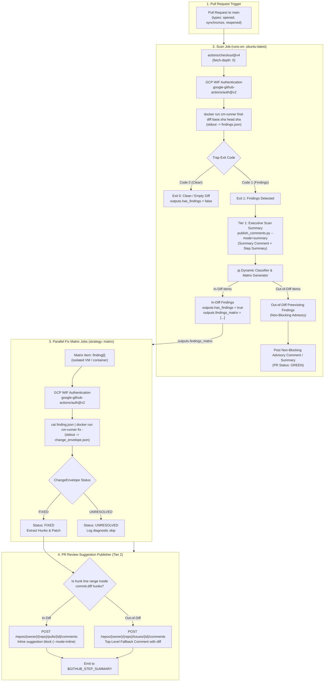
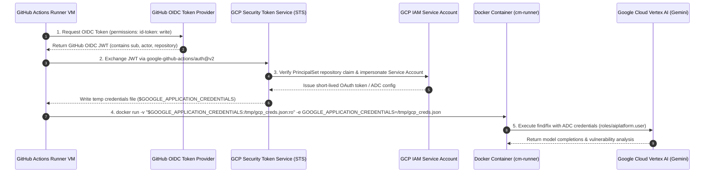
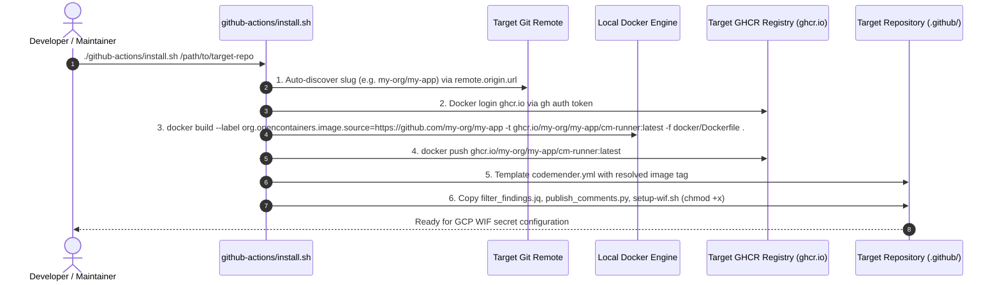

# CodeMender GitHub Actions CI/CD PR Review Workflow Design (`cm-pr-workflow`)

## 1. Context & Objectives

To operationalize CodeMender (`cm`) for engineering teams, `cm-pr-workflow`
establishes an opinionated, distributed GitHub Actions CI/CD workflow template
that executes vulnerability scanning and automated patch remediation on pull
requests.

Implementing
[cm-pr-workflow proposal](../../../proposals/cm-pr-workflow/proposal.md),
[ADR-0001](../../../../adrs/ADR-0001.md) (Batch Scanner), and
[ADR-0005](../../../../adrs/ADR-0005.md) (Stateless Fix Runner Protocol), this
capability focuses on:

1. **Direct Pull Request Diff Ingestion (`commit.diff`):** Dumps the exact pull
   request diff using
   `git diff ${{ github.event.pull_request.base.sha }} ${{ github.event.pull_request.head.sha }} > commit.diff`,
   scoping vulnerability analysis strictly to incoming changes and eliminating
   complex interval-parsing awk logic.
1. **GitHub Actions Native Runtime Context:** Leverages runner environment
   features (`$GITHUB_WORKSPACE`, `ACTIONS_ID_TOKEN_REQUEST_URL`,
   `${{ github.event.pull_request.base.sha }}`,
   `${{ github.event.pull_request.head.sha }}`) to operate cleanly without
   ad-hoc branch guessing or manual remote fetching.
1. **Keyless GCP WIF Authentication:** Exchanges GitHub Actions OIDC tokens for
   short-lived Google Cloud Application Default Credentials (ADC), securing
   Vertex AI model access without persistent service account keys.
1. **Dynamic Parallel Matrix Dispatch:** Slices the findings stream into
   isolated, concurrent matrix jobs (`strategy: matrix`), avoiding runner lock
   contention and scaling remediation throughput.
1. **Two-Tier PR Commenting Architecture:** Combines an executive scan summary
   report (Tier 1: total findings, metrics breakdown, structured table,
   collapsible threat analysis) during the scan phase with lightweight inline
   review suggestions (Tier 2: 1-click apply markdown ```` ```suggestion ````
   blocks) during the fix phase.
1. **Diff-Boundary Fallback Handling:** Intersects finding coordinates against
   `commit.diff`, routing out-of-diff findings to PR issue comments or
   `$GITHUB_STEP_SUMMARY` to prevent GitHub API `422 Unprocessable Entity`
   errors with per-envelope deduplication.
1. **Dedicated `github-actions/` Structure & Automated Installer:** Packages all
   deliverables under `github-actions/`
   (`github-actions/workflows/codemender.yml`, `github-actions/install.sh`,
   `github-actions/scripts/setup-wif.sh`,
   `github-actions/scripts/filter_findings.jq`,
   `github-actions/scripts/publish_comments.py`, and `github-actions/README.md`)
   with a 1-command installer script that builds and pushes the container image
   directly to the target repository's GitHub Container Registry (GHCR)
   namespace.

### Goals

- Provide a drop-in, production-ready GitHub Actions workflow template.
- Capture PR diffs cleanly via `commit.diff` without complex parsing scripts.
- Eliminate scan and fix noise by scoping operations strictly to PR diffs.
- Enable massive parallelization of remediation jobs via dynamic GitHub Actions
  matrices.
- Use keyless Google Cloud Workload Identity Federation for all AI interactions.
- Provide executive scan summary reports (Tier 1) and 1-click apply inline code
  suggestions (Tier 2) directly in GitHub PR review threads.
- Prevent GitHub API 422 errors through intelligent diff-boundary fallbacks and
  deduplication.
- Provide an automated installer script (`github-actions/install.sh`) to build
  and push the container image to the target repository's GHCR namespace,
  template the workflow, and copy assets with zero manual configuration errors.
- Maintain all workflow files outside `.github/` in `cm-connect`.

### Non-Goals

- Direct in-place branch auto-committing (all remediations are posted as review
  suggestions for human maintainer approval).
- Full repository vulnerability auditing on pull requests (full scans belong in
  scheduled nightly workflows, not PR gating).
- Self-hosted runner customization (standard GitHub-hosted `ubuntu-latest` /
  Debian containers are the target baseline).

______________________________________________________________________

## 2. End-to-End Workflow Architecture & Job DAG



______________________________________________________________________

## 3. GitHub Actions Runtime Environment Considerations

When executing inside GitHub Actions:

1. **Checked-out Ref Context:**
   - GitHub Actions provides the exact base and head commit SHAs in the event
     payload:
     - Base commit: `${{ github.event.pull_request.base.sha }}`
     - Head commit: `${{ github.event.pull_request.head.sha }}`
   - By running
     `git diff ${{ github.event.pull_request.base.sha }} ${{ github.event.pull_request.head.sha }} > commit.diff`,
     the workflow extracts the precise diff without requiring ad-hoc remote
     fetching or branch tracking assumptions.
1. **Container Filesystem & UID/GID Permissions:**
   - On GitHub-hosted runners (`ubuntu-latest`), Docker runs with access to
     `$GITHUB_WORKSPACE`.
   - The `cm-connect` container (`cm-runner`) executes as non-root user
     `codemender` (UID 1000, GID 1000) matching default workspace write
     permissions.
1. **Keyless OIDC & Secrets:**
   - The runner provides environment variables `ACTIONS_ID_TOKEN_REQUEST_URL`
     and `ACTIONS_ID_TOKEN_REQUEST_TOKEN` when `permissions: id-token: write` is
     granted.
   - `google-github-actions/auth@v2` automatically utilizes these variables to
     perform the STS token exchange.

______________________________________________________________________

## 4. Google Cloud Workload Identity Federation (WIF) Security & Token Flow



### Required GCP IAM Permissions:

- **Service Account Role:** `roles/aiplatform.user` on the Google Cloud project
  hosting CodeMender Vertex AI models.
- **Workload Identity User:** `roles/iam.workloadIdentityUser` bound to:
  `principalSet://iam.googleapis.com/projects/<PROJECT_NUM>/locations/global/workloadIdentityPools/<POOL>/attribute.repository/<OWNER>/<REPO>`

______________________________________________________________________

## 5. Diff Ingestion & Dynamic Matrix Partitioning Protocol

### Diff Ingestion via `commit.diff`:

```bash
# Extract complete pull request diff to workspace artifact
git diff "${{ github.event.pull_request.base.sha }}" "${{ github.event.pull_request.head.sha }}" > commit.diff
```

### Dynamic Matrix Schema:

The `scan` job constructs a JSON array emitted to `outputs.findings_matrix`:

```json
[
  {
    "finding_id": "478a8868-b05a-5258-99ac-aa9e932374a7",
    "file_path": "pkg/auth/store.go",
    "start_line": 42,
    "severity": "HIGH",
    "title": "SQL Injection in User Lookup",
    "payload": {
      "FilePath": "pkg/auth/store.go",
      "StartLine": 42,
      "Title": "SQL Injection in User Lookup",
      "Analysis": "Replace concatenation with parameterized query.",
      "Severity": "HIGH",
      "VulnType": "CWE-89",
      "Snippet": "query := fmt.Sprintf(...)"
    }
  }
]
```

______________________________________________________________________

## 6. PR Review Comment Synthesizer & Diff-Boundary Fallback Protocol

The PR review comment publisher is implemented as a standalone, zero-dependency
Python 3 standard library script (`github-actions/scripts/publish_comments.py`)
executed on the host runner VM. It interacts directly with the GitHub REST API
via `urllib.request` using `$GITHUB_TOKEN` and `$GITHUB_API_URL`.

### 1. Executive Scan Summary Report (Tier 1 — `--mode=summary`):

Executed during the `scan` job when vulnerabilities are detected:

- `issue_number`: PR Number
- `body`:
  ```markdown
  ### 🛡️ CodeMender Security Scan Summary

  **Total Findings:** 2 (**CRITICAL:** 1 | **HIGH:** 1)

  | Severity | Status | Finding | Location | Action |
  |---|---|---|---|---|
  | `CRITICAL` | `DETECTED` | **SQL Injection in User Lookup** (`CWE-89`) | `pkg/auth/store.go:42` | Automated Fix Pending |
  | `HIGH` | `DETECTED` | **Hardcoded API Key** (`CWE-798`) | `cmd/server/main.go:18` | Automated Fix Pending |

  <details><summary><b>🔍 View Vulnerability & Threat Analysis</b></summary>

  #### 1. SQL Injection in User Lookup (`CWE-89`)
  - **Location:** `pkg/auth/store.go:42`
  - **Severity:** `CRITICAL` | **Status:** `DETECTED`
  - **Threat Analysis & Impact:**

  Raw string concatenation in query allows arbitrary SQL execution.

  </details>
  ```

### 2. In-Diff Inline Review Suggestion Comment (Tier 2 — `--mode=inline`):

When `hunk.start_line` and `hunk.end_line` fall within `commit.diff` hunks, the
publisher invokes `POST /repos/{owner}/{repo}/pulls/{number}/comments`:

- `pull_number`: PR Number (from `$PR_NUMBER` or `$GITHUB_REF`)
- `commit_id`: PR Head SHA (from `$COMMIT_SHA` or payload)
- `path`: `hunk.file_path`
- `start_line`: `hunk.start_line` if multi-line
  (`hunk.start_line < hunk.end_line`), omitted if single-line
- `line`: `hunk.end_line`
- `side`: `"RIGHT"`
- `start_side`: `"RIGHT"` if multi-line, omitted if single-line
- `body`:
  ````markdown
  ### 🛡️ CodeMender Fix: SQL Injection in User Lookup

  Replaced string concatenation with parameterized query.

  ```suggestion
      query := "SELECT * FROM users WHERE id = $1"
      row := db.QueryRowContext(ctx, query, id)
  ```
  ````

### 3. Out-of-Diff Fallback Path & Deduplication (HTTP 422 Mitigation):

If the GitHub API rejects the comment with HTTP 422 (line outside PR diff), the
script catches `urllib.error.HTTPError` where `err.code == 422` and creates an
issue comment via `POST /repos/{owner}/{repo}/issues/{number}/comments`:

- `issue_number`: PR Number
- `fallback_posted`: Boolean tracked per envelope to deduplicate multiple
  out-of-diff hunk failures into a single top-level issue comment.
- `body`:
  ````markdown
  ### 🛡️ CodeMender Security Finding (Outside PR Diff): SQL Injection in User Lookup
  **File:** `legacy/helper.go:120` | **Severity:** HIGH | **Vulnerability:** CWE-89

  Hardcoded credential detected in untouched helper code.

  ```diff
  - const apiKey = "AIzaSy..."
  + const apiKey = os.Getenv("API_KEY")
  ```
  ````

### 4. Potentially Preexisting Finding Advisory Comment Path (`--advisory`):

For scan findings that fall on lines untouched by `commit.diff`:

- `issue_number`: PR Number
- `body`:
  ```markdown
  ### 🛡️ CodeMender Advisory: Potentially Preexisting Security Finding(s) (Non-Blocking)
  > **Note:** The following finding(s) were detected in untouched sections of the codebase outside the current pull request diff. They are advisory and do not block this PR.

  #### 1. Hardcoded Secret
  - **File:** `legacy/helper.go:120`
  - **Severity:** `HIGH` | **Vulnerability:** `CWE-798`
  - **Details:** Hardcoded credential detected in untouched helper code.
  ```

### 5. Step Summary Generation:

For all processed findings (both `FIXED`, `UNRESOLVED`, and potentially
preexisting advisories), the script formats a markdown status card and appends
it to `$GITHUB_STEP_SUMMARY`.

______________________________________________________________________

## 7. File Layout & Delivery Architecture

All GitHub Actions assets are organized under `github-actions/`:

```
cm-connect/
├── github-actions/
│   ├── README.md               # Quickstart guide & installation instructions
│   ├── install.sh              # One-command installer (builds/pushes image & templates workflow)
│   ├── scripts/
│   │   ├── setup-wif.sh        # GCP IAM & Workload Identity Federation configuration script
│   │   ├── filter_findings.jq  # Standalone jq filter for dynamic fix matrix generation
│   │   └── publish_comments.py # Zero-dependency Python 3 PR review comment & fallback publisher
│   └── workflows/
│       └── codemender.yml      # Standalone GitHub Actions workflow template
├── openspec/
│   ├── proposals/
│   │   └── cm-pr-workflow/
│   │       └── proposal.md     # Accepted OpenSpec proposal
│   └── specs/
│       └── workflow/
│           └── cm-pr-workflow/
│               ├── spec.md     # Normative capability specification
│               └── design.md   # Architectural design and protocol specification
```

### Automated Installer Protocol (`github-actions/install.sh`):

The `install.sh` script automates the full onboarding workflow from the
maintainer's local `cm-connect` checkout:



### Installation Lifecycle & Pre-flight Steps:

1. **Pre-flight Tool Validation:** Verifies that `git`, `gh` (authenticated via
   `gh auth status`), and an active Docker daemon are available before
   initiating the build. If `gh auth` lacks `write:packages` scope or Docker is
   unavailable, the script provides actionable troubleshooting guidance or
   prompts the user to use `--skip-build`.
1. **Slug Auto-Discovery:** Strips protocol prefixes (`git@github.com:`,
   `https://github.com/`) and `.git` suffixes from the target repository's git
   remote URL to cleanly extract `<owner>/<repo>`.
1. **Workflow Templating:** Replaces the default container image reference in
   `codemender.yml` with the resolved target GHCR tag
   (`ghcr.io/<owner>/<repo>/cm-runner:latest`) during destination copy.
1. **Executable Permissions:** Ensures `publish_comments.py` and `setup-wif.sh`
   are marked executable (`chmod +x`) in `<target-repo>/.github/scripts/`.

### Supported CLI Flags for `install.sh`:

- `install.sh <target-repo-dir>`: Full install (auto-discovers git remote slug,
  logs into `ghcr.io`, builds image with OCI source label, pushes image to
  `ghcr.io/<owner>/<repo>/cm-runner:latest`, and templates workflow).
- `--skip-build`: Skips the Docker build and push steps, copying the workflow
  template and helper scripts directly.
- `--image <custom-image>`: Overrides the container image reference in the
  templated workflow (e.g. for pre-existing shared registries).
- `--repo <owner/repo>`: Explicitly specifies the target repository slug,
  overriding git remote auto-discovery.
