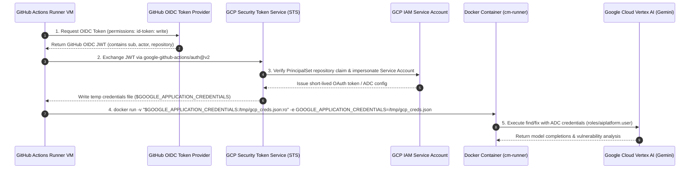

# CodeMender GitHub Actions CI/CD PR Review Workflow Design (`cm-pr-workflow`)

## 1. Context & Objectives

To operationalize CodeMender (`cm`) for engineering teams, `cm-pr-workflow`
establishes an opinionated, distributed GitHub Actions CI/CD workflow template
that executes vulnerability scanning and automated patch remediation on pull
requests.

Implementing
[cm-pr-workflow proposal](../../../proposals/cm-pr-workflow/proposal.md),
[ADR-0001](../../../../adrs/ADR-0001.md) (Batch Scanner), and
[ADR-0005](../../../../adrs/ADR-0005.md) (Stateless Fix Runner Protocol), this
capability focuses on:

1. **Diff-Scoped Scanning:** Restricts vulnerability analysis strictly to the
   pull request diff (`git diff --name-only origin/main...HEAD`), eliminating
   developer review fatigue from legacy repository issues.
1. **Keyless GCP WIF Authentication:** Exchanges GitHub Actions OIDC tokens for
   short-lived Google Cloud Application Default Credentials (ADC), securing
   Vertex AI model access without persistent service account keys.
1. **Dynamic Parallel Matrix Dispatch:** Slices the findings stream into
   isolated, concurrent matrix jobs (`strategy: matrix`), avoiding runner lock
   contention and scaling remediation throughput.
1. **Structured PR Review Suggestions:** Translates `ChangeEnvelope` hunk
   records into inline GitHub Pull Request Review comments
   (`POST /pulls/{id}/reviews`) with 1-click apply markdown
   ```` ```suggestion ```` blocks.
1. **Diff-Boundary Fallback Handling:** Intersects finding coordinates against
   the PR diff, routing out-of-diff findings to PR issue comments or
   `$GITHUB_STEP_SUMMARY` to prevent GitHub API `422 Unprocessable Entity`
   errors.
1. **Isolated Example Delivery:** Packages all deliverables under
   `examples/workflows/codemender.yml` and `examples/workflows/README.md` to
   prevent accidental activation on `cm-connect`.

### Goals

- Provide a drop-in, production-ready GitHub Actions workflow template.
- Eliminate scan and fix noise by scoping operations strictly to PR diffs.
- Enable massive parallelization of remediation jobs via dynamic GitHub Actions
  matrices.
- Use keyless Google Cloud Workload Identity Federation for all AI interactions.
- Post 1-click apply inline code suggestions directly in GitHub PR review
  threads.
- Prevent GitHub API 422 errors through intelligent diff-boundary fallbacks.
- Maintain all workflow files outside `.github/` in `cm-connect`.

### Non-Goals

- Direct in-place branch auto-committing (all remediations are posted as review
  suggestions for human maintainer approval).
- Full repository vulnerability auditing on pull requests (full scans belong in
  scheduled nightly workflows, not PR gating).
- Self-hosted runner customization (standard GitHub-hosted `ubuntu-latest` /
  Debian containers are the target baseline).

______________________________________________________________________

## 2. End-to-End Workflow Architecture & Job DAG

````mermaid
flowchart TD
    subgraph Trigger["1. Pull Request Trigger"]
        PR["Pull Request to main<br>(types: opened, synchronize, reopened)"]
    end

    subgraph ScanJob["2. Scan Job (runs-on: ubuntu-latest)"]
        direction TB
        Checkout["actions/checkout@v4<br>(fetch-depth: 0)"]
        DiffExtract["Extract PR Diff & Modified Files<br>git diff --name-only origin/main...HEAD"]
        WIFScan["GCP WIF Authentication<br>google-github-actions/auth@v2"]
        DockerFind["docker run cm-runner find .<br>(stdout -> findings.json)"]
        ExitTrap{"Trap Exit Code"}
        CleanExit["Exit 0: Clean<br>outputs.has_findings = false"]
        FindingsExit["Exit 1: Findings Detected<br>outputs.has_findings = true"]
        MatrixGen["jq Dynamic Matrix Generator<br>Filter by diff & sort by severity<br>outputs.findings_matrix = [...]"]

        Checkout --> DiffExtract --> WIFScan --> DockerFind --> ExitTrap
        ExitTrap -->|Code 0| CleanExit
        ExitTrap -->|Code 1| FindingsExit --> MatrixGen
    end

    subgraph FixMatrixJob["3. Parallel Fix Matrix Jobs (strategy: matrix)"]
        direction TB
        MatrixItem["Matrix Item: finding[i]<br>(isolated VM / container)"]
        WIFFix["GCP WIF Authentication<br>google-github-actions/auth@v2"]
        DockerFix["docker run cm-runner fix finding.json<br>(stdout -> ChangeEnvelope JSON)"]
        FixVerdict{"ChangeEnvelope Status"}
        Fixed["Status: FIXED<br>Extract Hunks & Patch"]
        Unresolved["Status: UNRESOLVED<br>Log diagnostic skip"]

        MatrixItem --> WIFFix --> DockerFix --> FixVerdict
        FixVerdict -->|FIXED| Fixed
        FixVerdict -->|UNRESOLVED| Unresolved
    end

    subgraph ReviewBot["4. PR Review Suggestion Publisher"]
        direction TB
        DiffCheck{"Is hunk line range inside<br>PR diff hunks?"}
        PostInline["POST /repos/{owner}/{repo}/pulls/{id}/reviews<br>Inline ```suggestion``` block"]
        PostFallback["POST /repos/{owner}/{repo}/issues/{id}/comments<br>Top-Level PR Comment with ```diff```"]
        StepSummary["Emit to $GITHUB_STEP_SUMMARY"]

        Fixed --> DiffCheck
        DiffCheck -->|Yes (In-Diff)| PostInline
        DiffCheck -->|No (Out-of-Diff)| PostFallback
        PostInline & PostFallback --> StepSummary
    end

    PR --> ScanJob
    MatrixGen -->|outputs.findings_matrix| FixMatrixJob
````

______________________________________________________________________

## 3. Google Cloud Workload Identity Federation (WIF) Security & Token Flow



### Required GCP IAM Permissions:

- **Service Account Role:** `roles/aiplatform.user` on the Google Cloud project
  hosting CodeMender Vertex AI models.
- **Workload Identity User:** `roles/iam.workloadIdentityUser` bound to:
  `principalSet://iam.googleapis.com/projects/<PROJECT_NUM>/locations/global/workloadIdentityPools/<POOL>/attribute.repository/<OWNER>/<REPO>`

______________________________________________________________________

## 4. Diff Extraction & Dynamic Matrix Partitioning Protocol

### Diff Inspection Algorithm:

```bash
# 1. Fetch complete base ref
git fetch origin main --depth=1

# 2. Extract changed file list
CHANGED_FILES=$(git diff --name-only origin/main...HEAD)

# 3. Extract modified line intervals per file
git diff -U0 origin/main...HEAD | awk '
  /^--- \/dev\/null/ { next }
  /^\+\+\+ b\// { file=substr($0, 7); next }
  /^@@/ {
    split($3, a, ",");
    start=substr(a[1], 2);
    count=(length(a) > 1 ? a[2] : 1);
    print file ":" start ":" (start + count - 1);
  }
' > /tmp/pr-diff-ranges.txt
```

### Dynamic Matrix Schema:

The `scan` job constructs a JSON array emitted to `outputs.findings_matrix`:

```json
[
  {
    "finding_id": "478a8868-b05a-5258-99ac-aa9e932374a7",
    "file_path": "pkg/auth/store.go",
    "start_line": 42,
    "severity": "HIGH",
    "title": "SQL Injection in User Lookup",
    "payload": {
      "FilePath": "pkg/auth/store.go",
      "StartLine": 42,
      "Title": "SQL Injection in User Lookup",
      "Analysis": "Replace concatenation with parameterized query.",
      "Severity": "HIGH",
      "VulnType": "CWE-89",
      "Snippet": "query := fmt.Sprintf(...)"
    }
  }
]
```

______________________________________________________________________

## 5. PR Review Comment Synthesizer & Diff-Boundary Fallback Protocol

### 1. In-Diff Inline Review Comment (Primary Path):

When `hunk.start_line` and `hunk.end_line` fall within the PR's modified diff
hunks, the publisher invokes `github.rest.pulls.createReviewComment`:

- `pull_number`: PR Number
- `commit_id`: PR Head SHA (`context.payload.pull_request.head.sha`)
- `path`: `hunk.file_path`
- `start_line`: `hunk.start_line < hunk.end_line ? hunk.start_line : undefined`
- `line`: `hunk.end_line`
- `side`: `"RIGHT"`
- `start_side`: `hunk.start_line < hunk.end_line ? "RIGHT" : undefined`
- `body`:
  ````markdown
  ### 🛡️ CodeMender Auto-Fix Suggestion: SQL Injection in User Lookup
  > **Vulnerability:** CWE-89 | **Severity:** HIGH | **Status:** FIXED

  Replaced string concatenation with parameterized query.

  ```suggestion
      query := "SELECT * FROM users WHERE id = $1"
      row := db.QueryRowContext(ctx, query, id)
  ```
  ````

### 2. Out-of-Diff Fallback Path (HTTP 422 Mitigation):

If the GitHub API rejects the comment with HTTP 422 (line outside PR diff), the
step catches the error and creates an issue comment via
`github.rest.issues.createComment`:

- `issue_number`: PR Number
- `body`:
  ````markdown
  ### 🛡️ CodeMender Security Finding (Outside PR Diff)
  **File:** `legacy/helper.go:120` | **Severity:** HIGH | **Vulnerability:** CWE-798

  Hardcoded credential detected in untouched helper code.

  ```diff
  - const apiKey = "AIzaSy..."
  + const apiKey = os.Getenv("API_KEY")
  ```
  ````

______________________________________________________________________

## 6. File Layout & Delivery Architecture

All deliverables are placed in the `examples/workflows/` directory:

```
cm-connect/
├── examples/
│   └── workflows/
│       ├── codemender.yml      # Standalone GitHub Actions workflow template
│       └── README.md           # Turnkey repo onboarding & GCP IAM setup guide
├── openspec/
│   ├── proposals/
│   │   └── cm-pr-workflow/
│   │       └── proposal.md     # Accepted OpenSpec proposal
│   └── specs/
│       └── workflow/
│           └── cm-pr-workflow/
│               ├── spec.md     # Normative capability specification
│               └── design.md   # Architectural design and protocol specification
```
